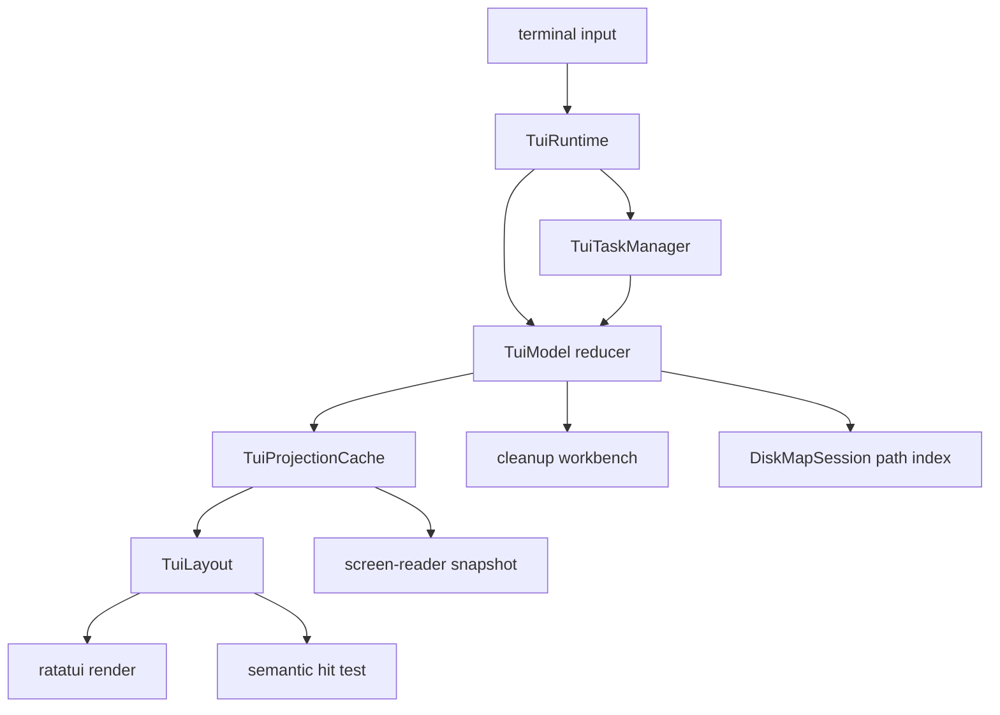
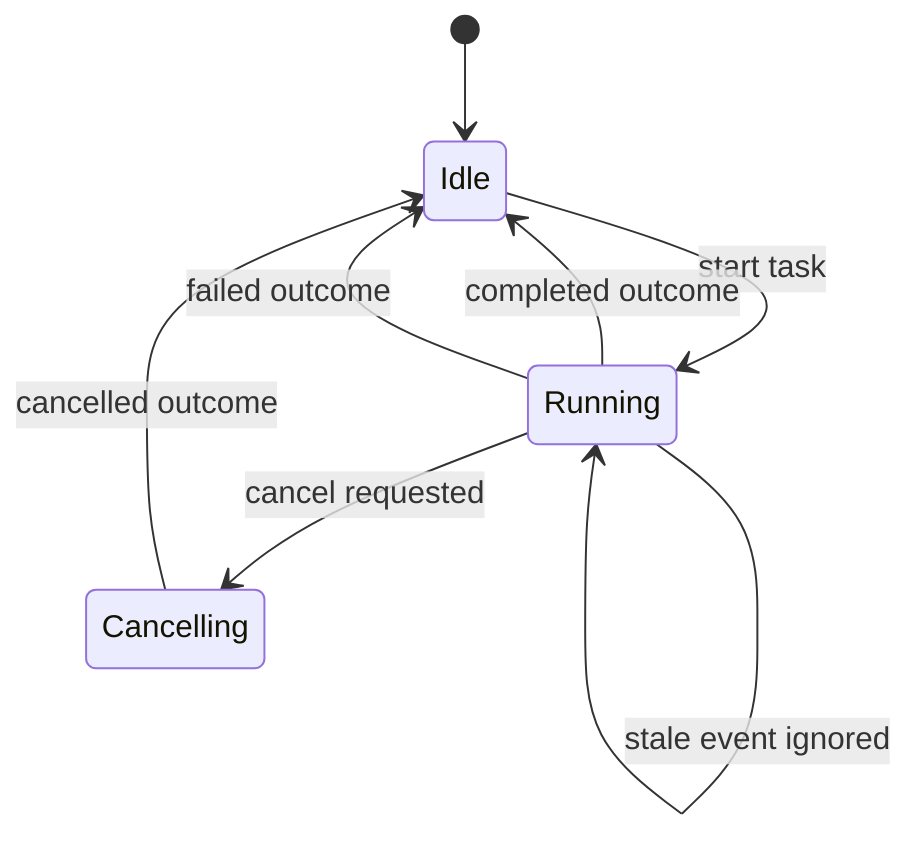
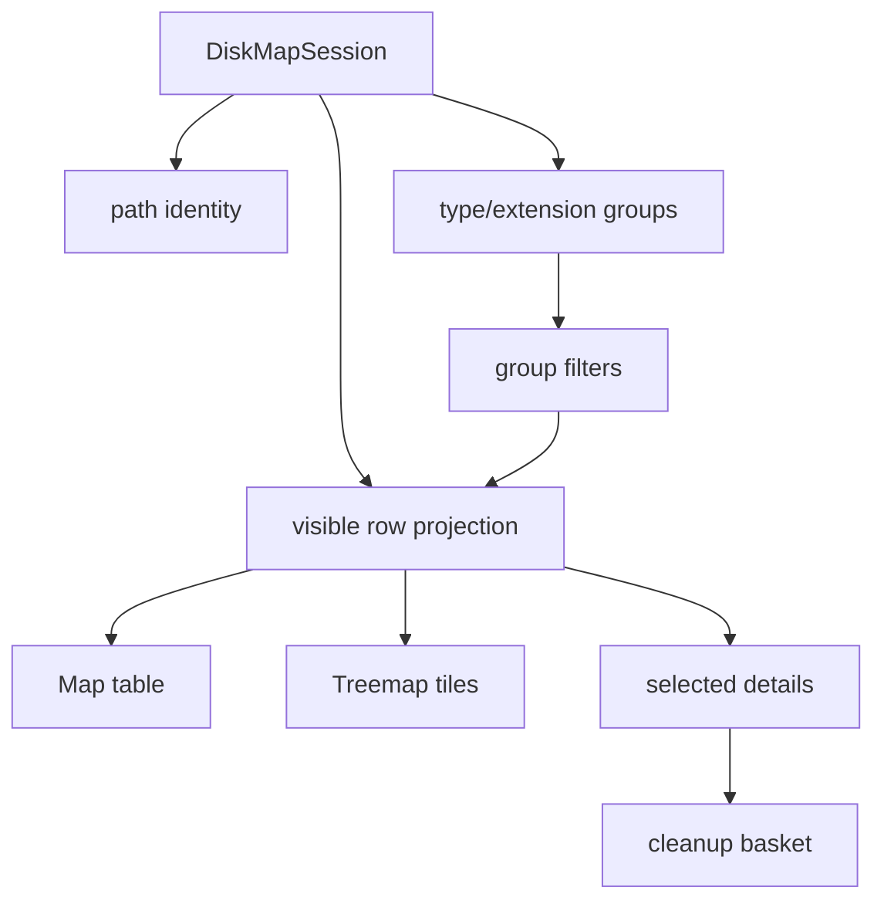

# TUI Foundation Workbench Refactor - Plan

## Goal Capsule

| Field | Decision |
|---|---|
| Objective | Refactor Rebecca's TUI into a clean, path-aware, responsive workbench foundation that can keep moving toward a WizTree-like cleanup experience. |
| Authority | User request: optimize and refactor fearlessly, break internal APIs, delete obsolete code, keep the TUI in the existing `rebecca` binary, and use mature project references without copying incompatible source. |
| Execution profile | Code implementation with characterization tests around current TUI journeys before breaking module boundaries, then focused unit tests and full workspace verification. |
| Stop conditions | Stop only for a product-scope contradiction, an unsafe cleanup path, or a verification failure that proves the planned architecture is wrong. |
| Landing | Commit directly according to repo convention; prior user preference allows work on `main` and direct remote `main` updates. |

---

## Product Contract

### Summary

This plan upgrades the existing `rebecca tui` from a working feature into a maintainable interactive workbench foundation.
It keeps the current map, treemap, type, extension, refresh, preview, execution, history, accessibility, and mouse behavior while splitting the state, layout, task runtime, and view-model seams that are now concentrated in a few large files.

### Problem Frame

Rebecca's TUI has already shipped the right product shape: one binary, safe cleanup workflow, deterministic headless rendering, keyboard journeys, a Treemap view, and non-destructive mouse selection.
The next bottleneck is internal structure.
`crates/rebecca/src/tui/app.rs` owns screen state, task status, row projection, cleanup basket, navigation, error retry, and many tests.
`crates/rebecca/src/tui/view.rs` owns rendering, snapshot text, layout geometry, hit testing, trimming, and visual helpers.
`crates/rebecca/src/tui/task.rs` already has task ids and cancellation, but the event loop still knows too much about active-task lifecycle and has no bounded progress/backpressure contract.
The workbench can become the best cleanup CLI only if these seams are clean before richer filtering, treemap zoom, and execution-stage UX are added.

### Requirements

**Foundation boundaries**

- R1. TUI application state, derived view models, cleanup basket state, progress state, and effect construction are separated into focused modules with no transitional compatibility layer.
- R2. Rendering, snapshot output, layout geometry, and hit testing share a stable layout contract so terminal coordinates map to what users see.
- R3. The task runtime owns active-task lifecycle, task ids, cancellation, stale-result rejection, and progress coalescing instead of spreading that logic through the event loop and app state.
- R4. Disk-map navigation and restore behavior become path-aware so view state can survive refreshes and future subtree replacement without trusting long-lived vector indices.

**Workbench interaction**

- R5. Map, Treemap, Types, and Extensions keep keyboard and mouse parity after the refactor.
- R6. Type and extension distribution rows can become actionable filters for the map and Treemap, not only read-only summaries.
- R7. The TUI exposes a compact breadcrumb and selected-item detail model that helps users understand scope, rule advice, and next actions without reading a tutorial.
- R8. Mouse actions remain non-destructive; cleanup execution continues to require preview and typed confirmation.

**Terminal quality**

- R9. Narrow terminal rendering avoids text overlap by stacking or compressing details instead of relying on fixed 68/32 splits.
- R10. Status/help text is concise in the main frame and moves longer command guidance into help/snapshot output.
- R11. Screen-reader and no-color modes remain deterministic and keep the same semantic information as visual mode.

**Performance and maintainability**

- R12. Per-frame row projection avoids repeated full `Vec` reconstruction for visible rows, distribution rows, and treemap items when input state is unchanged.
- R13. Existing TUI smoke tests remain green, and new pure tests cover the extracted model, layout, task runtime, and filter behavior.
- R14. Documentation, changelog, current-state notes, and the Rebecca disk-cleaner skill describe the refined TUI behavior and automation boundary.

### Acceptance Examples

- AE1. Given a root scan has completed, when the user switches between Map, Treemap, Types, and Extensions, then selection, breadcrumb, cleanup basket, and screen-reader snapshots remain coherent.
- AE2. Given the user clicks a type or extension row, when the map is shown again, then the visible rows are filtered by that group and the status line explains the active filter.
- AE3. Given a refresh finishes after the selected path moved or disappeared, when the result applies, then the app restores by path when possible and degrades to the nearest valid parent without panicking.
- AE4. Given an active scan emits many progress events, when the terminal loop polls, then the UI receives a bounded/coalesced progress snapshot and stale task messages cannot overwrite newer state.
- AE5. Given a narrow terminal width, when `--once --screen-reader --terminal-width 80` renders any TUI screen, then no line exceeds the injected width and no critical command is only available through truncated status text.
- AE6. Given the confirm screen is active, when the user clicks anywhere or scrolls, then no cleanup execution effect is produced.

### Scope Boundaries

- In scope: internal TUI API breakage, module extraction, path-aware navigation support, layout contract extraction, task manager refactor, projection caching, actionable distribution filters, breadcrumb/detail polish, docs/changelog/skill updates, and removal of obsolete transitional code.
- In scope: changing deterministic TUI snapshot text when the new wording better reflects the workbench model, with tests updated to the intentional contract.
- Deferred to follow-up work: GUI packaging, right-click context menus, drag selection, multi-select cleanup baskets, persistent user preferences, external plugin rule editing, and release packaging changes.
- Outside this product's identity: a separate `rebecca-tui` binary, direct cleanup execution from mouse input, treating TUI snapshots as a machine API, or copying GPL/LGPL/AGPL implementation code from reference projects.

---

## Planning Contract

### Key Technical Decisions

- KTD1. Split the TUI by responsibility instead of by screen.
  Screen-based files would still duplicate navigation, selection, progress, and effect logic.
  A model/projection/layout/runtime split matches the current failure mode and makes future screens cheaper.
- KTD2. Keep synchronous worker threads, but hide them behind a task manager.
  Disk scanning and cleanup execution are blocking workloads, so adding Tokio is not the right default.
  A task manager with bounded progress coalescing gives the concurrency properties the TUI needs without an async runtime dependency.
- KTD3. Make path identity the restore contract.
  `DiskMapNodeId` is currently an index-shaped handle.
  TUI state that crosses refresh boundaries should restore by path first and then map to fresh node ids.
- KTD4. Treat layout as a shared data model.
  Render, hit test, and snapshot should derive from the same layout/projection facts.
  This prevents mouse coordinates, narrow layouts, and deterministic snapshots from drifting.
- KTD5. Keep reference-project learning at behavior level.
  `repo-ref/dua-cli` is useful for dense terminal entries, marks, sort columns, and path compaction.
  `repo-ref/edirstat`, `repo-ref/squirreldisk`, and WinDirStat-like projects are useful for treemap selection and visual information hierarchy.
  Rebecca must keep original implementation code and respect license boundaries.
- KTD6. Optimize the human frame without weakening automation contracts.
  TUI snapshots stay test-only human surfaces; scripts continue to use `inspect`, `clean`, JSON, NDJSON, and the new CLI schema/capability commands.

### High-Level Technical Design

### Assumptions

- Scoping confirmation is considered pre-authorized by the user's instruction to proceed with the plan and then goal-driven implementation.
- Existing TUI user-visible commands are valuable and should remain unless the refactor finds a clearer replacement with test coverage.
- Internal module names and APIs can break freely because the project has not reached a public compatibility burden.
- `ratatui`, `crossterm`, and current synchronous scanning infrastructure remain the right foundation for this plan.

### System-Wide Impact

- `crates/rebecca/src/tui/app.rs` should shrink into a reducer/model boundary instead of staying the home for every TUI concept.
- `crates/rebecca/src/tui/view.rs` should stop being the only place for layout, render, snapshot, hit testing, and text trimming.
- `crates/rebecca/src/tui/task.rs` becomes a runtime subsystem with a smaller public surface.
- `crates/rebecca-core/src/disk_session.rs` gains path-identity APIs that benefit CLI, TUI, and future GUI consumers.
- CLI machine contracts should not change unless a test explicitly documents an intentional break.

### Risks & Dependencies

| Risk | Mitigation |
|---|---|
| Large refactor accidentally changes current keyboard journeys. | Add or preserve `cli_tui` characterization coverage before moving logic. |
| Layout extraction causes snapshot churn. | Treat snapshot updates as intentional only when wording or layout contract improves; keep width-bound assertions. |
| Progress coalescing hides important task state. | Preserve terminal states and latest counters; coalesce high-frequency counters only. |
| Path restore can mis-handle deleted paths. | Test missing path, nearest parent fallback, and root fallback. |
| Distribution filters can confuse cleanup staging. | Show active filter in breadcrumb/status and ensure basket semantics remain path/rule based. |

### Sources & Research

- `docs/plans/2026-07-07-002-feat-tui-cleanup-workbench-plan.md` established the single-binary TUI and safety model.
- `docs/plans/2026-07-07-003-feat-tui-distribution-refresh-plan.md` established distributions, refresh, and background task direction.
- `docs/plans/2026-07-07-004-feat-tui-treemap-mouse-plan.md` established Treemap and non-destructive mouse semantics.
- `docs/knowledge/engineering/current-state.md` lists TUI path identity, viewport, task backpressure, and subtree refresh as next design pressure points.
- `crates/rebecca/src/tui/app.rs` contains the current state machine, basket, projection, task status, and app tests.
- `crates/rebecca/src/tui/view.rs` contains rendering, snapshot text, geometry, hit testing, and width trimming.
- `crates/rebecca/src/tui/task.rs` contains worker spawning, task ids, cancellation, and progress conversion.
- `crates/rebecca-core/src/disk_session.rs` contains `DiskMapSession`, `DiskMapNodeId`, groups, and builder-local path indexing.
- `repo-ref/dua-cli/src/interactive/widgets/entries.rs` is the strongest local reference for dense terminal rows, marks, cleanup candidates, sort columns, and path compaction.
- `repo-ref/edirstat` and `repo-ref/squirreldisk` are useful behavior references for treemap-centric disk exploration and selection-driven detail panels; use design ideas only.

---

## Implementation Units

### U1. Characterize current TUI journeys and split model modules

- **Goal:** Preserve current TUI behavior while extracting state, navigation, basket, progress, and effects out of the monolithic app file.
- **Requirements:** R1, R5, R8, R13
- **Dependencies:** None
- **Files:** `crates/rebecca/src/tui/app.rs`, `crates/rebecca/src/tui/model.rs`, `crates/rebecca/src/tui/navigation.rs`, `crates/rebecca/src/tui/basket.rs`, `crates/rebecca/src/tui/progress.rs`, `crates/rebecca/src/tui/effect.rs`, `crates/rebecca/src/tui/mod.rs`, `crates/rebecca/tests/cli_tui.rs`
- **Approach:** Move plain state types and reducers into focused modules, keep `TuiApp` as the facade consumed by the runner and renderer, and delete transitional wrappers once callers are moved.
- **Execution note:** Start by running focused TUI tests and adding any missing characterization for current screen switching, staging, confirm, busy cancellation, and mouse non-execution behavior.
- **Patterns to follow:** Current tests at the bottom of `crates/rebecca/src/tui/app.rs`, current `TuiEffect` pattern, and Rust module visibility already used by `terminal.rs` and `treemap.rs`.
- **Test scenarios:** Existing replay journeys still pass. Pure app tests still prove mouse actions cannot execute cleanup. Confirm typing remains exact. Busy Esc still requests cancellation. Screen switching preserves map selection and basket state.
- **Verification:** Focused TUI app tests and `cargo nextest run -p rebecca --test cli_tui --locked` pass.

### U2. Add path-aware session APIs and restore state

- **Goal:** Make refresh, restore, and future subtree replacement use paths as stable identity rather than assuming old node ids remain meaningful.
- **Requirements:** R4, R5, R7, R13
- **Dependencies:** U1
- **Files:** `crates/rebecca-core/src/disk_session.rs`, `crates/rebecca-core/src/lib.rs`, `crates/rebecca-core/tests/disk_session.rs`, `crates/rebecca/src/tui/app.rs`, `crates/rebecca/src/tui/model.rs`
- **Approach:** Promote builder-local path indexing into public read APIs on `DiskMapSession`, add nearest-parent/path-restore helpers, and change TUI session snapshots to store paths plus screen/filter context.
- **Execution note:** Add core tests for path lookup and missing-path fallback before changing TUI restore behavior.
- **Patterns to follow:** Existing `DiskMapSessionBuilder::path_to_id`, `DiskMapSession::visible_rows`, and current TUI session snapshot restore code.
- **Test scenarios:** Looking up an existing root, child, and synthetic parent returns the expected node. Looking up a deleted path returns none. Restoring a deleted selected path falls back to the nearest existing parent. Refresh completion restores screen and selection by path when possible. Cleanup advice remains attached after restore.
- **Verification:** New `disk_session` tests and focused TUI refresh/restore tests pass.

### U3. Introduce projection cache and actionable group filters

- **Goal:** Replace repeated per-frame row allocation with a projection layer that also makes Types and Extensions actionable filters for Map and Treemap.
- **Requirements:** R5, R6, R7, R11, R12, R13
- **Dependencies:** U2
- **Files:** `crates/rebecca/src/tui/projection.rs`, `crates/rebecca/src/tui/model.rs`, `crates/rebecca/src/tui/app.rs`, `crates/rebecca/src/tui/view.rs`, `crates/rebecca/tests/cli_tui.rs`
- **Approach:** Add a `TuiProjectionCache` keyed by session generation, parent path, sort, search text, group filter, and screen mode. Let Map and Treemap consume the same projected rows. Let type/extension row activation install or clear a group filter.
- **Execution note:** Keep the first cache simple and invalidation explicit; correctness and clearer state matter more than clever lifetime tricks.
- **Patterns to follow:** Current `visible_rows()`, `distribution_rows_for()`, `active_distribution_kind()`, and group data from `DiskMapSession::distribution_rows`.
- **Test scenarios:** Repeated projection with unchanged inputs reuses cached rows. Search, sort, parent navigation, refresh, and filter changes invalidate the cache. Selecting a type row filters Map/Treemap rows to that type. Selecting an extension row filters rows to that extension. Clearing the filter restores the unfiltered selection without corrupting the cleanup basket.
- **Verification:** Pure projection tests and CLI TUI replay tests pass.

### U4. Extract layout, hit-test, snapshot, and component render modules

- **Goal:** Make render geometry, mouse hit testing, and screen-reader snapshots share one layout contract.
- **Requirements:** R2, R5, R8, R9, R10, R11, R13
- **Dependencies:** U1, U3
- **Files:** `crates/rebecca/src/tui/view.rs`, `crates/rebecca/src/tui/layout.rs`, `crates/rebecca/src/tui/hit_test.rs`, `crates/rebecca/src/tui/snapshot.rs`, `crates/rebecca/src/tui/components.rs`, `crates/rebecca/tests/cli_tui.rs`
- **Approach:** Extract `TuiLayout` for header/body/status, map/details, distributions, treemap, and stacked narrow layouts. Renderers and hit tests consume the same rects. Snapshot code consumes the same projection data and has its own text-formatting module.
- **Execution note:** Move tests with the code rather than deleting them; old helper tests should survive under the new modules.
- **Patterns to follow:** Current `screen_chunks`, `map_details_chunks`, `hit_header_tab`, `hit_map_row`, `hit_treemap_tile`, `snapshot_*`, and `trim_to_width`.
- **Test scenarios:** Header tab hit tests match rendered tab labels. Map, distribution, and treemap hit tests match layout rows/tiles. Narrow width stacks or compresses details without text overlap. Status text stays bounded and long command help remains discoverable through help/snapshot. CJK trimming still respects display width.
- **Verification:** View unit tests and `cli_tui` snapshot tests pass.

### U5. Refactor task runtime into a bounded manager

- **Goal:** Hide worker threads and channels behind a reusable task manager with explicit lifecycle, progress coalescing, cancellation, and stale-result rejection.
- **Requirements:** R3, R5, R8, R13
- **Dependencies:** U1
- **Files:** `crates/rebecca/src/tui/task.rs`, `crates/rebecca/src/tui/runtime.rs`, `crates/rebecca/src/tui/mod.rs`, `crates/rebecca/src/tui/progress.rs`, `crates/rebecca/tests/cli_tui.rs`
- **Approach:** Introduce `TuiTaskManager` as the only owner of active task state. Keep one active task for now, but make the policy explicit. Coalesce high-frequency progress into latest-state snapshots while preserving terminal events. Join/cancel in one place.
- **Execution note:** Do not add Tokio for this plan; the worker model is a better match for blocking filesystem work.
- **Patterns to follow:** Current `ActiveTask`, `TaskMessage`, task id filtering, `ScanCancellationToken::child_task`, and `run_interactive` polling loop.
- **Test scenarios:** Starting a second task while one is active is rejected without overwriting status. Late progress from an old task is ignored. Cancelling marks the task as cancel-requested and returns to a valid screen when the worker exits. Progress coalescing preserves the latest scanned bytes/files and latest plan target. Dropping the runtime cancels and joins active work.
- **Verification:** Focused task tests and TUI replay tests pass.

### U6. Polish workbench UX around breadcrumbs, details, and status

- **Goal:** Make the TUI easier to operate by exposing scope, active filters, selected item details, and concise commands without crowding the frame.
- **Requirements:** R5, R6, R7, R9, R10, R11, R14
- **Dependencies:** U3, U4
- **Files:** `crates/rebecca/src/tui/model.rs`, `crates/rebecca/src/tui/view.rs`, `crates/rebecca/src/tui/snapshot.rs`, `crates/rebecca/src/tui/components.rs`, `crates/rebecca/tests/cli_tui.rs`
- **Approach:** Add a breadcrumb/projection summary line, selected item detail model, active filter indicator, and a shorter status bar. Keep longer keyboard/mouse guidance in Help and deterministic snapshot output.
- **Patterns to follow:** Current README TUI command wording, existing `render_details`, `render_status`, and screen-reader snapshots.
- **Test scenarios:** Breadcrumb changes on drilldown and root refresh. Active type/extension filters are visible in visual and screen-reader output. Selected details include path, bytes, cleanup advice, rule command, and backend provenance when available. Narrow snapshots remain bounded. Help lists the full command set.
- **Verification:** Snapshot and help tests pass.

### U7. Upgrade Treemap layout and selection behavior

- **Goal:** Improve the Treemap from a basic proportional view into a clearer WizTree-like terminal component without making it unsafe or over-precise.
- **Requirements:** R5, R6, R8, R9, R11, R12, R13
- **Dependencies:** U3, U4, U6
- **Files:** `crates/rebecca/src/tui/treemap.rs`, `crates/rebecca/src/tui/view.rs`, `crates/rebecca/src/tui/hit_test.rs`, `crates/rebecca/tests/cli_tui.rs`
- **Approach:** Evaluate replacing the balanced split with a squarified or hybrid terminal layout if it improves tile readability under tests. Keep deterministic output, stable tile ordering, `Other` aggregation, and textual screen-reader rows. Add zoom/drill behavior only through existing keyboard/mouse selection semantics.
- **Execution note:** If the current binary split remains better for terminal constraints, keep it and improve labels/legend instead; the done signal is usability and test evidence, not adopting a named algorithm.
- **Patterns to follow:** Existing `layout_treemap` tests, `repo-ref/edirstat` treemap behavior, and `repo-ref/dust` readability trade-offs.
- **Test scenarios:** Layout remains deterministic, bounded, and non-overlapping. Largest rows remain visually dominant. Labels never overlap. `Other` remains selectable or clearly non-drillable. Clicking and pressing Enter on a directory tile behaves like Map. Screen-reader Treemap rows preserve rank, size, share, and advice.
- **Verification:** Treemap unit tests and TUI Treemap replay tests pass.

### U8. Update docs, changelog, skill, and run cleanup pass

- **Goal:** Document the refined TUI foundation and remove obsolete code left by the refactor.
- **Requirements:** R13, R14
- **Dependencies:** U1, U2, U3, U4, U5, U6, U7
- **Files:** `README.md`, `CHANGELOG.md`, `skills/rebecca-disk-cleaner/SKILL.md`, `docs/knowledge/engineering/current-state.md`, `crates/rebecca/src/tui/`, `crates/rebecca-core/src/disk_session.rs`
- **Approach:** Update user-facing TUI guidance, keep automation guidance pointed at machine-readable CLI surfaces, and remove old helpers/modules made obsolete by the new seams.
- **Patterns to follow:** Current Unreleased changelog bullets, TUI README section, and existing Rebecca skill guidance.
- **Test scenarios:** Changelog has an Unreleased entry. README and skill mention actionable filters, breadcrumb/status improvements, non-destructive mouse semantics, and automation boundaries. No dead-code allowances or unused transitional APIs remain.
- **Verification:** Documentation checks, `cargo clippy --workspace --all-targets -- -D warnings`, and full quality gates pass.

---

## Verification Contract

| Gate | Applies to | Done signal |
|---|---|---|
| `cargo fmt --all -- --check` | All Rust and markdown-touching units | Formatting is stable. |
| `cargo nextest run -p rebecca --test cli_tui --locked` | TUI behavior | Focused TUI journey and snapshot coverage passes. |
| `cargo nextest run -p rebecca-core --locked` | Disk session path APIs | Core session tests pass. |
| `cargo clippy --workspace --all-targets -- -D warnings` | All Rust code | No warnings, dead code, or unused transitional APIs remain. |
| `cargo nextest run --workspace --locked` | Whole workspace | Full test suite passes. |
| `cargo deny check` | Dependency/license/advisory policy | No new advisory, source, ban, or license failure is introduced. |
| `cargo run -p rebecca --locked -- tui --once --screen-reader --terminal-width 80 --root .` | Headless accessibility | Bounded textual TUI output renders without a real terminal. |
| `cargo run -p rebecca --locked -- tui --once --screen-reader --terminal-width 100 --root . --replay-keys 4` | Treemap accessibility | Textual Treemap output remains deterministic. |
| `python skills/validate.py skills/rebecca-disk-cleaner/SKILL.md` | Skill guidance | The Rebecca disk-cleaner skill remains valid. |
| `git diff --check` | Patch hygiene | No whitespace or diff hygiene issues remain. |

---

## Definition of Done

- `TuiApp` is no longer the home for every TUI concept; state, navigation, basket, progress, effects, and projections have clear module boundaries.
- Rendering, hit testing, and snapshot generation share layout/projection contracts and no longer drift by duplicating geometry assumptions.
- The TUI task runtime has a single owner for task lifecycle, cancellation, stale-result rejection, and bounded progress delivery.
- Disk-map navigation and refresh restore state by path when crossing session boundaries.
- Type and extension distribution rows can act as filters for Map and Treemap, with clear visible and screen-reader feedback.
- The main TUI frame has concise status text, breadcrumb/filter context, and selected-item details that work on narrow terminals.
- Treemap remains deterministic, readable, and safe; mouse and keyboard interactions cannot bypass preview and typed confirmation.
- README, CHANGELOG, the Rebecca disk-cleaner skill, and current-state docs reflect the refined TUI behavior.
- Obsolete transitional code introduced by earlier TUI iterations is deleted rather than preserved for compatibility.
- Every Verification Contract gate passes before final landing.
