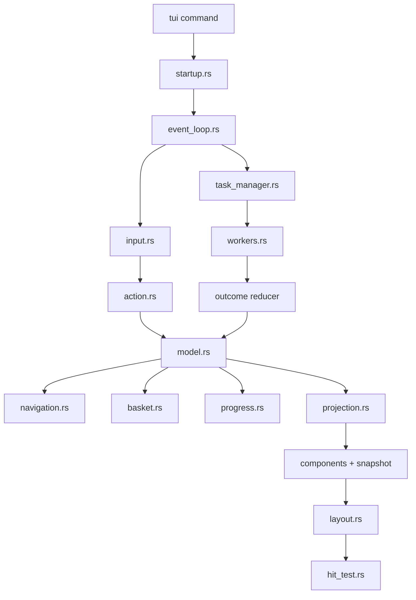
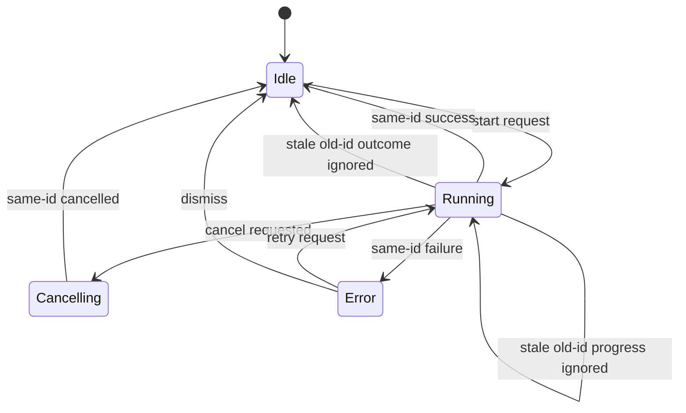
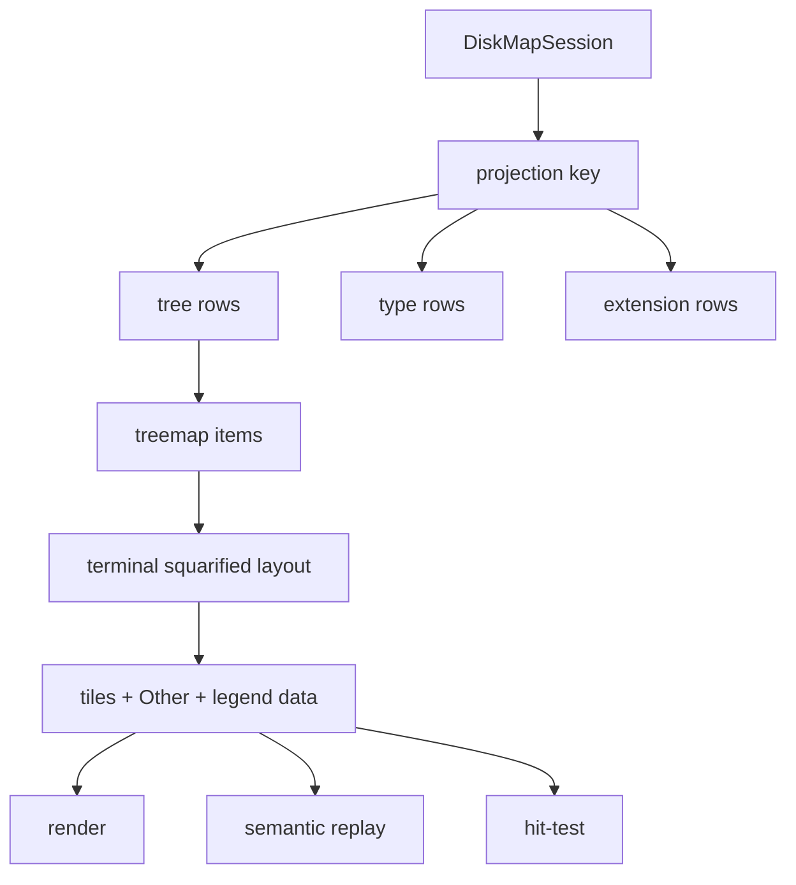

# TUI Workbench Architecture Refactor - Plan

## Goal Capsule

| Field | Decision |
|---|---|
| Objective | Refactor Rebecca's TUI into a cleaner WizTree-class workbench architecture without preserving transitional internal APIs. |
| Authority | User request: fearless refactor, breaking internal changes allowed, delete unnecessary code, keep moving from plan to goal-based implementation. |
| Execution profile | Code implementation with characterization coverage around current TUI behavior, focused unit tests for extracted boundaries, and workspace verification before landing. |
| Stop conditions | Stop only for cleanup-safety contradictions, terminal backend limits that invalidate the semantic input model, or verification failures that reveal product-scope decisions rather than implementation defects. |
| Landing | Commit incrementally with conventional commits when a complete refactor unit is green; main-branch landing is allowed by current repo preference. |

---

## Product Contract

### Summary

This plan turns the existing working TUI into a maintainable high-performance workbench: the state machine, row projections, layout/hit-test geometry, task runtime, treemap layout, and replay test surface become separate typed modules.
The user-visible TUI keeps Map, Treemap, Types, Extensions, refresh, mouse selection, safe cleanup preview, typed confirmation, and history, while the internal shape can break freely to remove first-generation scaffolding.

### Problem Frame

Rebecca's TUI already works, but the implementation is still concentrated in a few broad modules.
`crates/rebecca/src/tui/app.rs` owns screen state, navigation, selection, search, cleanup basket, preview/execution, history, progress, retry, task ids, and all input handlers.
`crates/rebecca/src/tui/view.rs` owns render, snapshot, layout, hit testing, formatting, style, and fixture tests.
`crates/rebecca/src/tui/task.rs` has task ids and stale-result checks, but the worker lifecycle, progress bridge, unbounded channel, and outcome application are still one module.

That shape is acceptable for an MVP but not for the "best disk cleaner CLI" target.
Future features such as richer treemap drilldown, command palette, capability-aware disabled actions, larger top-N views, semantic mouse replay, and background browsing need cleaner boundaries now.

### Requirements

**Architecture and ownership**

- R1. TUI state is split into narrow modules for model, actions/input, navigation, basket/cleanup requests, progress, and row projection.
- R2. Rendering, layout, hit testing, snapshot, theme, and formatting are separated so geometry and accessibility behavior cannot drift.
- R3. Background work is owned by a `TuiTaskManager`-style boundary with explicit request, task kind, task id, progress update, outcome, cancellation, stale-result, and join semantics.
- R4. The synchronous `--once` / replay path and the interactive background path share outcome application and error handling instead of duplicating behavior.
- R5. Transitional APIs and dead compatibility fields are deleted when the replacement boundary exists; no dead-code allowances are added for unfinished TUI scaffolding.

**Performance and responsiveness**

- R6. Visible rows, distribution rows, and treemap items use an invalidation-aware projection layer instead of recomputing and cloning full `Vec`s from every render, snapshot, hit-test, and selection lookup.
- R7. High-frequency progress events are coalesced or bounded so a large scan cannot backlog the UI behind thousands of stale file-measured events.
- R8. The TUI keeps the current blocking filesystem worker model; no async runtime is introduced unless implementation uncovers a non-blocking external IO surface.

**User experience**

- R9. The layout model adapts to narrow and wide terminals, using side-by-side detail panes only when there is enough width and stacked layouts otherwise.
- R10. Header, status, and help surfaces expose enough commands without long single-line truncation, including safe cleanup state and active task status.
- R11. Treemap V2 improves the current binary split layout toward a terminal-friendly squarified treemap with stable semantic color categories, an `Other` tile, legend/detail support, and deterministic geometry.
- R12. Mouse support remains semantic and non-destructive: clicks and wheel gestures select, switch, and scroll, but cannot execute cleanup or bypass typed confirmation.

**Contracts and tests**

- R13. Existing TUI keyboard, screen-reader, no-color, terminal-width, non-TTY, and snapshot behavior remains covered during the refactor.
- R14. Semantic replay expands beyond key tokens so CI can exercise click tab, click row, click treemap tile, and wheel scenarios without raw terminal coordinates.
- R15. The TUI consumes or shares current CLI capability/rule/config contract data through typed in-process APIs when showing supported actions; it does not shell out or parse human/JSON output.
- R16. README, CHANGELOG, current-state docs, and the Rebecca disk-cleaner skill describe the architecture-relevant TUI behavior and the human-vs-automation boundary.

### Acceptance Examples

- AE1. Given a scanned fixture, when Map, Treemap, Types, and Extensions render at 60, 80, 100, and 120 columns, then every snapshot line is bounded and details do not overlap the main content.
- AE2. Given the same fixture, when a test hit-tests a rendered row or tile through the layout model, then the selected semantic item matches what render and snapshot show.
- AE3. Given thousands of file-measured progress updates before a final scan result, when the task manager is polled, then the UI observes the latest meaningful progress and the final outcome without processing an unbounded backlog.
- AE4. Given a stale scan or refresh outcome from an old task id, when a newer session is already active, then the old outcome cannot mutate session, preview, execution, history, selection, or message state.
- AE5. Given semantic replay input for click tab, click row, click tile, and wheel, when it runs in headless mode, then the same app-state transitions occur as interactive mouse input.
- AE6. Given a cleanup preview or confirmation screen, when semantic mouse events are replayed, then no `Execute` effect is emitted and typed confirmation remains required.
- AE7. Given `rebecca capabilities` says a command is mutating or unsupported on the current platform, when the TUI renders action hints, then the corresponding action is labeled or disabled consistently with the shared capability model.

### Scope Boundaries

- In scope: internal TUI module split, projection caching, shared layout and hit-test contracts, task-manager refactor, progress coalescing, semantic replay, treemap V2, narrow-terminal polish, docs, changelog, skill updates, and deletion of obsolete transitional code.
- In scope: breaking internal Rust APIs under `crates/rebecca/src/tui/` and adjacent in-process service seams when tests prove the cleaner contract.
- Deferred to follow-up work: command palette, persisted TUI preferences, multi-select cleanup, restore-from-history UI, daemon or remote watch mode, GUI packaging, and custom rule editing inside the TUI.
- Outside this product's identity: a separate `rebecca-tui` binary, direct deletion from a mouse click, parsing CLI text or JSON to drive the TUI, adding Tokio only for cosmetic architecture, or treating TUI snapshots as stable machine APIs.

---

## Planning Contract

### Key Technical Decisions

- KTD1. Split `TuiApp` by ownership, not by screen.
  Screen-specific modules alone would preserve the current broad mutation surface.
  The useful seams are model state, input/actions, navigation, basket/cleanup request building, progress reduction, and row projections.
- KTD2. Make row projections a first-class cache.
  Current calls to `visible_rows()` and `distribution_rows()` allocate repeatedly across render, snapshot, hit-test, and selection.
  A projection cache keyed by session generation, current parent, screen, sort, and search state keeps the UI responsive as entry limits grow.
- KTD3. Make layout the source of geometry truth.
  Render and hit-test must consume the same layout model.
  This prevents narrow-terminal changes, screen-reader options, or future panes from causing "visible but not clickable" bugs.
- KTD4. Keep blocking workers and improve task ownership.
  Disk scanning, MFT work, filesystem deletion, and cleanup planning are blocking IO or CPU work.
  A synchronous worker manager with bounded/coalesced progress fits Rebecca's existing `CliRuntime`, cancellation token, and Rayon posture better than introducing Tokio now.
- KTD5. Centralize outcome application.
  `run_interactive` and `--once` / replay currently apply effects through different paths.
  The refactor should make scan, refresh, preview, execute, error, retry, and history update flow through one reducer-style outcome API.
- KTD6. Upgrade treemap as a presentation algorithm only.
  Treemap layout stays TUI-local because it is terminal geometry, not domain state.
  It consumes projected rows and returns deterministic tiles with selection metadata, labels, percentages, and `Other` aggregation.
- KTD7. Expand replay semantically, not by raw coordinates.
  CI should replay `click:tab:treemap`, `click:row:2`, `click:tile:3`, and `wheel:down` style actions.
  Raw coordinate replay would couple tests to terminal dimensions and make layout refactors brittle.
- KTD8. Use typed capability data in-process.
  The new CLI capability and schema modules are useful product contracts.
  The TUI should share those structs or their in-process sources for action availability instead of shelling out to `rebecca capabilities`.

### High-Level Technical Design

### Assumptions

- The current TUI behavior is the characterization baseline unless this plan calls out an intentional break.
- A single active mutating task remains the product contract for this refactor; internal task types prepare future concurrency without exposing multiple simultaneous cleanup jobs.
- Progress coalescing may drop intermediate file-level updates but must never drop final outcomes, cancellation, warnings, or terminal error states.
- Squarified treemap geometry should improve visual quality but remain bounded and deterministic for terminal cells.
- Capability-aware hints can start with in-process feature/platform/safety metadata and do not need a full plugin-style action registry in this plan.

### System-Wide Impact

- `crates/rebecca/src/tui/app.rs` should shrink into a coordinator or be replaced by narrower modules.
- `crates/rebecca/src/tui/view.rs` should stop owning layout and hit-test details directly.
- `crates/rebecca/src/tui/task.rs` should become a task-manager boundary plus worker/progress submodules.
- `crates/rebecca/src/tui/mod.rs` should become command dispatch and delegate startup, replay, and event-loop behavior.
- `crates/rebecca/src/capabilities.rs` may need a small public in-process report seam so TUI can reuse the same capability facts as the CLI command.
- Existing CLI machine contracts remain protected; this plan changes TUI internals and human TUI rendering, not JSON/NDJSON payload schemas unless capability data needs an additive field.

### Risks & Dependencies

| Risk | Mitigation |
|---|---|
| Splitting `TuiApp` can produce mechanical churn without real clarity. | Split by mutation ownership and require each module to gain focused tests or delete code. |
| Projection caching can go stale after refresh, search, sort, or parent navigation. | Use explicit generation keys and add invalidation tests for every state dimension. |
| Shared layout may make render code more abstract. | Keep layout structs small and concrete; render components consume named rects instead of reconstructing constraints. |
| Progress coalescing can hide useful detail. | Preserve latest current path, counters, cache stats, phase, cancellation, and final outcomes; drop only redundant intermediate file events. |
| Task-manager refactor can regress replay behavior. | Centralize outcome application and run focused replay tests after each unit. |
| Treemap V2 can become too complex for terminal value. | Keep the algorithm pure, bounded, deterministic, and covered by geometry tests; details pane remains authoritative. |
| Capability-aware hints can couple TUI to CLI renderer code. | Expose data producers separately from CLI printing and keep TUI away from output envelopes. |

### Sources & Research

- `docs/plans/2026-07-07-002-feat-tui-cleanup-workbench-plan.md` established the original TUI product contract and safety-first cleanup workflow.
- `docs/plans/2026-07-07-003-feat-tui-distribution-refresh-plan.md` added distribution views, refresh, and early task identity.
- `docs/plans/2026-07-07-004-feat-tui-treemap-mouse-plan.md` added Treemap and semantic mouse support.
- `crates/rebecca/src/tui/app.rs` is the broad state and input handler module targeted by this refactor.
- `crates/rebecca/src/tui/view.rs` is the current render/snapshot/layout/hit-test concentration point.
- `crates/rebecca/src/tui/task.rs` is the current background worker and progress bridge.
- `crates/rebecca/src/tui/treemap.rs` contains the current binary split treemap layout and tests.
- `crates/rebecca/tests/cli_tui.rs` is the integration test surface for no-TTY, replay, width, screen-reader, and snapshot behavior.
- `repo-ref/dua-cli/src/interactive` supports the terminal-disk-tool pattern of keeping app state, event loop, widgets, and cleanup markers separated.
- `repo-ref/dust/src/display.rs` supports width-aware text and screen-reader-first terminal output as a useful counterweight to visual flourish.
- `repo-ref/edirstat` supports the product behavior of treemap selection plus close detail context; use behavior ideas only and do not copy code.
- `repo-ref/czkawka/czkawka_cli/src/progress.rs` supports a separate progress presentation bridge for long-running cleanup/scanning tasks.

---

## Implementation Units

### U1. Extract TUI model, input, navigation, basket, and progress reducers

- **Goal:** Replace the monolithic `TuiApp` mutation surface with narrow ownership modules while preserving current behavior.
- **Requirements:** R1, R4, R5, R12, R13
- **Dependencies:** None
- **Files:** `crates/rebecca/src/tui/app.rs`, `crates/rebecca/src/tui/model.rs`, `crates/rebecca/src/tui/input.rs`, `crates/rebecca/src/tui/action.rs`, `crates/rebecca/src/tui/navigation.rs`, `crates/rebecca/src/tui/basket.rs`, `crates/rebecca/src/tui/progress.rs`, `crates/rebecca/src/tui/mod.rs`, `crates/rebecca/tests/cli_tui.rs`
- **Approach:** Move `TuiScreen`, key/mouse input, effects, cleanup basket item logic, confirmation phrase, navigation helpers, and progress reduction into focused modules.
  Keep a small `TuiApp` facade only if it materially simplifies call sites.
  Delete duplicated state-reset helpers after the reducers own those transitions.
- **Execution note:** Characterize key journeys and cleanup confirmation before moving the mutation code.
- **Patterns to follow:** Current `handle_key`, `handle_mouse_action`, `apply_task_progress`, `toggle_selected_rule`, `workbench_request`, and `confirmation_phrase` behavior.
- **Test scenarios:** Existing replay journeys still pass. Pure reducer tests cover tab cycling, search edit/commit/cancel, map and distribution selection clamp, cleanup staging/unstaging, confirmation phrase with spaces, retry from error, and Busy/Help return behavior. Mouse action tests prove selection and tab switching do not emit cleanup execution. Progress reducer tests cover scan, cleanup cache, execution finished, cancellation, and backend fallback events.
- **Verification:** `cargo nextest run -p rebecca --test cli_tui --locked` passes after extraction and focused module tests cover moved behavior.

### U2. Add projection cache for tree, distribution, and treemap rows

- **Goal:** Make row derivation explicit, cached, and invalidation-safe.
- **Requirements:** R6, R11, R13
- **Dependencies:** U1
- **Files:** `crates/rebecca/src/tui/projection.rs`, `crates/rebecca/src/tui/model.rs`, `crates/rebecca/src/tui/view.rs`, `crates/rebecca/src/tui/treemap.rs`, `crates/rebecca/tests/cli_tui.rs`
- **Approach:** Introduce projection keys from session generation, current parent, active screen, sort, search text, entry limit, and distribution kind.
  Cache visible rows, selected row, distribution rows, selected distribution row, and treemap item input.
  Invalidate on scan, refresh, restore, navigation, sort, search, and view-mode changes.
- **Execution note:** Add invalidation tests before replacing direct `visible_rows()` and `distribution_rows()` callers.
- **Patterns to follow:** Current `DiskMapSession::visible_rows`, `DiskMapSession::distribution_rows`, `selected_row`, `selected_distribution_index`, and `treemap_tiles` conversion.
- **Test scenarios:** Repeated render/snapshot/hit-test calls for unchanged state reuse the same projection generation. Changing search invalidates only the active row family. Changing sort invalidates all row families. Changing current parent invalidates tree and treemap rows. Refresh increments generation and invalidates everything. Selecting a row does not rebuild projections. Empty sessions and missing distribution kinds return empty projections without panics.
- **Verification:** Focused projection tests pass and TUI snapshots remain stable except for intentional text improvements.

### U3. Split layout, hit-test, snapshot, theme, and components

- **Goal:** Make layout a shared contract for rendering, hit testing, and headless snapshots.
- **Requirements:** R2, R9, R10, R12, R13
- **Dependencies:** U1, U2
- **Files:** `crates/rebecca/src/tui/view.rs`, `crates/rebecca/src/tui/layout.rs`, `crates/rebecca/src/tui/hit_test.rs`, `crates/rebecca/src/tui/snapshot.rs`, `crates/rebecca/src/tui/theme.rs`, `crates/rebecca/src/tui/format.rs`, `crates/rebecca/src/tui/components.rs`, `crates/rebecca/tests/cli_tui.rs`
- **Approach:** Move geometry into a `LayoutModel` that names header, content, status, table, details, treemap, and overlay rects.
  Render and hit-test consume that model.
  Add responsive constraints: wide terminals use side-by-side details, narrow terminals stack details below content, and status/help text wraps into bounded command segments.
  Move trim, byte bar, advice label, basket label, and styles out of `view.rs`.
- **Execution note:** Start with layout contract tests for current geometry, then intentionally update expectations for narrow layout.
- **Patterns to follow:** Current `screen_chunks`, `map_details_chunks`, `header_tab_rects`, `hit_map_row`, `hit_distribution_row`, `hit_treemap_tile`, `snapshot_*`, `byte_bar`, and `trim_to_width`.
- **Test scenarios:** Header tab rects match rendered tab labels. A map row coordinate maps to the rendered row after wide and narrow layout. Distribution and treemap hit tests use the same table/tile rects as render. 60, 80, 100, and 120 column snapshots stay within width. Screen-reader snapshots omit visual bars. No-color snapshots keep textual selected state. Status text is segmented or wrapped instead of relying on one long truncated line.
- **Verification:** View unit tests and `cli_tui` width/screen-reader tests pass.

### U4. Replace ad hoc workers with `TuiTaskManager`

- **Goal:** Centralize task start, poll, cancel, join, progress coalescing, stale-result handling, retry, and outcome application.
- **Requirements:** R3, R4, R7, R8, R13
- **Dependencies:** U1
- **Files:** `crates/rebecca/src/tui/task.rs`, `crates/rebecca/src/tui/task_manager.rs`, `crates/rebecca/src/tui/task_message.rs`, `crates/rebecca/src/tui/progress_bridge.rs`, `crates/rebecca/src/tui/workers.rs`, `crates/rebecca/src/tui/event_loop.rs`, `crates/rebecca/src/tui/replay.rs`, `crates/rebecca/src/tui/mod.rs`, `crates/rebecca/tests/cli_tui.rs`
- **Approach:** Define task requests and outcomes for scan, refresh, preview, and execute.
  Keep one active mutating task, but make the policy explicit.
  Replace the unbounded progress stream with a coalescing bridge that always preserves final outcomes and important state changes.
  Make replay/synchronous mode call the same outcome application path as the interactive task manager.
- **Execution note:** Add task lifecycle tests before replacing the current `ActiveTask` API.
- **Patterns to follow:** Current `ActiveTask`, `TaskMessage`, `TaskOutcome`, `scan_session_with_progress`, `progress_sender`, `plan_progress_sender`, `run_interactive`, and `handle_effect`.
- **Test scenarios:** Starting a second mutating task while one is active leaves the active task status intact and reports a clear message. Cancelling sets cancel-requested state, joins the worker, and returns to the right screen. A disconnected worker reports an error with retry when appropriate. Stale progress and stale outcomes cannot mutate app state. Execute history updates exactly once. Replay preview/execute errors match interactive error handling. A flood of file progress events coalesces into the latest visible progress and final outcome.
- **Verification:** Focused task-manager tests pass and existing TUI replay tests remain green.

### U5. Implement Treemap V2

- **Goal:** Replace the simple binary split treemap with a higher-quality deterministic terminal treemap.
- **Requirements:** R11, R12, R13
- **Dependencies:** U2, U3
- **Files:** `crates/rebecca/src/tui/treemap.rs`, `crates/rebecca/src/tui/projection.rs`, `crates/rebecca/src/tui/components.rs`, `crates/rebecca/src/tui/theme.rs`, `crates/rebecca/src/tui/snapshot.rs`, `crates/rebecca/tests/cli_tui.rs`
- **Approach:** Implement a terminal-friendly squarified layout that groups rows into strips with bounded aspect ratios, aggregates trimmed rows into an `Other` tile, and exposes tile percent, semantic color category, label visibility, and selected state.
  Keep all geometry pure and deterministic.
  Use the detail pane and snapshot rows for small tiles instead of forcing labels into unreadable cells.
- **Execution note:** Implement the pure treemap module test-first and keep old tests as behavior constraints where still meaningful.
- **Patterns to follow:** Current `layout_treemap` tests, current treemap render/snapshot behavior, and disk-usage treemap selection principles from `repo-ref/edirstat`.
- **Test scenarios:** Empty and zero-byte input returns no tiles. Tiles stay inside the requested area and do not overlap. Large items get larger area than small items in representative fixtures. Aspect ratios improve over the binary split baseline for skewed data. `Other` aggregates trimmed positive-size rows and is not selectable as a cleanup target. Very narrow areas degrade without panics. Stable input produces stable geometry. Snapshot includes rank, percent, size, label, and selected marker without visual bars in screen-reader mode.
- **Verification:** Treemap unit tests and Treemap replay snapshots pass.

### U6. Add semantic replay and capability-aware TUI hints

- **Goal:** Make mouse and capability behavior testable without raw terminal coordinates or CLI output parsing.
- **Requirements:** R14, R15, R12, R13
- **Dependencies:** U3, U4
- **Files:** `crates/rebecca/src/tui/replay.rs`, `crates/rebecca/src/tui/input.rs`, `crates/rebecca/src/tui/hit_test.rs`, `crates/rebecca/src/tui/model.rs`, `crates/rebecca/src/capabilities.rs`, `crates/rebecca/src/tui/capabilities.rs`, `crates/rebecca/tests/cli_tui.rs`, `crates/rebecca/tests/cli_api.rs`
- **Approach:** Add a semantic replay input path for tests and hidden CI use.
  Replay tokens should target semantic regions rather than raw coordinates, then go through the same app/action boundary as real input.
  Expose an in-process capability report or capability facts provider so TUI hints can reflect platform support, mutating commands, safety model, and schema availability without invoking the CLI.
- **Execution note:** Prove that semantic replay cannot emit `Execute` from mouse-like actions before wiring additional hints.
- **Patterns to follow:** Current `replay_token_to_key`, current `view::hit_test`, `capabilities_report`, and CLI API capability tests.
- **Test scenarios:** Semantic replay switches to Treemap by tab name, selects map row 2, selects treemap tile 3, selects extension row 1, and scrolls active selection. Replay rejects unknown semantic targets clearly. Mouse-like replay on Preview and Confirm cannot execute cleanup. TUI capability hints match `capabilities` command facts for mutating commands and current platform cleanup support. Capability output schema tests remain valid.
- **Verification:** `cli_tui` semantic replay tests and `cli_api` capability tests pass.

### U7. Documentation, changelog, skill, and final deletion pass

- **Goal:** Update user-facing guidance and remove obsolete architecture leftovers.
- **Requirements:** R5, R10, R16
- **Dependencies:** U1, U2, U3, U4, U5, U6
- **Files:** `README.md`, `CHANGELOG.md`, `docs/knowledge/engineering/current-state.md`, `skills/rebecca-disk-cleaner/SKILL.md`, `skills/README.md`, `crates/rebecca/src/tui/`, `crates/rebecca/tests/cli_tui.rs`
- **Approach:** Document the modern TUI layout, semantic replay as a CI-only test surface if exposed, safe mouse semantics, and the distinction between TUI for humans and JSON/NDJSON for automation.
  Run a deletion-oriented cleanup over old helpers, duplicated reducers, obsolete direct row methods, and transitional module exports.
  Keep the changelog entry in Unreleased.
- **Patterns to follow:** Existing README TUI section, changelog Unreleased style, and Rebecca disk-cleaner skill language.
- **Test scenarios:** README help snippets match live `tui --help`. Skill validation passes. No docs recommend scripting against TUI snapshots. `rg` finds no stale module names or unused transitional functions. Clippy reports no dead code or unused exports.
- **Verification:** Docs checks, skill validation, and full workspace quality gates pass.

---

## Verification Contract

| Gate | Applies to | Done signal |
|---|---|---|
| `cargo fmt --all -- --check` | All Rust units | Formatting is stable. |
| `cargo clippy --workspace --all-targets -- -D warnings` | All Rust units | No warnings, no dead code, no unused transitional APIs. |
| `cargo nextest run -p rebecca --test cli_tui --locked` | U1-U7 | TUI integration behavior, replay, snapshots, width, non-TTY, and screen-reader checks pass. |
| `cargo nextest run -p rebecca --test cli_api --locked` | U6 | Capability/API schema behavior remains valid. |
| `cargo nextest run --workspace --locked` | All units | Workspace tests pass. |
| `cargo deny check` | Dependency and policy surface | No new advisory, source, ban, or license failure is introduced. |
| `cargo run -p rebecca --locked -- tui --once --screen-reader --terminal-width 80 --root . --replay-keys 4` | U3, U5, U7 | Headless Treemap frame renders bounded text without visual bars. |
| `cargo run -p rebecca --locked -- tui --help` | U6, U7 | Help remains human-focused and does not expose hidden CI-only internals unless intentionally documented. |
| `python skills/validate.py skills/rebecca-disk-cleaner/SKILL.md` | U7 | Rebecca skill remains valid. |
| `git diff --check` | All units | Patch hygiene is clean. |

---

## Definition of Done

- TUI state, input/actions, navigation, basket, progress, projections, layout, hit-test, task manager, replay, and treemap are separated into clear modules with focused tests.
- `app.rs`, `view.rs`, `task.rs`, and `mod.rs` no longer concentrate unrelated responsibilities.
- Rendering and hit testing share one layout contract across wide and narrow terminals.
- Row projections avoid repeated full-row allocation across render, snapshot, hit-test, and selection when the relevant state has not changed.
- Background workers use explicit task manager semantics, bounded or coalesced progress, stale-result rejection, cancellation, join, retry, and shared outcome application.
- Treemap V2 provides deterministic terminal-friendly squarified layout, `Other` aggregation, stable semantic styling, accessible snapshots, and non-destructive selection.
- Semantic replay covers keyboard-equivalent and mouse-equivalent interactions without raw coordinate brittleness.
- TUI action hints can reuse current capability facts through typed in-process APIs rather than CLI output parsing.
- README, CHANGELOG, current-state docs, and the Rebecca disk-cleaner skill explain the updated TUI behavior and automation boundary.
- Obsolete first-generation TUI helpers and transitional compatibility code are removed.
- Every Verification Contract gate passes before final landing.
