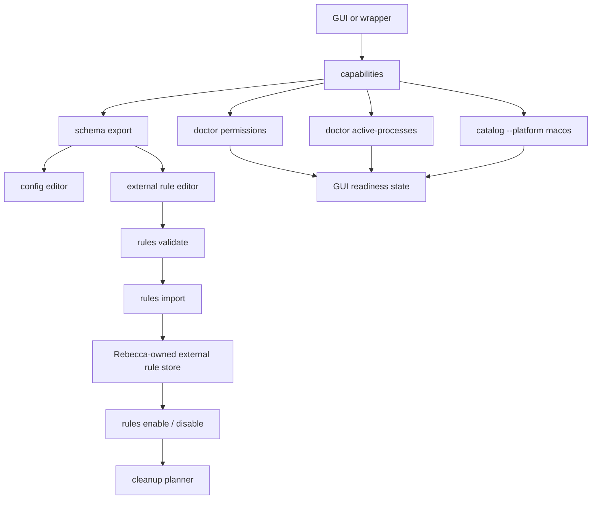
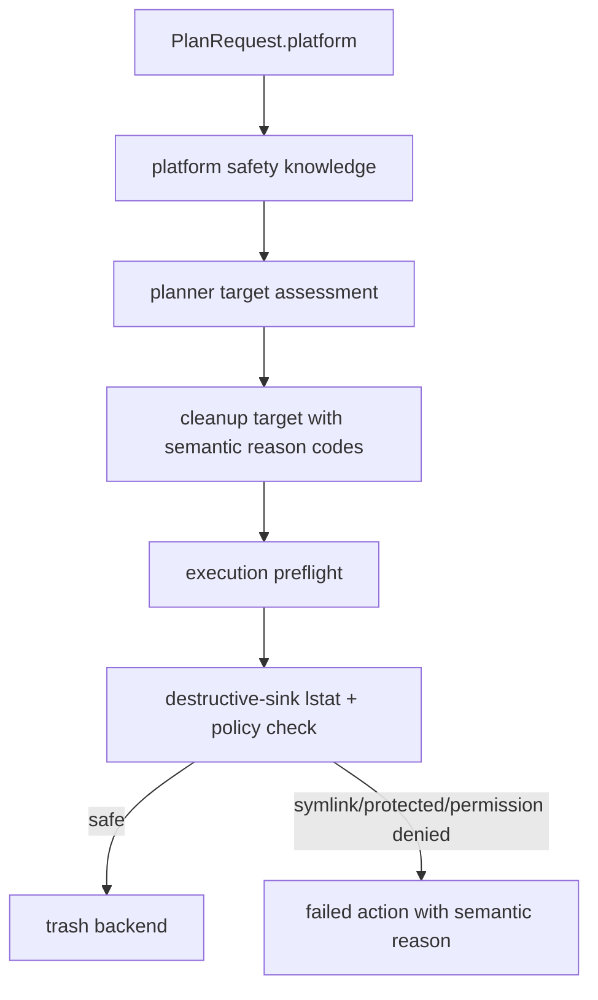

# macOS GUI Release Readiness Refactor - Plan

## Goal Capsule

| Field | Value |
|---|---|
| Objective | Finish the v0.2.0 macOS release-readiness work by making permission failures, GUI contracts, external rule management, macOS safety hardening, rule coverage, and release evidence explicit and testable. |
| Authority | The user's "fearless refactor, break if needed, delete unneeded code" direction outranks unreleased compatibility. Deletion safety, license safety, machine-contract stability, and macOS privacy correctness outrank preserving narrow helper APIs. |
| Execution profile | Deep Rust and CI refactor across `rebecca-core`, `rebecca`, `rebecca-rules`, CLI API v1 schemas/examples, release workflows, docs, and macOS rule manifests. |
| Stop conditions | Stop if a change weakens protected-path enforcement, makes imported external rules executable without explicit enablement, copies GPL source/rule data from `repo-ref/Mole`, or recommends `sudo` as a macOS TCC workaround. |
| Tail ownership | The active goal executes this plan to its Definition of Done, with progress tracked in git commits and task state rather than by editing this plan. |

---

## Product Contract

### Summary

Rebecca's macOS support is already functional, but the GUI-facing and release-facing contracts still need to be stronger before v0.2.0.
This plan turns macOS readiness from "rules exist and tests pass" into stable machine contracts: permission failures have semantic reason codes, `doctor permissions` gives GUI-ready preflight data, `capabilities` advertises platform workflows, external rules can be safely managed without silently enabling risky targets, execution closes symlink/TOCTOU gaps, and release gates prove macOS behavior outside ordinary PR CI.

### Problem Frame

The current `main` already includes macOS semantic roots, a canonical safety data crate, macOS cleanup rules, macOS CI smoke, `rules validate`, `schema export`, and GUI-oriented `capabilities`.
The remaining risk is not basic platform enablement.
It is contract drift and safety ambiguity around the surfaces a GUI or custom-rule workflow will depend on.

`doctor permissions` reports a macOS privacy block, but it does not yet tell a GUI which cleanup families are affected or expose stable action kinds.
The scanner can classify `PermissionDenied`, but several workflows collapse it to generic text or fail the whole command instead of producing target-level diagnostics.
`capabilities` reports command names and payload kinds, but not platform availability, preflight order, required flags, or schema coverage.
External rules are validate-only, which is safe, but GUI customization needs a local store, provenance, disabled-by-default semantics, and stricter target-shape validation before any import/enable command exists.
The safety model also needs a public-API audit so default safety knowledge follows `PlanRequest.platform` instead of accidentally inheriting Windows defaults.

`repo-ref/Mole` is GPL-licensed reference material.
Rebecca may borrow safety posture lessons such as preview-first cleanup, TCC preflight, bounded deletion, and reviewable protected paths, but must not copy Mole code, rule files, fixtures, exact strings, or data.

### Requirements

**macOS permission and failure semantics**

- R1. Permission-denied scan and execution failures must surface stable machine-readable reason codes instead of relying on error strings.
- R2. Rules, project artifacts, and app-leftover workflows must handle single-target permission failures consistently as target-level diagnostics unless the discovery root itself is unusable.
- R3. Human cleanup output must point permission failures at `rebecca doctor permissions`, while macOS advice must continue to reject `sudo` as a TCC or Full Disk Access workaround.
- R4. `doctor permissions` must expose GUI-ready macOS privacy preflight data, including stable action kind, affected cleanup families, probe status, and whether Full Disk Access may be relevant.

**GUI CLI contract**

- R5. `capabilities` must advertise platform availability, recommended GUI preflight commands, command schema relationships, mutating/default-preview facts, required opt-ins, and macOS permission preflight relevance.
- R6. `schema export` must cover the schemas a GUI needs to validate config editing and external cleaner manifests, not only envelope/event/error/payload schemas.
- R7. CLI API v1 docs, examples, and schema tests must fail on contract drift between `capabilities`, `schema export`, payload kind enums, and live command output.

**External rule customization**

- R8. External rule import must remain safe by default: validation and import do not enable execution, imported manifests are copied into Rebecca-owned storage with provenance and hash metadata, and enablement requires an explicit command.
- R9. External rule targets must be stricter than today's positive-basis string checks: no relative paths, no unknown variable syntax, no unwrapped `MACOS_CACHE_HOME`-style placeholders, and no arbitrary absolute path that only happens to contain words such as `cache`.
- R10. Imported external rules must be revalidated against the current platform safety knowledge before planning or execution, even if they validated at import time.

**macOS destructive-sink hardening**

- R11. Public planning/execution APIs must derive default safety knowledge from `PlanRequest.platform` or require an explicit platform safety policy, so macOS/Linux callers cannot silently use Windows safety defaults.
- R12. Cleanup execution must perform a final symlink/reparse-like and protection-policy check at the destructive sink boundary.
- R13. A symlink or path-replacement race between planning and execution must fail closed and must not hand the substituted path to the trash backend.

**macOS coverage and release evidence**

- R14. Add only high-confidence user-owned macOS cache rules before v0.2.0, prioritizing Homebrew, CocoaPods, and Xcode cache/build-artifact leaves while avoiding archives, device backups, app configuration, Keychain, Mail, Messages, Safari private data, Containers data, and Group Containers data.
- R15. macOS smoke coverage must include negative safety fixtures for private/durable `~/Library` leaves and positive fixtures for any new macOS rule family.
- R16. Release gates and release preflight must include macOS cleanup smoke evidence; Windows archive smoke remains Windows-only until Unix release archives are intentionally shipped.
- R17. Release and rule-authoring docs must describe macOS evidence, GUI preflight, external rule trust boundaries, and GPL reference hygiene.

### Acceptance Examples

- AE1. Given a macOS dry-run target whose scan returns `PermissionDenied`, when `clean --format json` runs, then the command returns a cleanup plan with a target-level permission reason code and a `doctor permissions` hint instead of only a generic `scan-failed` string.
- AE2. Given an app-leftover or project-artifact candidate that becomes unreadable during measurement, when the plan is built, then only that target is marked failed/skipped and sibling targets remain visible in the plan.
- AE3. Given `rebecca doctor permissions --format json` on macOS, when a privacy probe is permission-denied, then `macos_privacy` includes `likely-blocked`, a stable action kind, affected cleanup families, and no recommendation to rerun with `sudo`.
- AE4. Given `rebecca capabilities --format json`, when a GUI reads command metadata, then it can discover the recommended macOS preflight sequence, which commands mutate files, which commands support NDJSON, and which schema documents validate config and cleaner manifests.
- AE5. Given an external manifest containing `MACOS_CACHE_HOME/Example`, `%UNKNOWN_CACHE_HOME%/Example`, `relative/cache`, or `/Users/alice/Documents/cache-of-tax-records`, when `rules validate` or `rules import` runs, then the manifest is rejected with structured diagnostics.
- AE6. Given an imported external rule, when the user lists rules, then it is visible with source path, stored hash, platforms, warnings, and `enabled=false`; it does not participate in cleanup planning until explicitly enabled.
- AE7. Given an allowed macOS target is replaced by a symlink after planning but before execution, when `clean --yes` runs through a test trash backend, then execution fails closed before the backend receives the substituted path.
- AE8. Given macOS smoke fixtures include `Local Storage`, `IndexedDB`, `Keychains`, and `Containers/.../Data`, when dry-run JSON is inspected, then none are allowed cleanup targets.
- AE9. Given Release Gates is run before v0.2.0, when the workflow completes, then Windows release gates and macOS cleanup smoke both appear as release-candidate evidence.

### Scope Boundaries

- This plan does not ship macOS release archives or installers; the current release artifact path remains Windows-focused unless a separate release-distribution plan changes it.
- This plan does not add native TCC database reads, AppleScript automation, Settings automation, `tccutil`, `launchctl`, or macOS permission mutation.
- This plan does not clean Safari history, browser credentials, Mail, Messages, Photos, Keychain, app preferences, Containers data, Group Containers data, iOS device backups, Xcode Archives, or device support payloads.
- This plan does not make external community rules trusted by default; imported rules are local user intent and remain subject to Rebecca safety policy.
- This plan does not copy Mole code, fixtures, exact rule data, or user-facing strings.
- This plan may break unreleased CLI/API details where doing so removes ambiguity before v0.2.0.

---

## Planning Contract

### Key Technical Decisions

- KTD1. Promote permission failures into cleanup target semantics.
  Stable reason codes let GUI and human output respond consistently; string parsing is not a release contract.
- KTD2. Make workflow degradation target-scoped where possible.
  A single unreadable cache leaf should not hide the rest of the cleanup plan; root discovery failures remain command-level when no trustworthy target list exists.
- KTD3. Treat `capabilities` as the GUI's startup contract.
  A GUI should not infer preflight order, schema coverage, platform support, or mutating behavior from docs or CLI help text.
- KTD4. Add external rule management as a disabled-by-default local store, not as direct execution from arbitrary paths.
  Copying validated manifests into Rebecca-owned storage with provenance and hash metadata makes trust, revocation, and revalidation visible.
- KTD5. Tighten external target-shape validation before enabling import.
  Once custom rules can be stored, positive cleanup basis must be structural and platform-rooted, not a broad substring heuristic.
- KTD6. Move safety derivation to the plan/request platform boundary.
  Public API callers should get macOS safety for macOS requests without having to remember a separate injected policy object.
- KTD7. Recheck at the destructive sink.
  Planning-time and execution-start checks reduce risk, but the trash backend boundary is the last place to catch symlink replacement or path races.
- KTD8. Use Mole only for threat-model vocabulary.
  Mole's GPL license forbids copying implementation or rule material into Rebecca; the only load-bearing borrowing is the safety posture that destructive operations must be reviewable, bounded, and preview-first.

### High-Level Technical Design

### Assumptions

- `crates/rebecca-safety` is now the canonical built-in safety data source, so this plan does not repeat the previous safety-catalog consolidation.
- `rules validate` remains useful as a standalone command after import/list/enable commands are added.
- External imported rules are local machine state and should live under Rebecca's configured state/config directories, not beside the executable or release package.
- The first external rule store can be file-backed and deterministic; database-style migration machinery is out of scope unless implementation proves it is simpler than a versioned manifest index.
- Adding a few macOS rules is in scope only when each rule has a narrow, user-owned, regenerable target and a safety regression test.

### System-Wide Impact

- CLI API v1 changes add schema fields and command payloads, so `payloads.schema.json`, examples, docs, and contract tests must change with the Rust structs.
- Planning and execution APIs become stricter around platform safety; old convenience paths that rely on default Windows safety should be removed or deprecated in favor of platform-derived constructors.
- External rule management introduces local state with provenance and hash metadata; config/state path docs and cleanup of Rebecca-owned metadata must stay clear.
- macOS rule additions affect catalog validation, safety policy tests, macOS smoke, active-process hints when applicable, and README/rule-authoring docs.
- Release workflows gain macOS evidence but should not pretend macOS install artifacts exist.

### Risks and Mitigations

| Risk | Mitigation |
|---|---|
| New reason codes break existing unreleased GUI experiments. | Break before v0.2.0 and update schema/examples/tests in the same commit. |
| External rule import creates a path to unsafe deletion. | Keep imports disabled by default, store provenance, revalidate before planning, and keep runtime safety policy authoritative. |
| Strict target-shape validation rejects legitimate custom rules. | Start conservative, document why a shape failed, and require platform-rooted variables or known safe absolute roots. |
| Sink-level revalidation still cannot eliminate every TOCTOU race. | Fail closed on symlinks/reparse-like paths and permission errors at the last Rebecca-controlled boundary; defer stronger quarantine/rename semantics if the backend API cannot support it cleanly. |
| macOS rule additions target durable state by mistake. | Add negative tests for nearby durable/private leaves before adding positive rule manifests. |
| Release workflows get slower. | Put macOS smoke in release gates/preflight where release evidence matters, while keeping the existing PR CI matrix as the ordinary regression net. |

### Sources and Research

- `docs/plans/2026-07-07-001-feat-macos-cleanup-platform-plan.md` established first-class macOS platform support and current scope boundaries.
- `docs/plans/2026-07-07-003-refactor-macos-platform-boundaries-plan.md` consolidated macOS path/safety foundations and created the canonical safety data crate.
- `crates/rebecca/src/info.rs` currently owns `doctor permissions`, macOS privacy probes, and active-process diagnostics.
- `crates/rebecca/src/capabilities.rs` is the current GUI capability contract and lacks platform workflow metadata.
- `crates/rebecca/src/rules_cmd.rs` is the current validate-only external rule entry point with bounded directory discovery and no symlink traversal.
- `crates/rebecca-core/src/error.rs`, `crates/rebecca-core/src/scan/portable.rs`, and planner modules already classify scan failures but do not expose permission failures consistently across workflows.
- `scripts/ci/run-macos-cleanup-smoke.sh` proves macOS behavior in PR CI but release gates/preflight do not yet require equivalent macOS evidence.
- `repo-ref/Mole` was considered only as GPL-licensed behavior reference material for safety posture, not as source code or rule data.

---

## Implementation Units

### U1. Platform-aware safety and semantic permission reasons

- **Goal:** Make platform safety and permission failure semantics first-class in core cleanup targets and execution actions.
- **Requirements:** R1, R2, R3, R11, AE1, AE2.
- **Dependencies:** None.
- **Files:** `crates/rebecca-core/src/error.rs`, `crates/rebecca-core/src/plan.rs`, `crates/rebecca-core/src/planner/mod.rs`, `crates/rebecca-core/src/planner/rules.rs`, `crates/rebecca-core/src/planner/project_artifacts.rs`, `crates/rebecca-core/src/planner/app_leftovers.rs`, `crates/rebecca-core/src/planner/measure.rs`, `crates/rebecca-core/src/executor.rs`, `crates/rebecca-core/tests/planner.rs`, `crates/rebecca-core/tests/executor_contract.rs`, `crates/rebecca/tests/cli_clean.rs`, `crates/rebecca/tests/cli_api.rs`, `docs/api/cli/v1/payloads.schema.json`.
- **Approach:** Add stable cleanup issue/action reason variants for scan permission denied and execution permission denied. Convert `RebeccaError::ScanFailed` with `ScanFailureKind::PermissionDenied` into those variants where a target already exists. Change app-leftover and project-artifact measurement loops to keep sibling targets when one measurement fails. Audit public plan/executor constructors so default safety knowledge is selected from `PlanRequest.platform` or the caller must pass an explicit policy.
- **Execution note:** Start with failing characterization tests for permission-denied target behavior before changing planner loops.
- **Patterns to follow:** Existing `CleanupTargetIssueReason` projection in `crates/rebecca-core/src/plan.rs`, scan failure classification in `crates/rebecca-core/src/error.rs`, and rule-plan target fallback handling in `crates/rebecca-core/src/planner/rules.rs`.
- **Test scenarios:** A rule target whose scan root returns `PermissionDenied` becomes a failed target with the new reason code; a project artifact measurement permission failure does not abort sibling artifact targets; an app-leftover measurement permission failure does not abort sibling leftover targets; macOS and Linux public API requests do not use Windows safety knowledge by default; schema validation accepts the new reason codes.
- **Verification:** Core planner/executor tests and CLI JSON contract tests pass with the new reason codes visible in machine output.

### U2. macOS permission preflight as GUI-ready data

- **Goal:** Extend `doctor permissions` so a GUI can present macOS readiness without scraping human text or inferring TCC behavior.
- **Requirements:** R3, R4, R7, AE3.
- **Dependencies:** U1 for shared permission reason vocabulary.
- **Files:** `crates/rebecca/src/info.rs`, `crates/rebecca/tests/info.rs`, `crates/rebecca/tests/cli_api.rs`, `docs/api/cli/v1/payloads.schema.json`, `docs/api/cli/v1/examples/success-doctor-permissions.json`, `docs/api/cli/v1/README.md`, `README.md`, `scripts/ci/run-macos-cleanup-smoke.sh`.
- **Approach:** Add a small probe abstraction so tests can inject readable, missing, unknown, and permission-denied probe outcomes. Expand `macos_privacy` with stable fields such as action kind, Full Disk Access relevance, affected cleanup families, and per-probe impact labels. Keep probes read-only and best-effort. Update human output to preserve concise guidance while keeping machine output authoritative.
- **Execution note:** Keep macOS-specific fields absent on non-macOS unless the schema is intentionally changed to `null`; do not create a platform-polymorphic payload shape without tests.
- **Patterns to follow:** `active_process_diagnostic_from_processes` in `crates/rebecca/src/info.rs` for injectable diagnostic helpers, strict schema validation in `crates/rebecca/tests/cli_api.rs`.
- **Test scenarios:** Injected permission-denied probes yield `likely-blocked` plus Full Disk Access relevance; all missing probes yield `not-probed`; mixed unknown probes yield `unknown`; human and JSON advice never recommend `sudo` as a TCC workaround; macOS CI smoke asserts `macos_privacy.status`, `probes`, and action fields.
- **Verification:** `info` and CLI API tests validate the expanded permissions payload against the schema, and the macOS smoke script proves the live command still works on a macOS runner.

### U3. GUI capability registry and schema coverage

- **Goal:** Make `capabilities` and `schema export` a stable startup contract for GUI clients.
- **Requirements:** R5, R6, R7, AE4.
- **Dependencies:** U2 for permission preflight metadata.
- **Files:** `crates/rebecca/src/capabilities.rs`, `crates/rebecca/src/schema.rs`, `crates/rebecca/src/cli.rs`, `crates/rebecca/src/main.rs`, `crates/rebecca/tests/cli_api.rs`, `docs/api/cli/v1/payloads.schema.json`, `docs/api/cli/v1/config.schema.json`, `docs/api/cli/v1/cleaner-manifest-v1.schema.json`, `docs/api/cli/v1/examples/success-capabilities.json`, `docs/api/cli/v1/examples/success-cli-schema.json`, `docs/api/cli/v1/README.md`.
- **Approach:** Introduce a single command metadata registry consumed by `capabilities` and command-contract inference where practical. Add command availability, platform support, required preflight commands, required execution opt-ins, schema document references, and input schema names. Extend `schema export` to include config and Cleaner Manifest v1 schemas. Add drift tests that every advertised schema exports and every advertised payload kind exists in the payload schema enum.
- **Execution note:** Prefer a small explicit registry over trying to reflect every `clap` detail; GUI stability matters more than exposing parser internals.
- **Patterns to follow:** Existing `CommandCapability` struct, `CliApiContract::v1` command mapping in `crates/rebecca/src/main.rs`, and schema fixture validation in `crates/rebecca/tests/cli_api.rs`.
- **Test scenarios:** `capabilities.commands[].payload_kind` all exist in `payloadKind`; `capabilities.schema_documents` all succeed through `schema export`; macOS current platform advertises `doctor permissions` as cleanup preflight; mutating commands advertise `--yes`; config and manifest schemas are valid JSON Schema documents; examples validate.
- **Verification:** CLI API tests prove live `capabilities`, exported schemas, and checked-in examples remain synchronized.

### U4. Structured config and rule validation diagnostics

- **Goal:** Give GUI editors actionable diagnostics for config validation and external rule validation.
- **Requirements:** R6, R7, R9, AE5.
- **Dependencies:** U3 for exported input schemas.
- **Files:** `crates/rebecca/src/config_cmd.rs`, `crates/rebecca/src/rules_cmd.rs`, `crates/rebecca-rules/src/lib.rs`, `crates/rebecca-core/src/manifest.rs`, `crates/rebecca/tests/cli_api.rs`, `crates/rebecca-rules/src/lib.rs`, `docs/api/cli/v1/payloads.schema.json`, `docs/api/cli/v1/README.md`, `docs/rule-authoring.md`.
- **Approach:** Add a reusable validation diagnostic projection with code, severity, message, source path, and optional field/target path. Keep command exit behavior compatible where possible, but expose diagnostics in success reports and machine error envelopes for parse/validation failures. Tighten external rule target validation so accepted targets are platform-rooted and structurally recognized rather than accepted by broad cleanup-basis substrings.
- **Execution note:** Add negative tests before changing validators; external rule strictness is a security boundary, not UX polish.
- **Patterns to follow:** Existing `rule_catalog_invalid` wrapping in `crates/rebecca/src/rules_cmd.rs`, external rule metadata validation in `crates/rebecca-rules/src/lib.rs`, and config validation report style in `crates/rebecca/src/config_cmd.rs`.
- **Test scenarios:** Unknown config fields, invalid config version, invalid scan-cache values, non-absolute protected paths, missing explicit config file, malformed TOML, symlink rule files, too-deep rule directories, unknown placeholders, relative external targets, and arbitrary absolute cache-named paths all produce structured diagnostics.
- **Verification:** CLI API tests validate diagnostic payloads, and `rebecca-rules` tests cover strict external target positive and negative cases.

### U5. External rule store and explicit enablement

- **Goal:** Add safe GUI-customization commands for imported external rules without making validation equal execution.
- **Requirements:** R8, R10, AE6.
- **Dependencies:** U3 and U4.
- **Files:** `crates/rebecca-core/src/config.rs`, `crates/rebecca-core/src/model.rs`, `crates/rebecca-core/src/planner/rules.rs`, `crates/rebecca/src/cli.rs`, `crates/rebecca/src/main.rs`, `crates/rebecca/src/rules_cmd.rs`, `crates/rebecca/tests/cli_api.rs`, `crates/rebecca/tests/common/isolated.rs`, `docs/api/cli/v1/payloads.schema.json`, `docs/api/cli/v1/README.md`, `docs/rule-authoring.md`, `README.md`.
- **Approach:** Add `rules import`, `rules list`, `rules enable`, `rules disable`, and `rules remove` around a versioned Rebecca-owned external-rule store. Import validates manifests, copies canonical TOML into storage, records source display path, content hash, imported time, rule IDs, platforms, and `enabled=false`. Planning reads enabled external rules only after revalidating the stored manifest and applying current platform safety policy. Remove and disable should be reversible in behavior and explicit in machine output.
- **Execution note:** Stage this as local state management first; do not let cleanup planning consume imported rules until enablement and revalidation tests are in place.
- **Patterns to follow:** App path storage entries in `crates/rebecca-core/src/config.rs`, history/cache file handling for versioned local state, and CLI API envelope patterns in `crates/rebecca/src/output.rs`.
- **Test scenarios:** Import of a valid macOS external rule stores a disabled entry; list shows provenance and hash; enable makes the rule visible to planning only after revalidation; disable removes it from planning without deleting stored metadata; remove deletes the stored manifest/index entry; corrupted stored manifests fail closed; imported rules still cannot use dangerous safety levels.
- **Verification:** Isolated CLI integration tests prove import/list/enable/disable/remove behavior without touching user config, and cleanup planning sees only enabled, currently valid external rules.

### U6. Destructive-sink symlink and TOCTOU hardening

- **Goal:** Close the last Rebecca-controlled gap between planning-time safety checks and the trash backend.
- **Requirements:** R12, R13, R15, AE7, AE8.
- **Dependencies:** U1 should land first so failure reasons are stable.
- **Files:** `crates/rebecca-core/src/executor.rs`, `crates/rebecca-core/src/safety.rs`, `crates/rebecca-core/tests/executor_contract.rs`, `crates/rebecca-core/tests/recoverable_trash.rs`, `crates/rebecca-core/tests/safety_policy.rs`, `crates/rebecca/tests/cli_clean.rs`, `scripts/ci/run-macos-cleanup-smoke.sh`.
- **Approach:** Add a final `symlink_metadata` and platform protection-policy check immediately before a target is passed to the recoverable trash backend. Preserve existing execution reports by turning failed final checks into target/action failures with semantic reason codes. Add test backend hooks that can replace a target with a symlink between plan and execution to prove the backend is not called for the substituted path. Add macOS smoke negative fixtures for nearby private/durable Library leaves.
- **Execution note:** Do not rely on canonicalization for authority; it can follow symlinks. Use lstat-style metadata and the existing protection policy vocabulary.
- **Patterns to follow:** Existing reparse-like checks in `crates/rebecca-core/src/safety.rs`, executor revalidation tests in `crates/rebecca-core/tests/executor_contract.rs`, and cache purge symlink tests.
- **Test scenarios:** Planned symlink targets are refused; symlink replacement before execution is refused; protected macOS durable leaves are blocked in dry-run; execution preserves per-target outcomes for safe sibling targets; test trash backend receives only paths that passed the final check.
- **Verification:** Executor, recoverable-trash, safety-policy, CLI clean, and macOS smoke tests pass.

### U7. Curated macOS cache rule expansion

- **Goal:** Add a small, high-confidence macOS rule batch that fills obvious v0.2.0 gaps without broadening into durable state.
- **Requirements:** R14, R15, R17.
- **Dependencies:** U4 and U6 so target-shape validation and smoke negatives are in place first.
- **Files:** `crates/rebecca-rules/rules/cleanup/homebrew-cache.toml`, `crates/rebecca-rules/rules/cleanup/cocoapods-cache.toml`, `crates/rebecca-rules/rules/cleanup/xcode-cache.toml`, `crates/rebecca-rules/src/lib.rs`, `crates/rebecca-core/src/protection/patterns.rs`, `crates/rebecca-core/tests/safety_policy.rs`, `crates/rebecca-core/tests/planner.rs`, `crates/rebecca/tests/cli_catalog.rs`, `crates/rebecca/tests/cli_clean.rs`, `scripts/ci/run-macos-cleanup-smoke.sh`, `README.md`, `docs/rule-authoring.md`.
- **Approach:** Add only rules whose targets are user-owned and recoverable: Homebrew download/cache leaves, CocoaPods cache leaves, Xcode DerivedData and Xcode cache leaves. Add or extend protection allowlists for those exact leaves only. Add nearby negative tests for Xcode Archives, device support payloads, preferences, Keychains, and Containers data. Do not copy Mole rule data; author manifests from Rebecca's safety model and local path knowledge.
- **Execution note:** If a candidate cannot be proven as a narrow rebuildable cache during implementation, drop it instead of weakening the safety policy.
- **Patterns to follow:** Existing developer-cache manifests such as `pip-cache.toml`, `gradle-cache.toml`, `jetbrains-cache.toml`, and macOS allow/block tests in `crates/rebecca-core/tests/safety_policy.rs`.
- **Test scenarios:** Catalog includes the new macOS IDs with platform `macos`; dry-run fixtures produce allowed targets for positive cache leaves; nearby durable paths remain blocked; `catalog validate` accepts the manifests; macOS smoke exercises at least one new rule.
- **Verification:** Rules catalog tests, safety-policy tests, planner tests, CLI catalog/clean tests, and macOS smoke pass.

### U8. Release gates, documentation, and final contract proof

- **Goal:** Make macOS readiness visible in release workflows and user/developer documentation.
- **Requirements:** R7, R16, R17, AE9.
- **Dependencies:** U1 through U7 so docs and workflows reflect final behavior.
- **Files:** `.github/workflows/release-gates.yml`, `.github/workflows/release-preflight.yml`, `scripts/ci/run-macos-cleanup-smoke.sh`, `docs/release.md`, `docs/rule-authoring.md`, `docs/api/cli/v1/README.md`, `README.md`, `CHANGELOG.md`, `skills/rebecca-disk-cleaner/SKILL.md`.
- **Approach:** Add macOS cleanup smoke to release gates and release preflight while preserving Windows archive/install smoke as the artifact-specific gate. Update docs to explain the GUI preflight sequence, external rule lifecycle, macOS Full Disk Access guidance, release evidence expectations, and GPL reference boundary. Keep examples short and schema-backed.
- **Execution note:** Treat workflow YAML as release contract; prefer explicit macOS jobs over burying macOS behavior in a Windows PowerShell wrapper.
- **Patterns to follow:** Existing `ci.yml` macOS smoke job, release gate docs in `docs/release.md`, and API README command examples.
- **Test scenarios:** Workflow syntax is valid; release-gates includes a macOS smoke job; release-preflight includes macOS smoke without claiming macOS release archives; docs mention imported external rules are disabled by default; API docs match live capabilities and schema export output.
- **Verification:** Local YAML/static checks where available, doc/example schema validation through CLI API tests, and final workspace quality gates pass.

---

## Verification Contract

| Gate | Applies to | Done signal |
|---|---|---|
| Rust formatting | All units | `cargo fmt --all -- --check` passes. |
| Core contract tests | U1, U4, U6, U7 | `cargo nextest run -p rebecca-core --locked --no-fail-fast` passes. |
| Rule catalog tests | U4, U5, U7 | `cargo nextest run -p rebecca-rules --locked --no-fail-fast` and `cargo run -p rebecca --locked -- catalog validate --format json` pass. |
| CLI API tests | U2, U3, U4, U5, U8 | `cargo nextest run -p rebecca --test cli_api --test info --test cli_catalog --locked --no-fail-fast` passes. |
| Cleanup workflow tests | U1, U5, U6, U7 | Focused `cli_clean`, executor, recoverable-trash, and planner tests pass before the full suite. |
| Full workspace tests | All units | `cargo nextest run --workspace --locked` passes. |
| Lint | All Rust units | `cargo clippy --workspace --all-targets -- -D warnings` passes. |
| macOS smoke | U2, U6, U7, U8 | `scripts/ci/run-macos-cleanup-smoke.sh` passes on a macOS host or in GitHub macOS CI. |
| Release workflow evidence | U8 | Release Gates and release-preflight workflows contain macOS smoke jobs without weakening existing Windows gates. |

---

## Definition of Done

- Permission denied failures are represented by stable reason codes in Rust models, JSON schema, CLI examples, and human hints.
- `doctor permissions` exposes macOS readiness data that a GUI can consume without parsing prose.
- `capabilities` advertises GUI startup workflow, command availability, schema documents, preflight commands, and mutating-command opt-ins.
- Config and Cleaner Manifest schemas are exported and tested.
- External rule import/list/enable/disable/remove exists, remains disabled by default on import, stores provenance and hashes, and revalidates before planning.
- External rule target validation rejects relative paths, unknown placeholders, malformed macOS variables, and arbitrary cache-named absolute paths.
- Planning/execution public APIs use request-platform safety knowledge or require explicit policy injection.
- Execution performs a final lstat-style safety check before the trash backend sees a path.
- New macOS rules are narrow, user-owned, tested against nearby durable/private negative cases, and not copied from GPL sources.
- Release gates and release preflight include macOS cleanup smoke evidence.
- README, API docs, rule-authoring docs, release docs, changelog, and the Rebecca skill describe the final behavior.
- `cargo fmt`, `cargo nextest --workspace --locked`, `cargo clippy --workspace --all-targets -- -D warnings`, `catalog validate`, and macOS smoke are green, or any unrun macOS-only gate is clearly tied to waiting for remote macOS CI.
- Dead-end experimental code and obsolete duplicate helpers introduced during the refactor are removed before the final commit.
