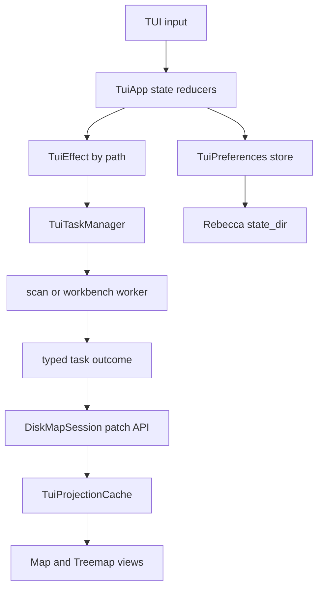

# TUI Subtree Workbench Refactor - Plan

## Goal Capsule

| Field | Value |
|---|---|
| Objective | Make Rebecca's TUI behave like a path-first disk workbench: subtree refresh patches the current scan in place, Treemap supports natural drilldown, cancellation truthfully reflects the active phase, and user workbench preferences survive restarts. |
| Authority | This plan follows the current `main` code after `docs/plans/2026-07-07-008-refactor-tui-workbench-architecture-plan.md`, especially the existing TUI module split, `DiskMapSession` projection, and task manager seams. |
| Execution profile | Breaking internal Rust APIs under `crates/rebecca/src/tui/` and `crates/rebecca-core/src/disk_session.rs` is acceptable. Delete transitional whole-session refresh code once the path-first contract replaces it. |
| Stop conditions | Stop if the chosen patch model would make root totals materially misleading without visible freshness/caveat state, or if cancellation during actual filesystem mutation cannot be represented truthfully. |
| Tail ownership | `ce-work` owns implementation, verification, simplification, review, commits, and pushing `main` when local and CI-equivalent gates pass. |

---

## Product Contract

### Summary

Rebecca already has a responsive TUI with Map, Treemap, type and extension distributions, cleanup staging, preview, execution, history, semantic replay, projection caching, and a bounded task manager.
The next product step is to make the workbench feel like a real disk explorer instead of a sequence of whole-scan snapshots.
Refreshing one subtree should preserve surrounding context, Treemap should open folders as naturally as the table view, cancellation should not overpromise during recoverable-trash moves, and common workbench preferences should persist through Rebecca's existing state model.

### Problem Frame

`DiskMapSession` currently exposes path lookup and path-aware restore helpers, but `TuiEffect::Refresh` still rescans roots and replaces the full session.
That creates unnecessary churn in navigation, undo state, cleanup advice, distribution rows, and future tree-oriented UI.
Treemap tile clicks only select rows, so visual exploration still requires switching mental models back to table controls.
The Busy screen says Esc cancels the active task, while cleanup execution can enter phases where cancellation is only cooperative before the mutation boundary.
Workbench preferences are still process-local defaults even though Rebecca has a durable state directory and a documented split between user config, state, cache, and history.

### Requirements

**Subtree session model**

- R1. Core owns in-place subtree replacement by path so TUI callers never splice `DiskMapSession` node vectors or rely on long-lived `DiskMapNodeId` values.
- R2. Subtree replacement preserves unaffected ancestors, siblings, cleanup advice, groups where still valid, and path-addressable restore while marking stale or partially recomputed aggregate facts visibly.
- R3. Refreshing a selected or current directory restores the nearest surviving path and selection by path, including the case where the refreshed directory disappeared.
- R4. Root refresh remains available, but it uses the same patch/outcome language as subtree refresh instead of a separate whole-session path.

**Workbench interaction**

- R5. Treemap supports drilldown and zoom parity with Map: keyboard Enter/l opens the selected directory, h/Esc moves up, and mouse-capable terminals can drill into a tile without authorizing cleanup.
- R6. Breadcrumb and status text expose the current scope, active filter, and freshness state in visual and screen-reader modes.
- R7. Type and extension filters continue to affect both Map and Treemap after subtree refresh, without applying stale row IDs.

**Task and cancellation semantics**

- R8. Scan, subtree refresh, and preview remain cooperatively cancellable through `ScanCancellationToken` and report cancellation without corrupting the parent runtime.
- R9. Cleanup execution has explicit phase semantics: cancellation is available before the execution boundary, and once filesystem moves are in flight the UI says that interruption may not stop already-started recoverable-trash work.
- R10. Late progress or stale task results cannot change the wrong session generation or screen.

**Persistence and documentation**

- R11. TUI preferences persist under Rebecca's durable state lifecycle, not under rebuildable cache or machine output contracts.
- R12. Persisted preferences cover only safe workbench ergonomics at first: last workbench view, sort field, scan backend, screen-reader/no-color preference when chosen in TUI, and entry limit.
- R13. TUI preferences never persist roots, selected cleanup rules, warning gates, preview plans, confirmation text, or cleanup targets.
- R14. README, changelog, current engineering state, and `skills/rebecca-disk-cleaner/SKILL.md` describe the new TUI behavior without presenting TUI snapshots as a machine API.

### Acceptance Examples

- AE1. Given a scanned root with `/tmp/cache` selected, when refresh completes for `/tmp/cache`, then the session still contains siblings outside `/tmp/cache`, the current scope remains at `/tmp/cache` or the nearest surviving ancestor, and old row IDs are not reused as authority.
- AE2. Given a selected Treemap tile for a directory, when the user presses Enter or performs the supported tile drill action, then the Treemap zooms into that directory and Space still only stages an advised cleanup rule, never executes deletion.
- AE3. Given a cleanup execution that has crossed into recoverable-trash moves, when the user presses Esc, then the Busy screen reports the truth about already-started filesystem work instead of implying immediate rollback.
- AE4. Given a TUI session where the user switches to Treemap and changes sort order, when Rebecca is restarted without explicit CLI overrides, then the workbench opens with the persisted ergonomic defaults while roots and cleanup authority remain explicit per run.
- AE5. Given `--screen-reader`, when a refreshed subtree or drilled Treemap scope is rendered, then the snapshot contains text-only scope, freshness, selection, size, and advice facts without requiring visual tile geometry.

### Scope Boundaries

- In scope: breaking internal TUI/core session APIs, replacing whole-session refresh internals, adding persistent TUI state, improving keyboard/mouse interaction semantics, and deleting superseded refresh/task glue.
- Deferred for later: command palette, multi-select cleanup batches, restore-from-history UI, custom rule authoring in TUI, background daemon/watch mode, GUI packaging, and a public machine-readable TUI protocol.
- Outside this product's identity: a separate `rebecca-tui` binary, direct execution from mouse gestures, treating hidden replay tokens as a stable automation API, or copying GPL/LGPL/AGPL implementation code.

---

## Planning Contract

### Key Technical Decisions

- KTD1. `DiskMapSession` is the patch authority.
  The correct boundary is a core API such as `replace_subtree_by_path` that accepts a refreshed report/session and returns a typed patch result.
  TUI can request a refresh by path, but it must not rewrite node vectors or infer aggregate correctness.
- KTD2. Paths, not node IDs, are the cross-task identity.
  `DiskMapNodeId` remains an in-session index for fast lookup, while task outcomes, selection restore, breadcrumbs, and replay assertions use paths.
- KTD3. Freshness is part of the data model.
  Subtree refresh can make local facts fresher than global totals or distribution groups.
  The session should expose patch scope and stale aggregate caveats instead of pretending every report-level metric was recomputed.
- KTD4. Treemap drilldown reuses navigation state.
  Treemap and Map should share `current_parent`, selection, filters, and projection cache inputs; zoom state should not become a second tree model.
- KTD5. Execution cancellation is phase-aware, not aspirational.
  Build/preview/scanning phases can stop cooperatively.
  Filesystem mutation phases either receive real cancellation checkpoints from core execution or surface a non-interruptible phase to the user.
- KTD6. TUI preferences are durable local state.
  Rebecca's `state_dir` is the right lifecycle for workbench ergonomics because the values are user-local and not rebuildable cache.
  The config schema should not grow unless a setting is intentionally user-editable outside TUI.
- KTD7. Synchronous replay and interactive background mode share outcomes.
  `--once` replay is a CI harness, but it must exercise the same patch, navigation, and preference application code as interactive mode where possible.

### High-Level Technical Design

The central change is replacing `Refresh(Vec<PathBuf>) -> DiskMapSession` with a path-scoped refresh outcome.
For a root refresh, the outcome can still rebuild a root, but it should be applied through the same path-first result path.
For a subtree refresh, the worker scans only the anchor path and returns the refreshed session/report plus the anchor path.
The core patch API resolves the anchor in the old session, rebuilds the replaced subtree with fresh node IDs, preserves unaffected nodes, and returns selection/aggregate metadata needed by the TUI.

The first preference store should be small and versioned, for example `tui-preferences.json` or `tui-state.json` under `AppPaths.state_dir`.
It should store ergonomics only.
It must not store cleanup authorization, warning gates, selected rules, previous roots to scan automatically, or typed confirmation content.

### System-Wide Impact

- `crates/rebecca-core/src/disk_session.rs` becomes a stronger client-facing model for interactive disk maps.
- `crates/rebecca/src/tui/app.rs`, `task.rs`, `effect.rs`, `projection.rs`, `hit_test.rs`, `replay.rs`, `snapshot.rs`, and `view.rs` must align on path-first identity.
- `crates/rebecca-core/src/executor.rs` and `crates/rebecca/src/workbench.rs` may need cancellation-aware execution options or explicit phase reporting.
- `docs/configuration.md` and `crates/rebecca-core/src/config.rs` must preserve the existing lifecycle distinction between config, state, cache, and history.
- CI replay tests become more important because interaction behavior is no longer a single table view plus static snapshots.

### Assumptions

- `ratatui` and `crossterm` remain the right terminal stack.
- Rebecca keeps one binary with `rebecca tui` and `rebecca i`; there is no separate TUI executable.
- Hidden TUI replay flags stay test hooks, not a public API.
- Internal breaking changes are allowed because this project has not stabilized the TUI API.
- Persisted TUI preferences can be ignored safely when corrupt, with a warning or fallback, because they are ergonomic state.

### Risks & Dependencies

| Risk | Severity | Mitigation |
|---|---:|---|
| Subtree patch metrics could imply a fully fresh global view when only one branch was refreshed. | High | Model patch scope and stale aggregate caveats explicitly, and render them in status/snapshot text. |
| Rebuilding node vectors can invalidate selections and baskets. | High | Restore by path and keep cleanup basket authority in rule/advice facts, not row IDs. |
| Execution cancellation may be impossible once recoverable-trash moves start. | High | Either add core checkpoints before each target/batch or represent the non-interruptible phase honestly in TUI. |
| Persisting preferences could accidentally store cleanup intent. | Medium | Keep the schema limited to ergonomics and add tests that selected rule IDs and confirmations are never persisted. |
| Mouse drilldown could make cleanup feel too easy. | Medium | Mouse opens/selects only; execution still requires preview plus typed confirmation. |
| Cross-platform path comparison can regress Windows case-insensitive restore. | Medium | Reuse the existing `same_path` behavior and add Windows-shaped tests where possible without platform-only assumptions. |

### Sources & Research

- `docs/knowledge/engineering/current-state.md` records the current TUI foundation baseline and names subtree replacement, Treemap drilldown, execution cancellation, and preferences as the next choices.
- `docs/plans/2026-07-07-008-refactor-tui-workbench-architecture-plan.md` is the completed architectural predecessor.
- `crates/rebecca-core/src/disk_session.rs` already has `node_id_by_path`, `nearest_existing_ancestor`, `restore_parent_by_path`, session groups, and visible-row projection.
- `crates/rebecca/src/tui/app.rs` owns current navigation, refresh snapshots, projection generation, confirmation, and Busy/Error state.
- `crates/rebecca/src/tui/task.rs` owns single-active task identity, bounded progress delivery, and worker outcome application.
- `crates/rebecca/src/workbench.rs` currently builds a recoverable-delete plan with cancellation, then calls `execute_cleanup_plan_parallel_with_policy` without passing cancellation.
- `crates/rebecca-core/src/executor.rs` currently executes serial or parallel cleanup batches without a cancellation token.
- `skills/rebecca-disk-cleaner/SKILL.md` is the agent-facing user workflow that must stay preview-first and TUI-human-only.

---

## Implementation Units

### U1. Characterize path-first refresh and drilldown contracts

- **Goal:** Strengthen tests around the behavior this refactor must preserve or replace before changing production code.
- **Requirements:** R1-R7, R10
- **Files:** `crates/rebecca-core/src/disk_session.rs`, `crates/rebecca/src/tui/app.rs`, `crates/rebecca/src/tui/replay.rs`, `crates/rebecca/src/tui/hit_test.rs`, `crates/rebecca/tests/cli_tui.rs`
- **Approach:** Add focused core tests for path lookup and restore edge cases, and TUI tests for refresh restore, Treemap keyboard navigation, tile selection, and screen-reader snapshots.
- **Patterns to follow:** Existing `tui_replay_*`, `tui_screen_reader_*`, `DiskMapSession::from_report`, and `TuiTaskManager` tests.
- **Test scenarios:** Refresh preserves current path when the target still exists. Refresh falls back to nearest ancestor when the target disappeared. Treemap Enter opens the selected directory. Tile click does not stage or execute cleanup. Screen-reader mode reports scope and selection text after drilldown.
- **Verification:** Focused tests fail or characterize current behavior before implementation, then pass after the unit's production changes land.

### U2. Add core-owned subtree patching to `DiskMapSession`

- **Goal:** Move subtree replacement and freshness accounting into core so TUI cannot corrupt session internals.
- **Requirements:** R1-R4, R7
- **Files:** `crates/rebecca-core/src/disk_session.rs`
- **Approach:** Add a typed patch input/output that addresses an anchor by path, applies a refreshed report/session under that anchor, rebuilds node IDs, preserves unaffected branches, and returns restored-path plus freshness/caveat metadata.
- **Patterns to follow:** Current `DiskMapSessionBuilder`, `same_path`, `restore_parent_by_path`, `DiskMapMetrics`, and `DiskMapGroup` projection patterns.
- **Test scenarios:** Replacing a directory preserves siblings. Replacing a root behaves like a root refresh through the same API. A missing refreshed anchor removes or marks the subtree without panic. Groups are retained, rebuilt, or marked stale according to the chosen freshness model. Cleanup advice on unaffected nodes survives.
- **Verification:** `cargo nextest run -p rebecca-core disk_session --locked` passes, and no public caller outside core edits session node vectors.

### U3. Refactor TUI refresh outcomes to apply patches by path

- **Goal:** Replace whole-session refresh in TUI with path-scoped task outcomes.
- **Requirements:** R1-R4, R7-R8, R10
- **Files:** `crates/rebecca/src/tui/effect.rs`, `crates/rebecca/src/tui/task.rs`, `crates/rebecca/src/tui/app.rs`, `crates/rebecca/src/tui/projection.rs`, `crates/rebecca/src/tui/mod.rs`, `crates/rebecca/tests/cli_tui.rs`
- **Approach:** Change refresh effects and worker outcomes to carry an anchor path and refreshed scan data, apply the core patch result on the main thread, and restore current parent/selection by path.
- **Patterns to follow:** Existing `TuiTaskId`, stale progress filtering, `pending_refresh_snapshot`, `session_generation`, and projection invalidation.
- **Test scenarios:** `r` refreshes selected/current subtree without losing sibling rows. `R` refreshes root through the shared patch path. Retry after refresh failure retries the same path. Cancelled refresh leaves the old session and basket intact. Late progress from stale task ID is ignored.
- **Verification:** `cargo nextest run -p rebecca --test cli_tui --locked` passes for refresh journeys, and `rg "Refresh\\(Vec<PathBuf>\\)" crates/rebecca/src/tui` finds no old effect shape.

### U4. Implement Treemap drilldown and scope feedback

- **Goal:** Make Treemap a first-class explorer view instead of only a visual selector.
- **Requirements:** R5-R7
- **Files:** `crates/rebecca/src/tui/app.rs`, `crates/rebecca/src/tui/input.rs`, `crates/rebecca/src/tui/hit_test.rs`, `crates/rebecca/src/tui/replay.rs`, `crates/rebecca/src/tui/view.rs`, `crates/rebecca/src/tui/snapshot.rs`, `crates/rebecca/tests/cli_tui.rs`
- **Approach:** Reuse Map navigation reducers for Treemap keyboard drilldown, add an explicit mouse action for tile activation if needed, and render current scope/breadcrumb/freshness text in visual and snapshot views.
- **Patterns to follow:** Existing Map `open_selected_node`, `open_parent_node`, `visible_rows`, `layout::treemap_tiles`, and semantic replay token parsing.
- **Test scenarios:** `4 enter` opens the selected directory in Treemap. `h` or Esc moves up from a Treemap scope. A semantic replay token can activate a Treemap tile for drilldown. File tiles select but do not open. Active type/extension filters persist after drilldown and clear with Backspace.
- **Verification:** Headless Treemap replay commands produce bounded snapshots with the expected current scope.

### U5. Make cancellation phase semantics truthful

- **Goal:** Align Busy-screen cancellation text and task behavior with what core execution can actually stop.
- **Requirements:** R8-R10
- **Files:** `crates/rebecca-core/src/executor.rs`, `crates/rebecca/src/workbench.rs`, `crates/rebecca/src/tui/task.rs`, `crates/rebecca/src/tui/progress.rs`, `crates/rebecca/src/tui/view.rs`, `crates/rebecca/src/tui/snapshot.rs`
- **Approach:** Prefer adding a cancellation-aware execution option that checks the token before each target or batch. If a target/batch has started and cannot be interrupted, expose that phase through progress/status so the UI stops claiming immediate cancellation.
- **Patterns to follow:** Existing `PlanBuildContext::new(runtime.cancellation())`, planner cancellation checks, `TuiTaskProgressEvent`, and executor batch revalidation.
- **Test scenarios:** Cancelling during preview returns an operation-cancelled result. Cancelling before execution starts prevents filesystem mutation. Cancelling during an in-flight execution phase reports a non-interruptible or already-started status without returning to Map until the worker finishes. Stale execute results cannot apply after a newer task generation.
- **Verification:** Focused executor/workbench/TUI tests pass and Busy snapshots distinguish cooperative cancellation from in-flight execution.

### U6. Persist minimal TUI workbench preferences

- **Goal:** Persist safe ergonomic TUI defaults without turning state into cleanup authority.
- **Requirements:** R11-R13
- **Files:** `crates/rebecca-core/src/config.rs`, `docs/configuration.md`, `crates/rebecca/src/tui/preferences.rs`, `crates/rebecca/src/tui/mod.rs`, `crates/rebecca/src/tui/app.rs`, `crates/rebecca/tests/cli_tui.rs`
- **Approach:** Add a small versioned TUI preference store under `AppPaths.state_dir`, load it at startup, apply CLI flags as higher-precedence overrides for the current run, and save ergonomics when the app exits normally.
- **Patterns to follow:** Existing `HistoryStore`, `AppPaths`, config path lifecycle docs, and JSON state/error-tolerant cache handling.
- **Test scenarios:** Missing preferences use defaults. Corrupt preferences fall back without preventing TUI startup. Last view, sort, entry limit, no-color, and screen-reader choices persist. Selected cleanup rules, warnings, roots, preview plans, and confirmation text are never serialized. CLI flags override persisted values for one run.
- **Verification:** TUI preference unit tests pass and `config paths` documentation still lists only public storage paths without exposing hidden CI flags.

### U7. Update docs, skill, changelog, and delete transitional code

- **Goal:** Keep user-facing guidance and engineering memory aligned with the new workbench behavior.
- **Requirements:** R14
- **Files:** `README.md`, `CHANGELOG.md`, `docs/configuration.md`, `docs/knowledge/engineering/current-state.md`, `skills/rebecca-disk-cleaner/SKILL.md`, `crates/rebecca/src/tui/`
- **Approach:** Document subtree refresh, Treemap drilldown, cancellation wording, preference persistence, and TUI-human-only automation boundaries. Remove old whole-session refresh helpers and any dead transitional APIs.
- **Patterns to follow:** Existing README TUI section, Unreleased changelog style, and Rebecca disk-cleaner skill preview-first wording.
- **Test scenarios:** Skill validation passes. README snippets match `tui --help`. `rg` finds no stale mention that Treemap tiles only select or that refresh replaces the whole scan. Clippy finds no dead transitional code.
- **Verification:** Documentation checks and full repo gates pass.

---

## Verification Contract

| Gate | Covers | Done signal |
|---|---|---|
| `cargo fmt --all -- --check` | U1-U7 | Rust formatting is stable. |
| `cargo clippy --workspace --all-targets -- -D warnings` | U1-U7 | No dead code, unused APIs, or lint regressions remain. |
| `cargo nextest run -p rebecca-core disk_session --locked` | U1-U2 | Core session patching and freshness semantics pass. |
| `cargo nextest run -p rebecca --test cli_tui --locked` | U1, U3-U6 | TUI replay, snapshot, refresh, drilldown, and preference behavior pass. |
| `cargo nextest run --workspace --locked` | U1-U7 | Workspace behavior remains green across CLI, core, rules, and NTFS-adjacent code. |
| `cargo deny check` | U1-U7 | Dependency, license, advisory, and source policies remain acceptable. |
| `python skills/validate.py` | U7 | Shipped skills remain installable and preview-first. |
| `cargo run -p rebecca --locked -- tui --once --screen-reader --terminal-width 80 --root . --replay-keys 4` | U4, U7 | Treemap screen-reader smoke renders bounded text. |
| `cargo run -p rebecca --locked -- tui --once --screen-reader --terminal-width 100 --root . --replay-keys "4 enter"` | U4 | Treemap drilldown smoke reaches a scoped view without terminal interaction. |
| `git diff --check` | U1-U7 | No whitespace or patch hygiene issues. |

---

## Definition of Done

- `DiskMapSession` exposes a core-owned path-scoped patch API and TUI refresh no longer replaces the whole session for subtree refresh.
- Refreshed subtree, root refresh, missing-path refresh, filters, selection restore, and cleanup advice preservation are covered by focused tests.
- Treemap supports keyboard and mouse-capable drilldown while preserving preview-first cleanup safety.
- Busy/cancellation UI distinguishes cooperative cancellation from filesystem execution that has already crossed the mutation boundary.
- Minimal TUI preferences persist under durable state and cannot persist cleanup authorization or target selection.
- README, changelog Unreleased, configuration docs, current engineering state, and `skills/rebecca-disk-cleaner/SKILL.md` match the shipped behavior.
- Transitional APIs and obsolete comments from the previous whole-session refresh path are removed.
- All Verification Contract gates pass locally before the final commit/push.
