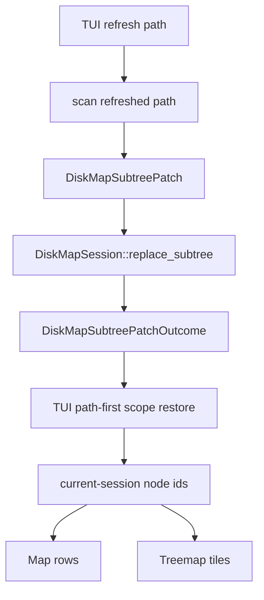
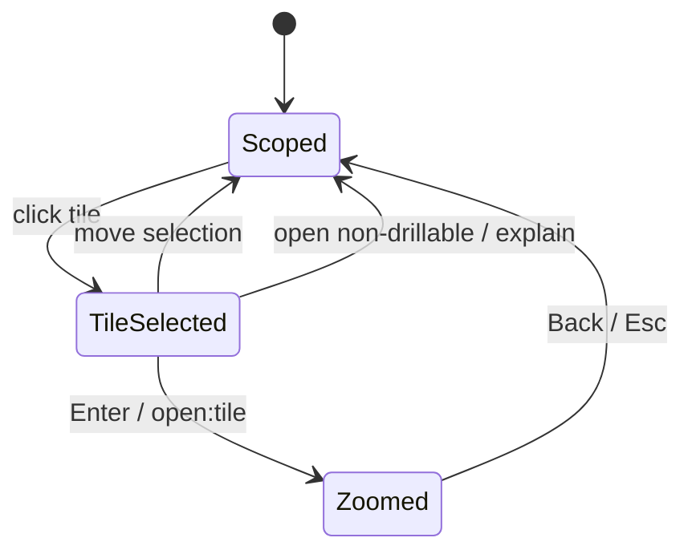
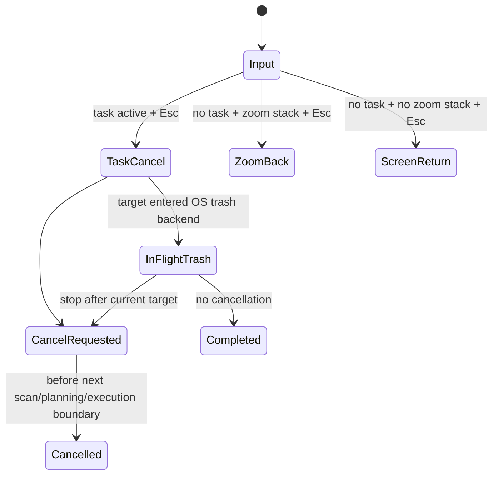

# TUI Subtree Workbench Semantics Refactor - Plan

## Goal Capsule

| Field | Decision |
|---|---|
| Objective | Move Rebecca's TUI from whole-session refresh and selection-only treemap interaction to path-stable subtree replacement, explicit drilldown, honest execution cancellation, and persisted human workbench preferences. |
| Authority | User request: fearless refactor, breaking internal changes allowed, delete obsolete code, keep one `rebecca` binary, and continue toward a best-in-class cleanup CLI. |
| Execution profile | Code implementation from the core session contract outward, with characterization coverage before replacing refresh/cancellation/preference behavior and full workspace verification before landing. |
| Stop conditions | Stop only for cleanup-safety contradictions, a filesystem execution limitation that changes the cancellation product contract, or verification failures that require product-scope decisions rather than implementation fixes. |
| Landing | Commit complete green units with conventional messages; direct main-branch landing remains allowed by current project preference, with precise staging only. |

---

## Product Contract

### Summary

Rebecca's TUI foundation is now modular, projection-cached, layout-aware, and covered by semantic replay.
The next gap is semantic correctness rather than rendering structure: refreshing a selected directory still replaces the whole `DiskMapSession`, `DiskMapNodeId` is still an in-session index, treemap clicks only select, execution cancellation can imply more than the executor can deliver, and TUI preferences are not durable.

This plan fixes those gaps by making the core session own subtree replacement, making TUI scope path-first, adding explicit treemap drilldown/zoom interactions, passing cancellation through cleanup execution boundaries, and storing private TUI preferences under Rebecca's state directory.

### Problem Frame

`crates/rebecca-core/src/disk_session.rs` currently builds an immutable sparse tree from a `DiskMapReport`.
It exposes path lookup and parent restore helpers, but has no core-owned API for replacing one subtree with a refreshed report.
`DiskMapNodeId(pub usize)` is a node-vector index, so it is correct inside one session but unsafe as a cross-refresh identity.

`crates/rebecca/src/tui/app.rs` currently handles refresh by saving a full `TuiSessionSnapshot`, scanning the requested path into a new `DiskMapSession`, replacing the whole session, then restoring the current parent by path.
That works for simple CI snapshots but makes local refresh a UI-side illusion and forces stale global totals, history restore, and selected-row recovery to live in the wrong layer.

Treemap keyboard drilldown already shares map navigation, but mouse and replay only select tiles.
Users need a modern disk-workbench experience where a tile can be selected safely, opened intentionally, backed out through a clear zoom stack, and explained when it is an aggregate `Other` tile.

Execution cancellation is currently cooperative for scan and preview, but recoverable cleanup execution calls `execute_cleanup_plan_parallel_with_policy` without a cancellation token.
The TUI must either cancel before the next target or say that the current OS trash operation is in flight; it must not promise immediate interruption after deletion has begun.

### Requirements

**Core session semantics**

- R1. `DiskMapSession` owns path-addressed subtree replacement and returns typed patch outcomes instead of letting TUI rebuild or splice node vectors.
- R2. Session node identity is path-stable across refresh at the TUI boundary; `DiskMapNodeId` remains a session-local projection handle only.
- R3. Subtree replacement preserves parent/child/root invariants, cleanup advice, estimate provenance, synthetic ancestors, and deterministic sorting.
- R4. Local refresh exposes freshness or caveat information when global totals, groups, or ancestor metrics cannot be proven exact after a subtree patch.

**TUI scope and interaction**

- R5. TUI stores current scope, selected row, refresh anchor, zoom stack, and restore state as paths, resolving to node ids only for the current projection.
- R6. Refreshing the current directory or selected directory updates that subtree in place when the anchor still exists, and degrades to nearest existing ancestor when it does not.
- R7. Treemap supports explicit drilldown/zoom with keyboard, semantic replay, and safe mouse gestures while single click remains selection-only.
- R8. Breadcrumbs and snapshots show the current scope, active filter, zoom depth, and non-drillable aggregate state without treating snapshots as public machine APIs.
- R9. Input priority is task-first: when a background task is active, `Esc` requests cancellation; when no task is active and the zoom stack is non-empty, `Esc` navigates back; when neither applies, existing screen-specific return/quit behavior applies.

**Execution and preferences**

- R10. Cleanup execution accepts cancellation and checks it before each target or batch; in-flight OS trash operations are described as non-interruptible until the current target returns.
- R11. TUI task status distinguishes cancellable scanning/planning from execution-stop-requested semantics.
- R12. TUI preferences persist human workbench defaults under `AppRuntimeConfig.app_paths.state_dir` without changing CLI JSON/NDJSON contracts.
- R13. Preference precedence is `built-in defaults < saved preferences < explicit CLI flags`; `--once`, semantic replay, and CI/test modes do not write preferences; explicit CLI overrides do not write back unless a future command defines an intentional save action.
- R14. Preferences do not store roots, current paths, search text, cleanup selections, or other sensitive workspace state.

**Verification and cleanup**

- R15. Core patch behavior, TUI subtree refresh, treemap drilldown, execution cancellation, preferences, and documentation are covered by focused tests.
- R16. Obsolete whole-session refresh snapshots, transitional id-based restore paths, dead helpers, and misleading cancellation text are deleted.
- R17. README, CHANGELOG, current-state memory, and the Rebecca disk-cleaner skill describe the updated TUI as a human workbench and keep typed CLI output as the automation surface.

### Acceptance Examples

- AE1. Given a session with `workspace/big/data.bin` selected, when `workspace/big` is refreshed and still exists, then the session keeps the surrounding root tree, replaces only that subtree, and restores selection by path.
- AE2. Given a refresh anchor path was deleted before the scan result applies, when the patch is applied, then the TUI lands on the nearest existing ancestor and reports the missing anchor without panicking or pointing at an old node id.
- AE3. Given a local subtree refresh changes child sizes, when the map renders, then the refreshed subtree shows new values and any stale ancestor/global estimate caveat is visible in status or details.
- AE4. Given the treemap screen, when semantic replay runs `open:tile:0`, then a directory-backed tile opens that directory and Back/Esc returns to the previous scope.
- AE5. Given an `Other` tile or a file tile, when the user tries to open it, then no cleanup action is emitted and the details/status line explains why it cannot be opened.
- AE6. Given cleanup execution has not started a target, when cancellation is requested, then later targets are skipped with an operation-cancelled result; if a target is already inside the OS trash backend, the UI says it will stop after the current target returns.
- AE7. Given a saved TUI preference for screen `treemap` and sort `allocated`, when `rebecca tui --root .` starts without explicit overrides, then it opens with those preferences; when `--screen-reader` or another explicit option is passed, the explicit option wins.

### Scope Boundaries

- In scope: `DiskMapSession` patch API, TUI path-first scope state, subtree refresh application, treemap drilldown/zoom, execution cancellation wiring, TUI private preferences, docs, changelog, skill updates, and deletion of obsolete refresh/cancellation scaffolding.
- In scope: breaking internal Rust APIs in `crates/rebecca-core/src/disk_session.rs`, `crates/rebecca-core/src/executor.rs`, `crates/rebecca/src/workbench.rs`, and `crates/rebecca/src/tui/`.
- Deferred to follow-up work: multi-select cleanup, command palette, right-click menus, double-click execution shortcuts, restoring deleted files from TUI history, daemon mode, and GUI packaging.
- Outside this product's identity: a separate `rebecca-tui` binary, direct cleanup from mouse gestures, scripting against TUI snapshots, storing private scanned paths in preferences, or copying GPL/LGPL implementation code from reference projects.

---

## Planning Contract

### Key Technical Decisions

- KTD1. Core owns subtree replacement.
  `DiskMapSession` already owns parent links, node ids, roots, groups, and path restore.
  Keeping replacement in core prevents TUI from learning vector-splice invariants and makes tests independent of terminal rendering.
- KTD2. Path is the durable UI identity.
  Node ids remain useful for current-session indexing and projection speed, but TUI state that crosses scan, refresh, restore, or preference boundaries must store `PathBuf` or typed path anchors.
- KTD3. Local refresh may be partially fresh.
  A subtree patch can be correct for refreshed descendants while ancestor totals and report-level groups may be stale or recomputed from sparse data.
  The model should expose that honestly instead of pretending the full scan was re-run.
- KTD4. Treemap open is an explicit action.
  Single click selects and updates details; Enter, keyboard right, semantic `open:tile:N`, or a deliberate future double-click opens.
  This preserves safety and avoids accidental navigation while still giving a WizTree-like zoom workflow.
- KTD5. Drilldown preserves filters.
  Opening a treemap tile keeps the active type/extension filter in place and displays it in breadcrumbs/status.
  If the preserved filter produces no rows in the opened scope, the TUI shows an empty filtered scope with a clear filter-clear action instead of silently clearing user intent.
- KTD6. Execution cancellation is boundary-based.
  Rebecca can check cancellation before targets and batches, and before planner/executor transitions.
  It cannot promise to interrupt an OS trash API call already in progress, so task status and tests must encode stop-before-next-target semantics.
- KTD7. Preferences are TUI-private durable state.
  Preferences belong under `state_dir` as rebuildable user-interface state, not in the main config schema at this stage.
  CLI flags remain authoritative for the current invocation.
- KTD8. No compatibility layer for pre-release TUI internals.
  This work can delete old refresh snapshots, id-first helpers, and obsolete tests once the new path-first contracts are covered.

### High-Level Technical Design

### Assumptions

- The latest completed TUI foundation refactor is the baseline; this plan should extend, not re-split, existing modules.
- `DiskMapReport` remains the scan output shape for refreshed paths.
- `DiskMapSession` may rebuild node ids during patch application as long as all external UI restore contracts are path-based.
- Report-level groups and totals should prefer correctness over fake precision after local refresh.
- Preferences are local human UI state and can use TOML or JSON according to existing crate dependencies and code style.

### System-Wide Impact

- `crates/rebecca-core/src/disk_session.rs` gains the patch data model, path index rebuilding, and replacement tests.
- `crates/rebecca/src/tui/app.rs` should stop storing refresh snapshots as full-session backups for normal local refresh.
- `crates/rebecca/src/tui/effect.rs`, `crates/rebecca/src/tui/task.rs`, and `crates/rebecca/src/tui/replay.rs` carry refresh anchors and treemap open actions through typed outcomes.
- `crates/rebecca-core/src/executor.rs` and `crates/rebecca/src/workbench.rs` carry cancellation into execution without weakening protection policy checks.
- `crates/rebecca/src/tui/preferences.rs` or an equivalent module owns TUI state file loading, saving, defaults, and CLI override merging.
- CLI machine-readable contracts stay stable; TUI text/snapshots may change when tests document the new behavior.

### Risks & Dependencies

| Risk | Mitigation |
|---|---|
| Subtree replacement corrupts parent links or duplicates paths. | Rebuild session indexes inside core and add invariant tests after every patch. |
| Local refresh gives misleading global totals. | Add explicit patch freshness/caveat state and show it in TUI status/details. |
| Path matching differs across Windows and Unix. | Reuse the existing `same_path` behavior and test case-insensitive Windows-style matching where practical. |
| Treemap open gestures cause accidental navigation. | Keep click as selection and require explicit open action in tests and docs. |
| Execution cancellation creates partial cleanup confusion. | Record target statuses and warnings through existing execution report fields and make UI wording target-boundary based. |
| Preferences leak sensitive paths. | Store only display defaults and never persist roots, current paths, filters, search text, or cleanup selections. |
| Adding state files breaks non-TTY CI. | Use temp `REBECCA_STATE_DIR` in tests and treat corrupt preference files as recoverable warnings or defaults. |

### Sources & Research

- `docs/plans/2026-07-07-008-refactor-tui-workbench-architecture-plan.md` is the completed architecture baseline this plan builds on.
- `docs/knowledge/engineering/current-state.md` lists the next TUI candidates: core-owned subtree replacement, Treemap drilldown/zoom, execution cancellation semantics, and persisted workbench preferences.
- `crates/rebecca-core/src/disk_session.rs` currently exposes path restore helpers but no subtree patch API.
- `crates/rebecca/src/tui/app.rs` currently replaces the whole session on refresh and stores full `TuiSessionSnapshot` backups.
- `crates/rebecca/src/tui/replay.rs` already supports semantic click tokens and can add open tokens without raw coordinate coupling.
- `crates/rebecca-core/src/executor.rs` currently executes cleanup without cancellation input.
- `crates/rebecca/src/workbench.rs` currently bridges TUI cleanup execution to core executor and history.
- `crates/rebecca-core/src/config.rs` owns `AppRuntimeConfig.app_paths.state_dir`, the right root for private TUI preference state.

---

## Implementation Units

### U1. Add core-owned subtree patching to `DiskMapSession`

- **Goal:** Make local refresh a core session operation with invariant checks and typed outcomes.
- **Requirements:** R1, R2, R3, R4, R15
- **Dependencies:** None
- **Files:** `crates/rebecca-core/src/disk_session.rs`, `crates/rebecca-core/src/lib.rs`
- **Approach:** Introduce a `DiskMapSubtreePatch` or equivalent from anchor path plus refreshed `DiskMapReport`/`DiskMapSession`.
  Add a `replace_subtree_by_path` API that validates the anchor, removes old descendants, inserts refreshed descendants under the existing parent or root slot, rebuilds node ids and children, and returns an outcome carrying restored anchor path, nearest ancestor, replaced metrics, and freshness/caveat state.
  Keep direct node-vector manipulation private.
- **Execution note:** Characterization-first for current path restore; patch tests should fail before the core API is implemented.
- **Patterns to follow:** `DiskMapSession::from_report`, `node_id_by_path`, `nearest_existing_ancestor`, `restore_parent_by_path`, `DiskMapSessionBuilder`, and existing `same_path`.
- **Test scenarios:** Replacing an existing directory updates only its descendants. Replacing a root works. Replacing a missing anchor reports nearest existing ancestor. Synthetic parents remain valid. Duplicate paths are not created. Node ids are rebuilt consistently. Cleanup advice and provenance survive for refreshed entries. Local refresh marks stale or partial global groups/totals when exact recomputation is unavailable.
- **Verification:** Focused `rebecca-core` disk session tests pass.

### U2. Make TUI refresh and scope state path-first

- **Goal:** Remove whole-session refresh replacement from TUI and restore scope/selection through core patch outcomes.
- **Requirements:** R2, R5, R6, R8, R16
- **Dependencies:** U1
- **Files:** `crates/rebecca/src/tui/app.rs`, `crates/rebecca/src/tui/effect.rs`, `crates/rebecca/src/tui/task.rs`, `crates/rebecca/src/tui/model.rs`, `crates/rebecca/src/tui/projection.rs`, `crates/rebecca/tests/cli_tui.rs`
- **Approach:** Change refresh effects and task outcomes to carry the requested anchor path and refreshed scan result.
  Apply refresh through `DiskMapSession` patching instead of assigning a new session.
  Store current scope and selected row restore anchors as paths, resolving to `DiskMapNodeId` only when reading the current session.
  Delete normal-refresh full session snapshots once restore behavior is path-first; keep explicit previous-scan restore only if it remains a user-visible feature with intentional data ownership.
- **Execution note:** Add TUI refresh replay tests before deleting the old snapshot path.
- **Patterns to follow:** Current `refresh_selected_directory`, `refresh_current_directory`, `apply_refresh_result`, `current_session_snapshot`, projection generation bumps, and `tui_replay_can_refresh_selected_directory_and_restore_previous_scan`.
- **Test scenarios:** Refresh selected directory restores the same path and selected child when it still exists. Refresh selected directory removed from disk lands on nearest ancestor with a clear message. Refresh root keeps valid root selection. Refresh does not reuse stale node ids. Projection cache invalidates once after patch. Previous-scan restore remains intentional or is deleted with tests updated to the new product behavior.
- **Verification:** `cargo nextest run -p rebecca --test cli_tui --locked` passes for refresh journeys.

### U3. Add Treemap drilldown, zoom stack, and non-drillable feedback

- **Goal:** Turn Treemap from selection-only into an intentional disk exploration view without adding dangerous mouse shortcuts.
- **Requirements:** R5, R7, R8, R9, R15
- **Dependencies:** U2
- **Files:** `crates/rebecca/src/tui/app.rs`, `crates/rebecca/src/tui/input.rs`, `crates/rebecca/src/tui/hit_test.rs`, `crates/rebecca/src/tui/replay.rs`, `crates/rebecca/src/tui/snapshot.rs`, `crates/rebecca/src/tui/view.rs`, `crates/rebecca/src/tui/treemap.rs`, `crates/rebecca/tests/cli_tui.rs`
- **Approach:** Keep single click as tile selection.
  Add explicit open actions for the selected treemap tile through keyboard and semantic replay, and add mouse double-click only if it can be represented without brittle timing in tests.
  Maintain a zoom/path stack through the same path-first navigation model as Map.
  Preserve active type/extension filters on drilldown, show the filter in breadcrumb/status, and show a clear empty-filtered-scope state when the filter leaves no rows.
  Show breadcrumb, current scope, selected tile name, entry kind, drillable state, non-drillable reason, zoom depth, active filter, and primary available action in details and screen-reader snapshots.
- **Execution note:** Prove mouse-like actions cannot emit cleanup execution before adding any new open gesture.
- **Patterns to follow:** Existing `handle_map_key`, `open_selected_node`, `open_parent_node`, `TuiMouseAction::SelectMapRow`, `replay::tile_action`, `layout::treemap_tiles`, and screen-reader snapshot helpers.
- **Test scenarios:** `open:tile:0` opens a directory-backed tile. `click:tile:0` only selects. Enter opens the selected directory from Treemap. Back/Esc returns to the previous scope only when no task is active. Opening a file tile reports non-drillable. Opening `Other` reports aggregate non-drillable. Drilldown preserves active filter and exposes empty filtered scopes clearly. Breadcrumb and snapshot include current scope, zoom depth, active filter, selected tile name, drillable state, non-drillable reason, and primary available action. Cleanup preview/execution cannot be triggered by tile gestures.
- **Verification:** Focused TUI replay and snapshot tests pass.

### U4. Wire cancellation through cleanup execution

- **Goal:** Make TUI and CLI execution cancellation honest at target or batch boundaries.
- **Requirements:** R9, R10, R11, R15, R16
- **Dependencies:** None
- **Files:** `crates/rebecca-core/src/executor.rs`, `crates/rebecca-core/src/execution.rs`, `crates/rebecca/src/workbench.rs`, `crates/rebecca/src/clean.rs`, `crates/rebecca/src/tui/task.rs`, `crates/rebecca/src/tui/progress.rs`, `crates/rebecca/src/tui/view.rs`, `crates/rebecca/src/tui/snapshot.rs`
- **Approach:** Add cancellation-aware executor entry points and route existing callers through them with a default non-cancelled token where needed.
  Check cancellation before revalidation, before each batch, and before each target in serial fallback.
  Preserve protection-policy revalidation and execution report aggregation.
  Update TUI status so execution cancellation says it will stop before the next target or after the current OS trash operation returns.
- **Execution note:** Add executor tests with a fake backend that cancels after the first target before changing TUI wording.
- **Patterns to follow:** Existing `ScanCancellationToken`, `RebeccaError::OperationCancelled`, planner cancellation helpers, `execute_cleanup_plan_parallel_with_policy`, and TUI task failure handling.
- **Test scenarios:** A cancelled token before execution prevents mutation. A token cancelled after the first fake backend call skips later targets. Batch execution checks cancellation before the batch. Dry-run remains unaffected. Protection-blocked targets remain blocked, not cancelled. TUI Esc during execution sets stop-requested wording and reports cancelled only when the executor returns cancellation.
- **Verification:** Core executor tests and focused TUI task/progress tests pass.

### U5. Persist private TUI workbench preferences

- **Goal:** Remember human TUI defaults without changing script-facing APIs or leaking workspace paths.
- **Requirements:** R12, R13, R14, R15
- **Dependencies:** U2, U3
- **Files:** `crates/rebecca/src/tui/preferences.rs`, `crates/rebecca/src/tui/mod.rs`, `crates/rebecca/src/tui/app.rs`, `crates/rebecca/src/tui/model.rs`, `crates/rebecca/src/cli.rs`, `crates/rebecca-core/src/config.rs`, `crates/rebecca/tests/cli_tui.rs`
- **Approach:** Add a TUI preference schema with version, last screen, sort field, entry limit, scan backend, screen-reader default, and no-color default.
  Load from `runtime_config.app_paths.state_dir.join("tui-preferences.toml")` or a JSON equivalent, merge values with `built-in defaults < saved preferences < explicit CLI flags`, and save only from interactive human sessions.
  Do not write preferences from `--once`, semantic replay, CI/test paths, or explicit one-run CLI overrides.
  Treat missing or corrupt preference files as defaults plus a visible non-fatal message when appropriate.
- **Execution note:** Use temp `REBECCA_STATE_DIR` tests and avoid writing preferences from tests unless the test opts in.
- **Patterns to follow:** `AppRuntimeConfig.app_paths`, `HistoryStore` parent-directory creation, existing `toml` config parsing, and TUI option construction in `crates/rebecca/src/tui/mod.rs`.
- **Test scenarios:** Missing preference file uses defaults. Saved screen/sort/entry limit are loaded. Explicit CLI options override saved values for the run without writing them back. Interactive human sessions save supported preferences. `--once`, semantic replay, and CI/test mode do not write preferences. Preferences never serialize roots, current paths, filters, search text, basket contents, preview, or history. Corrupt preference file does not prevent TUI startup. Preference parent directories are created as needed.
- **Verification:** TUI preference unit tests and CLI TUI tests pass with isolated state directories.

### U6. Documentation, changelog, cleanup, and full verification

- **Goal:** Remove obsolete code and document the stronger TUI semantics for users and future agents.
- **Requirements:** R15, R16, R17
- **Dependencies:** U1, U2, U3, U4, U5
- **Files:** `README.md`, `CHANGELOG.md`, `docs/knowledge/engineering/current-state.md`, `skills/rebecca-disk-cleaner/SKILL.md`, `crates/rebecca/src/tui/`, `crates/rebecca-core/src/disk_session.rs`, `crates/rebecca-core/src/executor.rs`
- **Approach:** Update user-facing docs to describe path-stable subtree refresh, treemap drilldown, target-boundary execution cancellation, and preferences.
  Keep automation guidance on JSON/NDJSON APIs, not TUI snapshots.
  Delete obsolete full-session refresh scaffolding, id-first restore helpers, misleading cancellation strings, and temporary adapters after tests cover replacements.
- **Patterns to follow:** Current README TUI section, CHANGELOG Unreleased bullets, current-state durable summary style, and `skills/rebecca-disk-cleaner/SKILL.md` human-vs-automation guidance.
- **Test scenarios:** Help and docs match live behavior. Changelog has Unreleased bullets. Skill validation passes. `rg` finds no stale "cooperative Esc cancellation" wording that overpromises execution interruption. Clippy finds no dead compatibility APIs.
- **Verification:** Full Verification Contract passes.

---

## Verification Contract

| Gate | Applies to | Done signal |
|---|---|---|
| `cargo fmt --all -- --check` | All Rust units | Formatting is stable. |
| `cargo clippy --workspace --all-targets -- -D warnings` | All Rust units | No warnings, no dead code, and no unused transitional APIs remain. |
| `cargo nextest run -p rebecca-core --locked` | U1, U4 | Session patching and executor cancellation contracts pass. |
| `cargo nextest run -p rebecca --test cli_tui --locked` | U2, U3, U5, U6 | TUI refresh, treemap drilldown, preferences, snapshots, and replay pass. |
| `cargo nextest run --workspace --locked` | All units | Full workspace regression suite passes. |
| `cargo deny check` | Dependency and policy surface | No new advisory, source, ban, or license failure is introduced. |
| `cargo run -p rebecca --locked -- tui --once --screen-reader --terminal-width 80 --root . --replay-keys "4 open:tile:0"` | U3, U6 | Headless treemap drilldown renders bounded screen-reader text without a real TTY. |
| `cargo run -p rebecca --locked -- tui --once --terminal-width 72 --root .` | U3, U6 | Narrow snapshot remains bounded after breadcrumb/preference text changes. |
| `python skills/validate.py skills/rebecca-disk-cleaner/SKILL.md` | U6 | Rebecca skill remains valid. |
| `git diff --check` | All units | Patch hygiene is clean. |

---

## Definition of Done

- `DiskMapSession` exposes a core-owned subtree patch API with invariant tests and no public vector-splice responsibilities.
- TUI refresh applies path-addressed patches and no longer depends on cross-refresh `DiskMapNodeId` stability.
- Current scope, selected row restore, refresh anchor, and treemap zoom stack are path-first.
- Treemap supports explicit drilldown/zoom and clear non-drillable feedback while single click remains selection-only.
- Execution cancellation is wired through core executor boundaries and the TUI accurately communicates target/batch-boundary semantics.
- TUI preferences persist private human defaults under Rebecca state without storing roots, paths, filters, search text, cleanup selections, or history.
- README, CHANGELOG, current-state docs, and Rebecca disk-cleaner skill reflect the new behavior and preserve the TUI-vs-automation boundary.
- Obsolete whole-session refresh scaffolding, stale id-first helpers, misleading cancellation text, and unused adapters are deleted.
- Every Verification Contract gate passes before the work is considered complete.
