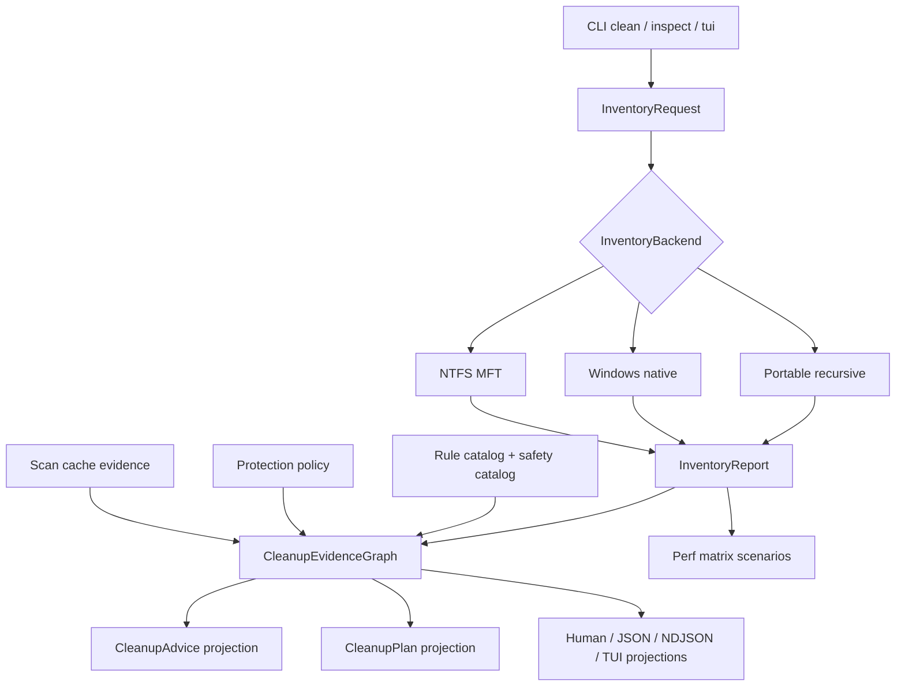

# Inventory Evidence Pipeline Refactor - Plan

## Goal Capsule

| Field | Decision |
|---|---|
| Objective | Refactor Rebecca's disk inventory, cleanup evidence, rule validation, and performance baseline into cleaner first-class contracts so scan, inspect, clean, TUI, and future platform backends share one model. |
| Authority | User direction favors fearless refactor, breaking unreleased APIs, deleting obsolete compatibility paths, and optimizing toward the strongest cleanup CLI rather than preserving intermediate shapes. |
| Execution profile | Break internal Rust APIs and CLI machine shapes when they simplify the model; preserve deletion safety, preview-first execution, recoverable-trash default, and GPL/reference-only boundaries. |
| Stop conditions | Stop for a change that weakens safety policy, makes machine output ambiguous, requires adopting incompatible source, or makes full workspace verification impossible without a design change. |
| Tail ownership | Implementation may commit incrementally to `main` and push when verified, following repo conventions and the user's preference for remote `main` updates. |

---

## Product Contract

### Summary

Rebecca has enough platform support, TUI surface, scan backends, rules, cache policy, and progress plumbing that the next quality jump is not another view.
The next quality jump is a smaller set of core concepts that every surface consumes: inventory facts for "what uses space" and evidence facts for "why this path is safe, blocked, warning-gated, cache-derived, or actionable."

### Problem Frame

`crates/rebecca-core/src/disk_map.rs` currently owns request configuration, backend selection, metadata semantics, top-entry aggregation, groups, diagnostics, cleanup advice attachment, and NTFS fallback projection.
`crates/rebecca-core/src/cleanup_advice.rs` separately reconstructs rule/protection/project/app facts for ranked map advice.
`crates/rebecca-core/src/planner/measure.rs` and CLI renderers then produce their own issue matrices, warning matrices, restore hints, and cache evidence.
This works, but it makes each new backend or output surface repeat decisions about provenance and safety explanation.

### Requirements

**Inventory pipeline**

- R1. Disk inventory must have a backend-neutral core model for roots, entries, metrics, groups, diagnostics, metric semantics, filesystem identity, and provenance.
- R2. Portable, Windows-native, NTFS/MFT, clean estimate, inspect map, and TUI session flows must consume the same inventory model instead of each carrying separate disk-map assumptions.
- R3. Backend selection must be explicit and observable, including fallback source, confidence, cache compatibility, semantic caveats, and platform support limits.
- R4. Inventory aggregation must keep logical, allocated, unique logical, and unique allocated bytes nullable where the backend cannot prove them.

**Evidence and advice**

- R5. Cleanup advice must become a projection from typed evidence facts rather than a one-off status builder.
- R6. Cleanup plans, inspect-map advice, TUI staging, human output, JSON, and NDJSON must explain the same underlying evidence in surface-appropriate shapes.
- R7. Evidence must distinguish rule match, project artifact, app leftover, protection block, safety opt-in, warning gate, active process, scan-cache hit/miss, backend fallback, and execution result facts.
- R8. The model must keep "safe to delete" separate from "large", "recoverable", "warning-gated", and "user-selected".

**Rule and performance quality**

- R9. Built-in cleanup rule fixtures must be generated or table-driven from the TOML catalog so platform additions do not require brittle count assertions or hand-maintained near-miss tests.
- R10. Performance gates must report scenario-level JSON for scan, inventory, rule planning, cache hit, cache miss, and cleanup execution paths with stable scenario IDs.
- R11. Benchmarks must be useful on Windows, Linux, and macOS without requiring privileged NTFS paths for the common smoke path.

**Compatibility boundary**

- R12. Pre-release compatibility names and duplicate internal adapters should be removed when the new contracts exist.
- R13. User-facing docs, changelog, and the Rebecca skill must describe the new inventory/evidence contract without telling automation to parse TUI snapshots or human text.

### Acceptance Examples

- AE1. Given a directory scanned by portable inventory, when `inspect map --cleanup-advice --format json` runs, then each ranked entry carries inventory metrics and cleanup evidence projected from the same typed evidence model used by `clean --dry-run`.
- AE2. Given an explicit NTFS/MFT backend request that falls back, when `inspect map --format ndjson` runs, then fallback evidence appears as structured backend evidence and as bounded human caveats without changing deletion authority.
- AE3. Given a rule path blocked by protection policy, when it appears in inspect advice, clean preview, and TUI staging, then all surfaces agree on protected status, protection reason, and no execution affordance.
- AE4. Given a Linux browser cache rule with an active-process warning gate, when the rule fixture matrix runs, then the generated cases prove cache leaves are accepted, durable profile data is rejected, and missing warning gates are reported consistently.
- AE5. Given a perf smoke run, when it writes `target/perf/rebecca-core-perf_matrix-report.json`, then scenario IDs for inventory, rule planning, cache, and execution can be compared against a previous baseline with a bounded regression threshold.

### Scope Boundaries

- Deferred for later: a raw APFS or ext4 metadata backend, real-time filesystem watching, and GUI-only visualizations.
- Outside this product's identity: permanent deletion as the default, copying GPL/LGPL/AGPL code or rule files, trusting a disk inventory backend as deletion authority without the protection planner, or treating TUI snapshots as a machine API.

---

## Planning Contract

### Key Technical Decisions

- KTD1. Rename the internal model toward inventory, not maps.
  The CLI can keep `inspect map` as a user-facing command, but core code should expose `InventoryRequest`, `InventoryReport`, `InventoryEntry`, and `InventoryGroup` concepts so cleanup planning and TUI do not depend on a presentation name.
- KTD2. Extract backend execution behind an inventory backend result.
  `ScanEngine`, portable recursive traversal, Windows native metadata, and NTFS/MFT should produce the same inventory report envelope with backend evidence and metric semantics.
- KTD3. Model cleanup explanation as an evidence graph.
  A ranked entry or cleanup target should carry typed facts; `CleanupAdvice`, issue matrices, warning matrices, human summaries, and TUI staging are projections.
- KTD4. Keep evidence projection deterministic and bounded.
  Evidence can be rich, but top-entry reports and machine payloads must remain bounded by existing `top`, `group-limit`, and diagnostic limits.
- KTD5. Generate rule matrix coverage from catalog shape.
  The source of truth is `crates/rebecca-rules/rules/cleanup/*.toml` plus the safety catalog; tests should derive positive and near-miss cases from rule metadata where possible.
- KTD6. Treat performance as product behavior.
  The perf matrix should remain optional in local development, but the smoke path must be stable enough to catch obvious regressions before a release.

### High-Level Technical Design

### Existing Patterns to Follow

- `crates/rebecca-core/src/disk_map.rs` has the current aggregation, group, metric, backend fallback, and diagnostics behavior to preserve while extracting.
- `crates/rebecca-core/src/disk_session.rs` shows how TUI consumes a typed report without parsing CLI output.
- `crates/rebecca-core/src/cleanup_advice.rs` has the current advice ranking and command projection behavior.
- `crates/rebecca-core/src/planner/measure.rs` has scan-cache evidence and target measurement events that should become evidence inputs.
- `crates/rebecca/src/clean_view.rs`, `crates/rebecca/src/cache_view.rs`, and `crates/rebecca/src/inspect.rs` show the human projection pattern.
- `crates/rebecca-rules/src/lib.rs` already enforces provenance, safety shape, warning, and platform catalog invariants.
- `crates/rebecca-core/benches/perf_matrix.rs` and `scripts/perf/run-benchmark-matrix.ps1` are the performance reporting base.

### Sequencing

Inventory model extraction lands before evidence graph work because evidence facts need a stable path and metrics carrier.
Evidence graph lands before CLI/TUI projection rewrites because renderers should consume projections, not build facts.
Rule matrix and perf baselines can run after the model boundaries exist, because they prove the refactor did not hollow out safety or speed.

### System-Wide Impact

This plan touches core data contracts used by scan, inspect, clean, cache reuse, TUI, rules, and documentation.
It may intentionally break JSON field names if the new evidence shape is clearer, but machine outputs must remain internally consistent and documented.
Safety behavior must become stricter or equally conservative; no implementation unit may downgrade a blocked path to allowed because inventory evidence is more precise.

### Risks and Mitigations

| Risk | Severity | Mitigation |
|---|---:|---|
| Renaming disk-map internals causes broad churn and missed call sites | High | Land in units with focused compile/test gates and delete aliases only after callers move. |
| Evidence graph becomes a verbose dumping ground | High | Keep typed facts small, bounded, and projection-oriented; require deterministic ordering tests. |
| Machine API churn outpaces docs | Medium | Update schema/API docs in the same unit that changes payloads. |
| Generated rule matrix overfits TOML structure | Medium | Keep hand-written safety-boundary tests for critical paths and use generated cases as coverage expansion. |
| Perf baselines are noisy across hosts | Medium | Gate smoke scenarios on structure and rough regression thresholds; reserve strict comparisons for release workflow baselines. |

---

## Implementation Units

### U1. Extract Inventory Domain Model

- **Goal:** Create backend-neutral inventory types and move disk-map report semantics onto them.
- **Requirements:** R1, R2, R4, R12.
- **Files:** `crates/rebecca-core/src/disk_map.rs`, `crates/rebecca-core/src/disk_session.rs`, `crates/rebecca-core/src/lib.rs`, `crates/rebecca-core/src/scan.rs`, `crates/rebecca/tests/cli_inspect.rs`.
- **Approach:** Add a focused `inventory` module or equivalent internal boundary, migrate `DiskMapReport`/`DiskMapEntry` semantics to `InventoryReport`/`InventoryEntry`, then update disk-map command code to be a presentation wrapper.
  Remove duplicate compatibility aliases before the unit is done.
- **Test Scenarios:** Existing inspect-map JSON/NDJSON/table tests still pass or intentionally update to the new inventory names; TUI session construction still navigates ranked entries; all nullable allocated and unique fields preserve old unknown semantics.
- **Verification:** `cargo nextest run -p rebecca-core disk_map disk_session --locked` and `cargo nextest run -p rebecca --test cli_inspect --locked`.

### U2. Extract Inventory Backend Pipeline

- **Goal:** Make portable, Windows-native, and NTFS/MFT inventory production return one backend result type with shared evidence.
- **Requirements:** R2, R3, R4.
- **Files:** `crates/rebecca-core/src/disk_map.rs`, `crates/rebecca-core/src/scan.rs`, `crates/rebecca-core/src/scan/windows_ntfs_mft.rs`, `crates/rebecca-core/src/scan/backend.rs`, `crates/rebecca-core/src/scan_cache/store.rs`.
- **Approach:** Define the backend result shape around report, backend source, confidence, metric semantics, caveats, and fallback reason.
  Move backend selection out of presentation aggregation and make cache compatibility consume the same metric semantics.
- **Test Scenarios:** Portable default returns portable backend evidence; explicit Windows native keeps native allocation/identity evidence when available; explicit NTFS fallback remains safe and structured when the feature or platform is unavailable; cache records reject incompatible backend semantics.
- **Verification:** `cargo nextest run -p rebecca-core scan_engine disk_map scan_cache --locked` and `cargo nextest run -p rebecca --test cli_clean --test cli_inspect --locked`.

### U3. Introduce Cleanup Evidence Graph

- **Goal:** Replace one-off advice construction with typed cleanup evidence facts and deterministic projections.
- **Requirements:** R5, R6, R7, R8.
- **Files:** `crates/rebecca-core/src/cleanup_advice.rs`, `crates/rebecca-core/src/planner/measure.rs`, `crates/rebecca-core/src/plan.rs`, `crates/rebecca-core/src/protection.rs`, `crates/rebecca-core/src/app_leftovers.rs`, `crates/rebecca-core/src/project_artifacts.rs`.
- **Approach:** Add evidence fact types for rule matches, project artifacts, app leftovers, protection, opt-ins, warning gates, scan-cache events, backend provenance, and execution results.
  Rebuild `CleanupAdvice` and plan issue/warning summaries as projections from ordered evidence.
- **Test Scenarios:** Protected paths dominate cleanable facts; warning-gated rules produce both actionable suggested command and warning evidence; project artifact and app-leftover entries retain restore hints and source-specific context; unknown entries carry no false cleanup affordance.
- **Verification:** `cargo nextest run -p rebecca-core cleanup_advice planner executor_contract project_artifacts --locked`.

### U4. Update CLI, TUI, and Machine Projections

- **Goal:** Make user surfaces consume inventory and evidence projections without rebuilding facts in renderers.
- **Requirements:** R6, R7, R8, R13.
- **Files:** `crates/rebecca/src/inspect.rs`, `crates/rebecca/src/clean.rs`, `crates/rebecca/src/clean_view.rs`, `crates/rebecca/src/tui/`, `docs/api/cli/v1/`, `README.md`, `CHANGELOG.md`.
- **Approach:** Update human summaries, JSON envelopes, NDJSON events, tables, and TUI staging to use evidence projections.
  Rename payload fields where needed and update schema/examples in the same unit.
- **Test Scenarios:** `clean --dry-run --format json`, `inspect map --cleanup-advice --format json`, NDJSON progress, table exports, and TUI screen-reader snapshots all agree on evidence status and commands; automation guidance remains JSON/NDJSON/table based.
- **Verification:** `cargo nextest run -p rebecca --test cli_api --test cli_clean --test cli_inspect --test cli_tui --locked`.

### U5. Generate Rule Fixture Matrix

- **Goal:** Replace brittle rule count and hand-maintained near-miss coverage with table-driven catalog fixture cases.
- **Requirements:** R9.
- **Files:** `crates/rebecca-rules/src/lib.rs`, `crates/rebecca-rules/rules/cleanup/*.toml`, `docs/rule-authoring.md`, `crates/rebecca/tests/cli_clean.rs`.
- **Approach:** Add a generator or deterministic test helper that derives positive cache leaves, rejected durable roots, warning-gate cases, and platform ID shape checks from the catalog.
  Keep hand-written tests only for high-risk policy boundaries that cannot be derived from TOML.
- **Test Scenarios:** Windows, Linux, and macOS browser cache rules each prove accepted cache leaves and rejected private data; package-manager rules prove moderate/permission-sensitive gates; desktop app rules prove active-process warning requirements; catalog provenance tests still reject copied reference material.
- **Verification:** `cargo nextest run -p rebecca-rules --locked` and `cargo nextest run -p rebecca --test cli_clean --locked`.

### U6. Strengthen Performance Matrix Baselines

- **Goal:** Make performance scenarios first-class evidence for inventory and evidence pipeline changes.
- **Requirements:** R10, R11.
- **Files:** `crates/rebecca-core/benches/perf_matrix.rs`, `scripts/perf/run-benchmark-matrix.ps1`, `docs/performance/`, `docs/release.md`.
- **Approach:** Add stable scenario IDs for portable inventory, inventory grouping, cleanup advice evidence projection, rule planning with generated matrix fixtures, scan-cache hit/miss, and recoverable execution batching.
  Keep smoke scenarios cross-platform and reserve NTFS-specific scenarios for Windows all-capability runs.
- **Test Scenarios:** Smoke perf run writes JSON, CSV, and markdown summary; baseline comparison flags regressions over threshold; missing benchmark artifacts fail clearly in `-SkipRun` mode.
- **Verification:** `pwsh -File scripts\perf\run-benchmark-matrix.ps1 -SkipRun` and a smoke benchmark run when local runtime budget permits.

### U7. Final Cleanup, Docs, and Policy Gates

- **Goal:** Remove obsolete compatibility code and document the new inventory/evidence model.
- **Requirements:** R12, R13.
- **Files:** `README.md`, `CHANGELOG.md`, `docs/knowledge/engineering/current-state.md`, `skills/rebecca-disk-cleaner/SKILL.md`, `docs/security-audit.md`, `docs/configuration.md`.
- **Approach:** Update user and agent guidance, remove stale names, document machine-output changes, and run a search audit for old disk-map-only or one-off-advice language.
- **Test Scenarios:** No docs recommend parsing TUI or human text for evidence; changelog Unreleased names breaking payload changes; skill validation passes; `rg` finds no obsolete compatibility helpers introduced during the refactor.
- **Verification:** `python skills/validate.py`, `git diff --check`, and full workspace gates.

---

## Verification Contract

| Gate | Command | Applies to | Done signal |
|---|---|---|---|
| Format | `cargo fmt --all -- --check` | All Rust units | Formatting is stable. |
| Lint | `cargo clippy --workspace --all-targets --all-features -- -D warnings` | U1-U7 | No dead code, unused compatibility APIs, or cfg regressions remain. |
| Core inventory | `cargo nextest run -p rebecca-core disk_map disk_session scan_engine scan_cache --locked` | U1-U2 | Inventory model and backend pipeline tests pass. |
| Core evidence | `cargo nextest run -p rebecca-core cleanup_advice planner executor_contract project_artifacts --locked` | U3 | Evidence graph and plan projections pass. |
| CLI surfaces | `cargo nextest run -p rebecca --test cli_api --test cli_clean --test cli_inspect --test cli_tui --locked` | U4 | Human, JSON, NDJSON, table, and TUI projections pass. |
| Rules | `cargo nextest run -p rebecca-rules --locked` | U5 | Catalog and generated fixture matrix tests pass. |
| Workspace | `cargo nextest run --workspace --all-features --locked` | All units | Full suite passes with every feature enabled. |
| Dependency policy | `cargo deny check` | U1-U7 | Advisory, source, ban, and license policy remain acceptable. |
| Skills | `python skills/validate.py` | U7 | Rebecca skill remains installable and preview-first. |
| Perf smoke | `pwsh -File scripts\perf\run-benchmark-matrix.ps1 -SkipRun` plus one smoke benchmark run when practical | U6 | Performance report structure and comparison path remain valid. |

---

## Definition of Done

- The core inventory model is the source of truth for inspect map, cleanup estimates, TUI sessions, grouping, diagnostics, and backend evidence.
- Cleanup advice and cleanup-plan issue/warning summaries are projections from typed evidence facts.
- Rule fixture coverage is generated or table-driven enough that adding a platform rule family requires adding rule metadata, not fragile count assertions.
- Performance matrix reports include stable inventory, evidence, cache, rule-plan, and execution scenario IDs.
- Obsolete disk-map-only internal adapters, one-off advice builders, stale compatibility aliases, and temporary migration code are deleted.
- README, changelog, API docs, security/configuration docs, and `skills/rebecca-disk-cleaner/SKILL.md` describe the current model.
- Every Verification Contract gate passes, or a blocker is surfaced with the exact design contradiction and failing command.
