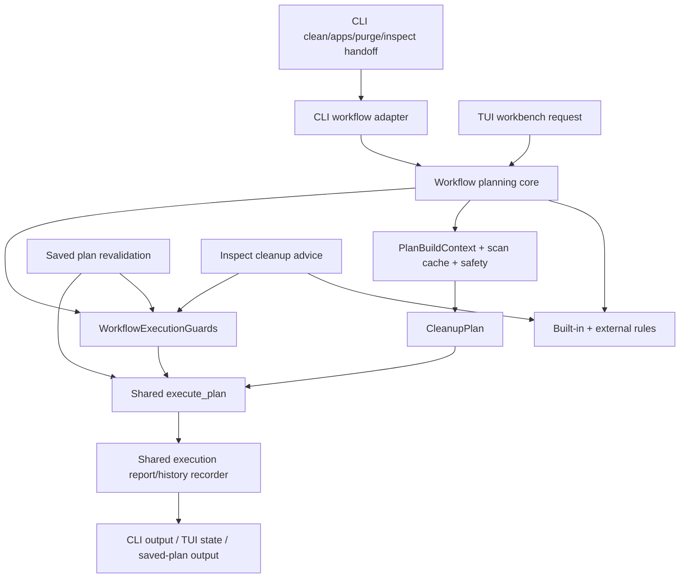

# Workbench Workflow Planner Unification - Plan

## Goal Capsule

| Field | Decision |
|---|---|
| Objective | Make CLI cleanup, TUI/workbench preview and execution, and saved-plan execution share one cleanup planning and protection boundary. |
| Authority | User direction favors fearless refactor, breaking unreleased internal APIs, deleting duplicated code, and making Rebecca's cleanup model harder to misuse across Windows, Linux, and macOS. |
| Execution profile | Break internal Rust APIs where cleaner; preserve preview-first cleanup, recoverable-trash default, permanent-delete explicitness, scan-cache semantics, and machine-output contracts. |
| Stop conditions | Stop for a safety regression, a machine-output contract ambiguity, or a verification failure that implies a product decision rather than an implementation defect. |
| Landing | Commit incrementally with conventional commits after green focused verification; main-branch landing and remote push are allowed by current user preference. |

---

## Product Contract

### Summary

Rebecca already has a `WorkflowPlanner` boundary for CLI cleanup, but the TUI workbench and saved-plan execution still rebuild parts of planning and protection themselves.
This plan makes one workflow-planning core own rules, external-rule merge, scan-cache context, safety knowledge, protected storage, protected paths, and execution guards, while CLI, TUI, saved-plan execution, and inspect advice keep only presentation-specific behavior.

### Problem Frame

`crates/rebecca/src/workflow_planner.rs` now owns most CLI plan construction, but it still mixes reusable planning work with CLI progress and NDJSON output.
`crates/rebecca/src/workbench.rs` independently loads built-in rules, discovers applications, builds `PlanBuildContext`, assembles `ProtectionPolicy`, handles scan-cache setup, and duplicates `merged_protected_paths`.
`crates/rebecca/src/saved_plan.rs` also assembles execution protection separately.
`crates/rebecca/src/inspect.rs` still loads rule/protection inputs for cleanup advice and lint-like protection checks outside the shared workflow boundary.
That divergence makes every future Linux/macOS cleanup adaptation and TUI safety change pay the same integration cost again.

The highest-value refactor is to make planning and execution guards a reusable in-process service, then delete the TUI/saved-plan duplicate code.
The TUI should still own terminal progress, task threading, and recovery UI; it should not own cleanup safety policy assembly.

### Requirements

**Shared planning and safety**

- R1. A reusable workflow planning core owns rule source resolution, external-rule merge, application discovery, scan-cache store/policy wiring, safety knowledge, protected storage, protected paths, and cancellation.
- R2. CLI cleanup, app cleanup, purge cleanup, inspect cleanup handoff, TUI workbench preview, TUI workbench execution, and saved-plan execution use the same execution-guard construction.
- R3. Presentation-specific progress remains outside the reusable core: CLI keeps human/NDJSON progress, while TUI receives typed `PlanProgressEvent` values.
- R4. TUI workbench recoverable cleanup uses the same protected-path semantics as CLI cleanup, including user configured protected paths and TUI request exclusions.

**Cleanup execution contract**

- R5. Recoverable deletion remains the default for CLI and TUI execution; permanent deletion remains explicit and unavailable from the TUI workbench execution path in this plan.
- R6. Execution history and receipt-related side effects stay centralized enough that new cleanup surfaces do not hand-roll history append and execution-report synchronization.
- R7. Saved-plan execution revalidates saved targets as it does today, then uses the shared guard/executor path.

**Maintainability and tests**

- R8. Duplicated helper code in `workbench.rs` and `saved_plan.rs` is removed once shared helpers exist.
- R9. Existing CLI/TUI/saved-plan tests continue to pass, with new regression coverage proving shared planner use, TUI progress bridging, and saved-plan guard reuse.
- R10. Documentation and changelog note the internal safety/workbench convergence without presenting TUI snapshots or human output as machine APIs.
- R11. `inspect map` cleanup advice and protection-oriented linting reuse the same rule-resolution and protection-root construction used by cleanup workflows.

**TUI runtime and rendering foundation**

- R12. TUI synchronous replay and interactive execution share the same task outcome reducer so errors, retry state, cancellation, history, and preview/execution transitions cannot drift.
- R13. TUI task runtime separates task ownership, blocking workers, progress bridging, and outcome application into clear modules instead of one large file.
- R14. TUI render, snapshot, replay, and hit-test paths consume one frame projection and one shared presentation text layer instead of cloning and formatting the same view state independently.

### Acceptance Examples

- AE1. Given a configured protected path and a matching TUI-selected cleanup target, when the workbench builds a preview, then the target is blocked by the same reason code as CLI cleanup.
- AE2. Given a TUI preview with `scan_cache` enabled, when a target has a compatible scan-cache record, then the TUI progress bridge receives a cache-hit event and the target estimate source remains scan-cache.
- AE3. Given a TUI execution request with allowed targets, when execution runs, then it uses recoverable trash and records history through the same execution report synchronization semantics as CLI cleanup.
- AE4. Given a saved preview plan whose target is unchanged, when `plan run --yes` executes, then execution uses shared protection guards and preserves saved-plan fingerprint revalidation.
- AE5. Given CLI `clean --format ndjson`, when planning emits target and cache events, then NDJSON lifecycle behavior stays unchanged after the reusable core extraction.
- AE6. Given the same TUI app state, when render, snapshot, replay, and hit-test ask for visible rows or distribution rows, then they consume a single frame projection with the same selected row and row counts.

### Scope Boundaries

- In scope: internal Rust API changes in `crates/rebecca/src/workflow_planner.rs`, `crates/rebecca/src/workbench.rs`, `crates/rebecca/src/clean.rs`, `crates/rebecca/src/saved_plan.rs`, `crates/rebecca/src/inspect.rs`, `crates/rebecca/src/tui/*.rs`, and tests that exercise these surfaces.
- In scope: deleting duplicated planner/protection helpers that become obsolete.
- Deferred to follow-up work: permanent deletion from TUI, restore-from-history UI, command palette cleanup workflows, raw APFS/ext4 metadata backends, and a public plugin API for custom cleanup workflows.
- Outside this product's identity: weakening preview-first cleanup, making TUI snapshots a machine API, shelling out from TUI to parse CLI output, copying GPL rule data, or making permanent delete the default.

---

## Planning Contract

### Key Technical Decisions

- KTD1. Split reusable planning core from CLI progress presentation.
  The current `workflow_planner.rs` is the right home for workflow planning, but `PlanProgressReporter` is CLI-specific.
  The core should expose a typed progress callback or sink so TUI can reuse planning without inheriting CLI spinners or NDJSON writers.
- KTD2. Keep `WorkflowExecutionGuards` as the shared safety authority.
  Every execution surface should derive `ProtectionPolicy` from the same guard type instead of rebuilding safety knowledge, storage protection, and protected paths.
- KTD3. Let workbench request building stay TUI-owned.
  `CleanupWorkbenchRequest` converts staged UI state into a `PlanRequest`; after that point the shared planner owns the cleanup semantics.
- KTD4. Treat saved-plan execution as execution-only reuse.
  Saved plans already carry a built and fingerprinted plan, so they should not rebuild planning, but they should reuse guard construction and executor selection.
- KTD5. Centralize execution report recording without coupling TUI to output artifacts.
  `WorkflowArtifacts` can remain CLI-output-aware, but history append and plan execution-report synchronization should be reusable by TUI and saved-plan paths.
- KTD6. Resolve rule and protection inputs once for cleanup-adjacent surfaces.
  `inspect map` advice is not a destructive workflow, but its "maybe cleanable / blocked / warning-gated" facts should come from the same rule resolver and protection-root builder so external rules and protected paths do not drift from `clean`.
- KTD7. Collapse TUI synchronous replay and interactive task completion into a shared outcome reducer.
  Replay remains deterministic and non-interactive, but the state transition for preview, execution, error, retry, cancellation, and history should be the same transition used by the interactive task manager.
- KTD8. Prefer an explicit `TuiFrameProjection` snapshot over borrowed cache slices.
  This avoids `RefCell` lifetime coupling while still removing repeated `Vec` cloning and duplicated render/snapshot/hit-test projection logic.

### High-Level Technical Design

### Assumptions

- The TUI workbench should remain recoverable-trash-only for real execution in this plan.
- External rules should participate in TUI workbench previews the same way they participate in CLI cleanup, unless implementation uncovers an explicit reason to exclude them.
- The existing `PlanProgressEvent` enum is sufficient for the TUI progress bridge; no new progress protocol is planned unless tests expose a missing event.

### Existing Patterns to Follow

- `crates/rebecca/src/workflow_planner.rs` for the current CLI planner extraction and `WorkflowExecutionGuards`.
- `crates/rebecca/src/clean.rs` for the canonical mode-to-backend execution path and CLI NDJSON error/cancellation behavior.
- `crates/rebecca/src/workbench.rs` for current TUI request semantics and recoverable execution behavior.
- `crates/rebecca/src/tui/task.rs` for typed progress bridging and bounded task-channel behavior.
- `crates/rebecca/src/saved_plan.rs` for saved-target fingerprint revalidation.
- `docs/adr/0006-deletion-and-recovery-model.md` for preview-first cleanup and recoverable-trash semantics.

### Risks & Dependencies

| Risk | Mitigation |
|---|---|
| CLI progress behavior regresses while extracting reusable planner code | Preserve CLI adapter tests and run CLI API/clean regressions that assert NDJSON lifecycle events and human progress-independent output. |
| TUI workbench starts honoring external rules unexpectedly | Treat this as intended unless tests reveal TUI selection cannot represent the rule; document the assumption and keep selected-rule filtering authoritative. |
| Saved-plan execution loses fingerprint safety while sharing guards | Keep revalidation before execution and add a regression that changed targets are skipped before shared execution begins. |
| Borrowing/lifetime complexity around `ProtectionPolicy<'_>` spreads | Keep `WorkflowExecutionGuards` owning safety data and only borrow it at the final execution call boundary. |
| TUI projection refactor introduces borrow or stale-frame bugs | Use an owned frame projection per render/replay/hit-test cycle and add tests that selection, filtering, refresh generation, and screen changes rebuild only the required projection data. |

---

## Implementation Units

### U1. Extract a reusable workflow planning core

- **Goal:** Separate plan construction and guard construction from CLI progress/output so non-CLI surfaces can reuse the same core.
- **Requirements:** R1, R2, R3, R8.
- **Dependencies:** None.
- **Files:** `crates/rebecca/src/workflow_planner.rs`; `crates/rebecca/src/clean.rs`; `crates/rebecca/tests/cli_api.rs`; `crates/rebecca/tests/cli_clean.rs`.
- **Approach:** Keep `WorkflowExecutionGuards` as the owned guard container and introduce a reusable planning entry point that accepts a typed progress callback or sink.
  Move CLI-only spinner and NDJSON behavior behind a CLI adapter that calls the reusable core.
  Preserve `WorkflowPlanBuildOutcome` or replace it with a cleaner equivalent if implementation shows the error/event-writer split is adapter-only.
- **Execution note:** Start with characterization coverage around CLI NDJSON lifecycle events before changing the adapter shape.
- **Patterns to follow:** Existing `build_workflow_plan` flow in `workflow_planner.rs`; CLI output contract handling in `clean.rs`.
- **Test scenarios:** `clean --format ndjson` still emits started, progress, completed, cancellation, and error envelopes without human text; `clean --format json` still returns the same success payload shape; scan-cache hit/miss/write-skip progress remains gated by `ProgressDetail`.
- **Verification:** Focused CLI API and clean tests prove the adapter is behavior-preserving before other surfaces are moved.

### U2. Move TUI workbench preview to the shared planner

- **Goal:** Make workbench preview use the reusable workflow planner for rule loading, external rules, safety knowledge, protected paths, scan cache, and progress.
- **Requirements:** R1, R2, R3, R4, R8, R9.
- **Dependencies:** U1.
- **Files:** `crates/rebecca/src/workbench.rs`; `crates/rebecca/src/tui/task.rs`; `crates/rebecca/tests/cli_tui.rs`; `crates/rebecca-core/tests/safety_policy.rs` if core-level fixtures need strengthening.
- **Approach:** Replace `workbench::build_plan` internals with the shared planner core while preserving `CleanupWorkbenchRequest` as the TUI-owned state-to-request adapter.
  Wire the TUI progress callback through the shared planner instead of direct `build_cleanup_plan_with_context`.
  Delete local built-in rule loading, application discovery, scan-cache context assembly, and `merged_protected_paths` from `workbench.rs`.
- **Execution note:** Add or update a TUI/workbench regression before deleting the local planner helper.
- **Patterns to follow:** `plan_progress_sender` in `tui/task.rs`; current `CleanupWorkbenchRequest::dry_run_plan_request`.
- **Test scenarios:** Preview with a selected rule produces the same allowed/skipped target counts as CLI planning; preview with a protected path blocks the target; preview with scan cache enabled forwards cache-hit or cache-miss progress to TUI state; an empty selection remains a valid no-target preview.
- **Verification:** TUI unit tests and CLI TUI smoke tests prove preview behavior and progress bridging remain stable.

### U3. Move TUI workbench execution to shared guards and execution recording

- **Goal:** Make TUI recoverable execution use shared `WorkflowExecutionGuards`, shared executor selection, and reusable history/execution-report synchronization.
- **Requirements:** R2, R4, R5, R6, R8, R9.
- **Dependencies:** U1, U2.
- **Files:** `crates/rebecca/src/workbench.rs`; `crates/rebecca/src/workflow_artifacts.rs` or a new workflow execution recorder module if cleaner; `crates/rebecca/src/tui/task.rs`; `crates/rebecca/tests/cli_tui.rs`; `crates/rebecca-core/tests/executor_contract.rs`.
- **Approach:** Reuse the guards returned by the shared planner for execution instead of rebuilding a second `ProtectionPolicy`.
  Extract history append plus `plan.execution_report` synchronization from `WorkflowArtifacts::record_execution` into a reusable helper that does not depend on CLI output files.
  Keep receipt writing in CLI-only artifacts.
- **Execution note:** Keep TUI execution recoverable-only; do not add a permanent-delete affordance as a side effect.
- **Patterns to follow:** `clean::execute_plan`; `WorkflowArtifacts::record_execution`; TUI execution result application in `tui/task.rs`.
- **Test scenarios:** Execution with zero allowed targets returns without backend calls; execution with allowed targets moves through recoverable backend and records pending reclaim bytes; history append warning is preserved in the execution report; cancellation is surfaced as a TUI task cancellation instead of a generic error.
- **Verification:** Focused TUI execution tests and executor contract tests prove shared guards do not weaken safety or history behavior.

### U4. Reuse shared execution guards in saved-plan execution

- **Goal:** Remove saved-plan-specific protection policy assembly while preserving saved-target revalidation.
- **Requirements:** R2, R7, R8, R9.
- **Dependencies:** U1, U3.
- **Files:** `crates/rebecca/src/saved_plan.rs`; `crates/rebecca/tests/cli_plan.rs`; `crates/rebecca/tests/cli_receipt.rs`.
- **Approach:** Add a guard-construction path that can be used with an already-built plan and no TUI exclude paths.
  Keep `SavedCleanupPlan::revalidated_plan` unchanged unless implementation reveals duplicated state-reset logic.
  Route execution through the same `execute_plan` and shared execution recorder.
- **Execution note:** Characterize changed-target and symlink/reparse saved-plan behavior before changing execution wiring.
- **Patterns to follow:** `SavedPathMetadata::mismatch_reason`; `revalidate_saved_target`; `clean::execute_plan`.
- **Test scenarios:** An unchanged saved target executes; a missing saved target is skipped before execution; a changed saved target is skipped with saved-plan reason code; a protected saved target is blocked through shared guards; `--permanent` still requires `--yes`.
- **Verification:** Saved-plan CLI tests prove revalidation and shared protection still compose.

### U5. Unify inspect cleanup advice rule and protection inputs

- **Goal:** Make inspect-map cleanup advice and protection-oriented linting derive rule and protected-root inputs from the same workflow resolver/guard helpers as cleanup planning.
- **Requirements:** R1, R2, R8, R9, R11.
- **Dependencies:** U1.
- **Files:** `crates/rebecca/src/inspect.rs`; `crates/rebecca/src/workflow_planner.rs` or a new resolver/guard helper module if cleaner; `crates/rebecca/tests/cli_inspect.rs`; `crates/rebecca-core/tests/cleanup_advice.rs`.
- **Approach:** Extract a reusable rule resolver for built-in plus enabled external rules, and expose a guard-derived protected-root view for advice/lint consumers.
  Keep inspect advice non-destructive: it may classify and explain cleanup relevance, but it must not become an execution authority.
  Remove local built-in rule loading and ad hoc protection-root assembly from inspect paths that can share the workflow helpers.
- **Execution note:** Add characterization around current inspect advice output before enabling external-rule visibility if existing count assertions are brittle.
- **Patterns to follow:** `inspect::annotate_map_report_with_cleanup_advice`; `workflow_planner::WorkflowExecutionGuards`; `cleanup_advice` core projections.
- **Test scenarios:** An enabled external rule can contribute inspect cleanup advice; a configured protected path produces advice/protection status consistent with `clean --dry-run`; advice status filtering still returns the expected ranked entries; lint/protection roots include app storage and user protected paths without duplicates.
- **Verification:** Inspect CLI and cleanup-advice tests prove the non-destructive advice path agrees with cleanup planning on rule and protection facts.

### U6. Split TUI task runtime and unify outcome application

- **Goal:** Make TUI async/concurrent execution easier to reason about by separating task ownership, worker execution, progress bridging, and state outcome application.
- **Requirements:** R12, R13, R9.
- **Dependencies:** U2, U3.
- **Files:** `crates/rebecca/src/tui/task.rs`; new modules under `crates/rebecca/src/tui/` if cleaner; `crates/rebecca/src/tui/mod.rs`; `crates/rebecca/tests/cli_tui.rs`.
- **Approach:** Keep the current bounded-channel and cancellation behavior, but move task manager state, blocking workers, progress conversion, and outcome application into distinct modules or clearly separated types.
  Route replay and `--once` execution through the same outcome reducer used by interactive task completion.
  Preserve progress coalescing rules so high-volume file events can be dropped while target/cache/execution events remain reliable.
- **Execution note:** Characterize current replay and interactive task completion before deleting the duplicate synchronous handler.
- **Patterns to follow:** `TuiTaskManager` active-task id checks, `plan_progress_sender` in `tui/task.rs`, and replay handling in `tui/replay.rs`.
- **Test scenarios:** Stale task outcomes do not mutate the app; cancellation joins the worker and leaves the app in a retryable state; preview and execute replay apply the same state as interactive completion; progress flooding keeps the last meaningful non-file progress event; history append warnings surface through the shared outcome.
- **Verification:** TUI unit tests and `cli_tui` replay tests cover both synchronous and interactive paths.

### U7. Introduce TUI frame projection and shared presentation text

- **Goal:** Stop render, snapshot, hit-test, and replay from cloning projected rows and duplicating user-facing TUI text formatting.
- **Requirements:** R14, R9, R10.
- **Dependencies:** U6 can proceed independently after app state APIs are stable.
- **Files:** `crates/rebecca/src/tui/app.rs`; `crates/rebecca/src/tui/projection.rs`; new `crates/rebecca/src/tui/frame_projection.rs` or equivalent; `crates/rebecca/src/tui/view.rs`; `crates/rebecca/src/tui/snapshot.rs`; `crates/rebecca/src/tui/hit_test.rs`; `crates/rebecca/src/tui/replay.rs`; new `crates/rebecca/src/tui/text.rs` or equivalent.
- **Approach:** Add an owned frame projection built from the current app state that contains visible rows, distribution rows, selected row metadata, and any treemap inputs needed by render/snapshot/hit-test.
  Replace `TuiApp::visible_rows()` and `TuiApp::distribution_rows()` owned-return APIs with frame-projection accessors or narrowly-scoped borrowing helpers.
  Move help, history, plan summary, byte bars, and width trimming into a shared presentation module consumed by both terminal render and snapshot output.
- **Execution note:** Keep snapshots human-oriented; do not treat snapshot text as a stable machine API while deduplicating it.
- **Patterns to follow:** Existing `TuiProjectionCache` invalidation tests and current `snapshot.rs` snapshot shape.
- **Test scenarios:** Render/snapshot/hit-test agree on row counts and selected labels for map, treemap, type, and extension screens; filtering and refresh generation rebuild projection data; width trimming is shared and tested once; help/history/plan text changes in one module appear in both render and snapshot paths.
- **Verification:** TUI projection/unit tests and `cli_tui` snapshots stay green without duplicated formatting helpers.

### U8. Update docs, changelog, and remove obsolete compatibility code

- **Goal:** Document the unified cleanup-workflow and TUI foundation work, then remove any leftover transitional helpers after the code paths converge.
- **Requirements:** R8, R10, R14.
- **Dependencies:** U1, U2, U3, U4, U5, U6, U7.
- **Files:** `CHANGELOG.md`; `docs/knowledge/engineering/current-state.md`; `docs/adr/0006-deletion-and-recovery-model.md` if the model text needs a small update; `skills/rebecca-disk-cleaner/SKILL.md`; `crates/rebecca/src/workbench.rs`; `crates/rebecca/src/saved_plan.rs`.
- **Approach:** Add a short user-facing changelog note under Unreleased describing safer internal cleanup workflow convergence.
  Update durable engineering state only if the refactor materially changes the current-state baseline.
  Delete local helper functions, duplicated text helpers, owned-row APIs, and imports that exist only for the previous duplicate paths.
- **Execution note:** Keep user-facing text human and concise; do not expose internal module names unless the document is an engineering-memory artifact.
- **Patterns to follow:** Existing changelog Unreleased style; current Rebecca disk-cleaner skill user language.
- **Test scenarios:** Documentation-only changes need no unit tests; dead-code deletion is covered by `cargo clippy --workspace --all-targets --locked -- -D warnings`.
- **Verification:** Formatting, clippy, full nextest, and skill validation pass with no dead-code allowances.

---

## Verification Contract

| Gate | Applies to | Done signal |
|---|---|---|
| `cargo fmt --all -- --check` | All units | Formatting is stable with no unrelated churn. |
| `cargo clippy --workspace --all-targets --locked -- -D warnings` | All Rust units | No dead code, unused helpers, or warning regressions remain after deleting duplicate paths. |
| `cargo nextest run -p rebecca --test cli_api --test cli_clean --test cli_tui --test cli_plan --test cli_receipt --test cli_inspect --locked --no-fail-fast` | U1-U7 | CLI, TUI, saved-plan, inspect, progress, and receipt regressions pass. |
| `cargo nextest run --workspace --locked --no-fail-fast` | Whole plan | Workspace behavior remains green across core, rules, NTFS, Windows adapter, and CLI crates. |
| `python skills/validate.py` | U8 | Rebecca disk-cleaner skill remains valid after wording changes. |

---

## Definition of Done

- CLI cleanup, TUI workbench preview/execution, saved-plan execution, and inspect cleanup advice all use shared workflow planning, rule resolution, or shared execution guards where appropriate.
- `workbench.rs` no longer contains its own rule loading, scan-cache context assembly, safety-knowledge policy construction, or protected-path merge helper.
- `saved_plan.rs` no longer hand-builds an execution `ProtectionPolicy`.
- CLI NDJSON/JSON output remains contract-compatible.
- TUI progress, cancellation, history, and recoverable-trash behavior remain covered.
- TUI task runtime has clear task-manager, worker/progress, and outcome boundaries instead of one catch-all implementation file.
- TUI render, snapshot, replay, and hit-test share frame projection and presentation text instead of cloning and duplicating formatting logic.
- Changelog and user-facing skill/docs describe the behavior in user terms.
- Abandoned transitional code and temporary helpers are removed before the final commit.
- All Verification Contract gates pass locally before landing.
