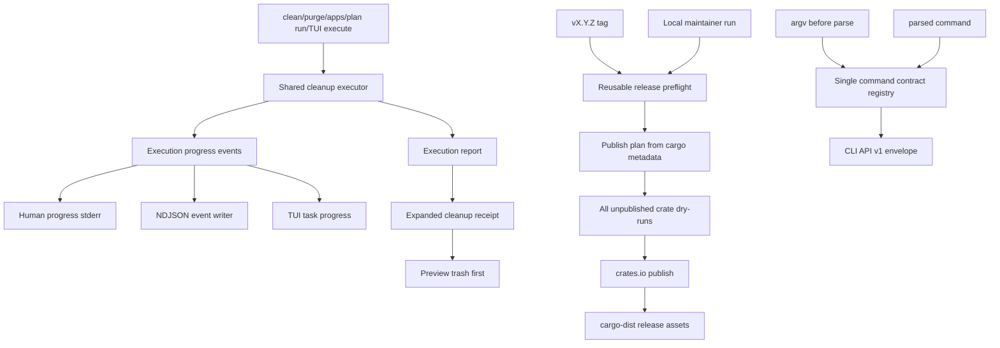

# Release Dogfood And Cleanup Safety Refactor - Plan

## Goal Capsule

| Field | Decision |
|---|---|
| Objective | Make Rebecca safer to run after cleanup, harder to publish incorrectly, easier to audit from machine output, and measurably faster or more explainable on large scans. |
| Authority | User direction explicitly allows fearless refactoring, breaking unreleased APIs, deleting compatibility baggage, using subagent audit findings, committing during the work, and prioritizing the best architecture over small patches. |
| Execution profile | Break internal and pre-release public Rust APIs where needed; preserve preview-first cleanup, recoverable trash by default, explicit permanent deletion, current CLI API v1 payload compatibility unless this plan calls out an intentional additive schema change, and green cross-platform CI. |
| Stop conditions | Stop for a deletion-safety ambiguity, irreversible release-publishing risk that cannot be made testable locally, or a verification failure that implies a product decision rather than an implementation defect. |
| Landing | Commit incrementally with conventional commits after focused verification; main-branch landing and remote push are allowed by current user preference. |

---

## Product Contract

### Summary

Rebecca has become a real cross-platform cleanup CLI with a TUI, recoverable-trash execution, receipts, skills, shell completions, release workflows, dogfood scripts, and NTFS performance evidence.
The next quality bar is not another isolated cleanup rule.
It is making the product trustworthy when a normal user executes cleanup, and making the release path trustworthy when a maintainer pushes a tag.

This plan fixes the most important user-facing safety gap first: Rebecca must not casually suggest `rebecca trash empty --yes` as the immediate next step after a normal cleanup, because that can empty the whole system Trash or Recycle Bin, not only files Rebecca moved.
Then it turns release readiness into a reusable, tag-blocking evidence gate, removes duplicated command-contract mappings, adds execution-phase progress, strengthens cleanup receipts, and takes the next measurable scan-performance step.

### Problem Frame

Subagent and local audits identified four high-value themes:

- User safety: several CLI/TUI/receipt next-step surfaces directly suggest `rebecca trash empty --yes`, which is too aggressive for a system-wide trash operation.
- Release safety: tag pushes can start crates.io publishing while release preflight and release gates remain manual workflows; publish order and dependency version requirements are duplicated in workflow scripts.
- Operability: cleanup planning progress is strong, but actual execution can still feel silent; receipts lack enough request, invocation, restore, and provenance detail to serve as a complete audit artifact.
- Architecture/performance: command-to-payload contract mapping exists in more than one place, disk-map progress can generate per-file work even when target-level detail is enough, and several pre-release API/manifest surfaces can be broken cleanly before wider adoption.

The priority order is intentionally safety-first.
A faster scanner is useful, but a cleanup tool must first avoid misleading users about irreversible follow-up actions and must avoid publishing broken artifacts.

### Requirements

**Cleanup safety and user trust**

- R1. After recoverable cleanup, every human, TUI, receipt, and machine-facing next-step surface must recommend previewing trash first, not immediately emptying it with `--yes`.
- R2. Rebecca may show the `trash empty --yes` command only as a second-step action after making it clear that it empties the platform Trash or Windows Recycle Bin scope, not only Rebecca's last run.
- R3. Platform unsupported trash operations must use a typed, user-comprehensible error classification and a human next step, not a generic internal error.
- R4. Windows wording should say Recycle Bin where the destination is Windows-specific; portable wording may say system trash.

**Release and package safety**

- R5. Tag-driven release publishing must depend on the same release-readiness checks that maintainers can run locally.
- R6. Workspace crate publish order, workspace dependency version requirements, package file lists, registry-independent dry-runs, catalog validation, skill validation, and cargo-dist planning must be validated by reusable scripts rather than duplicated inline workflow logic.
- R7. Preflight must detect a workspace crate that is missing from the publish plan or a workspace dependency requirement that does not match the release version.
- R8. Preflight must dry-run all unpublished workspace crates in dependency order before any real crates.io publish job can start.
- R9. Existing legacy release archive scripts should either be demoted to smoke-only helpers or removed from release authority if cargo-dist is the official publisher.

**Machine output, receipts, and progress**

- R10. Command API contract inference must have one source of truth so parse-time and post-parse envelopes cannot drift.
- R11. Cleanup execution must expose typed progress for execution start, target start, target finish, and execution completion.
- R12. Human progress, NDJSON progress, and TUI progress must consume the same execution progress events while keeping stdout clean for machine formats.
- R13. Cleanup receipts must include enough request, invocation, selected gates, restore hints, estimate provenance, and saved-plan provenance to explain what happened after the terminal session is gone.

**Performance and maintainability**

- R14. Disk-map and cleanup scan progress should honor target-level progress detail at the core boundary so TUI and CLI do not allocate or send per-file events unless file-level detail is requested.
- R15. Scanner metadata work should be profile-driven: logical-only paths should avoid allocated/identity metadata work where the caller does not need those fields, while allocated/unique/age grouping paths keep the richer metadata with explicit provenance.
- R16. Pre-release API baggage that blocks clean refactoring should be removed or narrowed, including duplicated rule include lists, manifest `search_kind` input compatibility, and overly broad public module exports where feasible in this plan.
- R17. Performance gates should emit evidence that can be compared in release gates and understood from a single report artifact.

**Documentation and release notes**

- R18. README, skill guidance, release docs, and changelog must explain the updated trash flow, release gate flow, receipt audit detail, and scanner evidence in user language.
- R19. Changelog entries must stay concise and human-readable under Unreleased, without repeating internal module names.

### Acceptance Examples

- AE1. Given `rebecca clean --yes --category browser`, when the human summary and optional receipt are generated, then the next step says to run `rebecca trash empty` first and explains that `--yes` empties the system trash after review.
- AE2. Given the TUI completes a recoverable cleanup on Windows, when the result screen is rendered, then it references the Recycle Bin and offers preview-before-empty wording.
- AE3. Given a tag push for `v0.3.1`, when release workflow starts, then crate publishing cannot begin until reusable preflight validates version, publish order, dependency requirements, package file lists, catalog, skill validation, dry-runs, and dist planning.
- AE4. Given a workspace dependency requirement intentionally mismatched from the release version, when the release publish plan script runs, then it fails before any cargo publish command.
- AE5. Given a parse-time JSON error for `config show --bad-flag`, when the envelope is emitted, then `command` and `payload_kind` match the same command contract used after normal parsing.
- AE6. Given a cleanup execution with multiple allowed targets, when `--format ndjson` is used, then NDJSON includes execution progress events without human text on stdout.
- AE7. Given a receipt for a saved-plan run, when the saved target is revalidated and executed, then the receipt includes the source plan path, request shape, invocation, restore hints, estimate provenance, and revalidation outcome summary.
- AE8. Given `inspect map` with default target-level progress, when a large tree is scanned, then core progress does not generate per-file owned-path events; `--progress-detail file` still emits file-level progress.
- AE9. Given a manifest with `search_kind`, when rule validation runs after this refactor, then it is rejected or ignored according to the new broken-clean manifest contract, and built-in rules still validate without that field.

### Scope Boundaries

- In scope: `crates/rebecca/src/render/clean.rs`, `cleanup_receipt.rs`, `trash.rs`, `output.rs`, `workflow_execution.rs`, `workflow_planner.rs`, `main.rs`, `cli.rs`, `tui/*`, release scripts, workflow files, receipt schemas, rule manifest parsing, public crate export narrowing, benchmark/dogfood scripts, README, skill, release docs, changelog, and tests.
- In scope: deleting old or duplicated release logic, command contract mappings, manifest compatibility fields, and broad module exports when the affected code can be updated in the same plan.
- Deferred: cross-platform release archives beyond the current cargo-dist target matrix, installer profile editing for completions, APFS/ext4 native metadata backends, TUI permanent-delete affordance, restore-from-trash automation, and a public plugin API.
- Outside this product's identity: making permanent deletion the default, using ad hoc shell deletion instead of Rebecca's executor, treating TUI snapshots as machine API, publishing crates before preflight, or silently returning stale scan-cache data.

---

## Planning Contract

### Key Technical Decisions

- KTD1. Treat trash emptying as a separate destructive workflow.
  Recoverable cleanup moves data to trash; emptying trash is a separate action with a separate preview and confirmation.
- KTD2. Put release publish knowledge in scripts, not workflow YAML.
  GitHub Actions should call the same scripts maintainers run locally, while workflows only wire inputs, secrets, runners, and artifacts.
- KTD3. Make tag release depend on preflight before crates.io publishing.
  A bad tag should fail before publishing any crate.
- KTD4. Use a single command contract registry for machine envelopes.
  Parse-time inference and post-parse command execution must not keep independent mappings.
- KTD5. Execution progress belongs in the core execution boundary.
  CLI, NDJSON, and TUI should adapt typed execution events rather than polling execution reports after the fact.
- KTD6. Receipts are user audit artifacts, not just execution totals.
  They should capture request intent, invocation, gates, restore hints, provenance, and saved-plan revalidation context.
- KTD7. Optimize scan observability before adding a new scanner algorithm.
  Avoid needless per-file progress allocations first, then add profile-driven metadata collection and benchmarks that prove impact.
- KTD8. Break pre-release APIs now.
  Rebecca is not broadly adopted yet, so narrowing public exports and removing stale manifest inputs is cheaper now than after release.

### High-Level Technical Design

### Assumptions

- `trash empty --yes` may remain available, but it must not be the first recommended post-cleanup action.
- Release workflow can still support manual `release-preflight` and `release-gates`, but tag release must run the critical preflight gate automatically.
- Receipt schema changes are additive for CLI API v1 unless implementation proves an old field is actively misleading.
- Public Rust API narrowing is acceptable because the user has approved breaking changes before wider adoption.
- Scan profile work should preserve deterministic output ordering even if traversal internals become more selective or concurrent.

### Existing Patterns to Follow

- `scripts/release/run-release-gates.ps1` for a report-oriented gate wrapper.
- `.github/workflows/release.yml` publish-crates job for existing publish retry/wait behavior.
- `crates/rebecca/src/workflow_execution.rs` and `crates/rebecca-core/src/execution.rs` for shared execution report boundaries.
- `crates/rebecca/src/output.rs` for CLI API envelope and NDJSON event structure.
- `crates/rebecca/src/tui/task_progress.rs` for adapting typed progress events to TUI state.
- `crates/rebecca-core/src/progress.rs` and `scan/progress.rs` for progress detail and sampling patterns.
- `scripts/perf/run-benchmark-matrix.ps1` and `scripts/perf/compare-benchmark-matrix.ps1` for evidence-first performance reporting.

### Risks & Dependencies

| Risk | Mitigation |
|---|---|
| Trash wording becomes too cautious and hides how to free space | Show both steps: preview trash first, then empty with `--yes` only after review, with platform-specific scope wording. |
| Release preflight slows every tag too much | Keep full release correctness checks mandatory before publish; leave expensive dogfood/benchmark modes configurable but visible in release gates. |
| Workflow scripts diverge between PowerShell and bash | Prefer one metadata-driven script per responsibility; call it from both local docs and workflows. |
| Execution progress changes NDJSON contracts | Add new event kinds without removing existing lifecycle events; preserve sequence ordering and stdout cleanliness. |
| Receipt schema grows too large | Keep high-value audit fields structured and bounded; avoid embedding full plans unless already saved separately. |
| Scan progress gating hides useful file detail | Keep `--progress-detail file` and tests proving file events still exist when requested. |
| Public API narrowing breaks internal tests/fuzz | Add explicit `test_support` or feature-gated exports only where needed; run docs and all-feature tests. |

---

## Implementation Units

### U1. Make post-cleanup trash guidance safe by default

- **Goal:** Replace direct `trash empty --yes` next-step recommendations with preview-first trash guidance across CLI, TUI, receipt, README, and skill text.
- **Requirements:** R1, R2, R4, R18, R19.
- **Dependencies:** None.
- **Files:** `crates/rebecca/src/render/clean.rs`; `crates/rebecca/src/cleanup_receipt.rs`; `crates/rebecca/src/tui/presentation.rs`; `crates/rebecca/src/tui/view.rs`; `crates/rebecca/src/tui/progress.rs`; `README.md`; `skills/rebecca-disk-cleaner/SKILL.md`; `CHANGELOG.md`.
- **Approach:** Introduce shared wording or helper data for recoverable cleanup next steps: preview trash, then empty after review.
  Make Windows wording prefer Recycle Bin when the platform is known.
  Update receipt `next_steps` so `--yes` is not the first action.
- **Execution note:** Keep existing `rebecca trash empty --yes` command behavior; this unit changes recommendations and audit output.
- **Test scenarios:** Human clean summary suggests `rebecca trash empty` before `--yes`; receipt next steps distinguish preview and confirmed empty; TUI result/snapshot uses preview-first wording; README and skill examples match the new flow.
- **Verification:** `cargo nextest run -p rebecca --test cli_clean --test cli_receipt --test cli_tui --test cli_trash --locked --no-fail-fast`; `python skills/validate.py`.

### U2. Give trash unsupported paths typed user-facing errors

- **Goal:** Replace generic internal-error behavior for unsupported trash listing/emptying with typed errors and platform-specific next steps.
- **Requirements:** R3, R4, R18.
- **Dependencies:** U1.
- **Files:** `crates/rebecca/src/trash.rs`; `crates/rebecca/src/output.rs`; `crates/rebecca/tests/cli_trash.rs`; `crates/rebecca/tests/cli_api.rs`; `README.md`.
- **Approach:** Add a stable error code such as `trash-unsupported` or `platform-unavailable` for unsupported platform trash operations.
  Human output should tell users to use the platform Trash UI when Rebecca cannot list or empty it.
  Machine output should remain structured and avoid `internal-error` for known platform limitations.
- **Execution note:** Keep supported Windows behavior unchanged, including `--drive`.
- **Test scenarios:** Unsupported trash preview/empty returns typed error; supported dry-run and execution tests still pass; JSON errors have the expected command and payload kind.
- **Verification:** `cargo nextest run -p rebecca --test cli_trash --test cli_api --locked --no-fail-fast`.

### U3. Extract a reusable release publish plan and preflight gate

- **Goal:** Make release correctness checks reusable locally, in manual preflight, and in tag-driven release before crates.io publishing.
- **Requirements:** R5, R6, R7, R8, R9, R17, R18.
- **Dependencies:** None.
- **Files:** `scripts/release/*`; `.github/workflows/release.yml`; `.github/workflows/release-preflight.yml`; `.github/workflows/ci.yml`; `docs/release.md`; `Cargo.toml`.
- **Approach:** Add a metadata-driven publish-plan script that reads `cargo metadata`, resolves workspace crates, computes dependency order, verifies all workspace crates are included, verifies all workspace crate versions match the requested release, verifies internal dependency requirements match the release version, and emits JSON/Markdown evidence.
  Add a reusable preflight script or workflow step that calls this script, package-list checks, full unpublished crate dry-runs in publish order, catalog validation, skill validation, cargo deny, and cargo-dist plan.
  Make `publish-crates` in tag release depend on this preflight job before any publish command.
- **Execution note:** If full dry-run of dependent unpublished crates is impossible against crates.io without already-published dependencies, implement a local-registry transaction or explicitly document and test the registry-independent subset plus dependency requirement proof.
- **Test scenarios:** Publish plan fails for missing workspace crate; publish plan fails for out-of-order dependency; publish plan fails for mismatched dependency requirement; preflight package-list checks include schemas and skill asset; release workflow calls the shared script rather than duplicating order logic.
- **Verification:** publish-plan script self-test; `cargo metadata --no-deps --format-version 1`; `cargo package -p <workspace crate> --list` for all workspace crates; `cargo deny check`; `cargo run -p rebecca --locked -- catalog validate --format json`; `python skills/validate.py`; `dist plan --output-format=json`.

### U4. Collapse CLI command contract mapping to one source of truth

- **Goal:** Ensure parse-time and post-parse CLI API envelopes use the same command and payload-kind contract.
- **Requirements:** R10.
- **Dependencies:** None.
- **Files:** `crates/rebecca/src/main.rs`; `crates/rebecca/src/cli.rs`; `crates/rebecca/src/capabilities.rs` if command metadata can share vocabulary; `crates/rebecca/tests/cli_api.rs`; new or existing help/API tests.
- **Approach:** Introduce a single command contract table or resolver that can be used both before clap parsing completes and after typed command dispatch.
  Delete duplicate match arms from `infer_command_api_contract_from_args` or `command_api_contract`.
  Cover subcommands such as `config show`, `config validate`, `skills`, `trash`, `plan`, and `completion`.
- **Execution note:** Do not change public command names unless duplicated logic exposes an obviously wrong pre-release name.
- **Test scenarios:** Parse-time JSON errors for representative nested commands report the same `command` and `payload_kind` as normal execution; unknown commands still fall back to a safe generic contract; existing CLI API tests pass.
- **Verification:** `cargo nextest run -p rebecca --test cli_api --test cli_help --locked --no-fail-fast`.

### U5. Add execution-phase progress events

- **Goal:** Surface real cleanup execution progress across CLI human progress, NDJSON, and TUI instead of going quiet after planning.
- **Requirements:** R11, R12.
- **Dependencies:** U4 only if event envelopes need the unified command contract.
- **Files:** `crates/rebecca-core/src/executor.rs`; `crates/rebecca-core/src/execution.rs`; `crates/rebecca/src/workflow_execution.rs`; `crates/rebecca/src/output.rs`; `crates/rebecca/src/workflow_planner.rs`; `crates/rebecca/src/tui/task_worker.rs`; `crates/rebecca/src/tui/task_progress.rs`; `crates/rebecca/src/tui/progress.rs`; `crates/rebecca/tests/cli_api.rs`; `crates/rebecca/tests/cli_clean.rs`; `crates/rebecca/tests/cli_tui.rs`.
- **Approach:** Add typed execution progress events at the shared execution boundary.
  Emit start/target-started/target-finished/completed events with bounded path text, status, bytes, pending reclaim, and counts.
  Adapt events to NDJSON event writer, human stderr progress, and TUI task progress without duplicating executor logic.
- **Execution note:** Maintain existing planning progress event order; execution progress starts only after a plan is accepted for execution.
- **Test scenarios:** NDJSON execution includes execution event sequence; human execution progress remains on stderr; TUI execution status updates during execution; file-heavy execution does not flood unbounded messages.
- **Verification:** `cargo nextest run -p rebecca --test cli_api --test cli_clean --test cli_tui --locked --no-fail-fast`.

### U6. Expand cleanup receipts into durable audit artifacts

- **Goal:** Make cleanup receipts useful after the terminal session is gone by recording request intent, invocation, gates, restore hints, estimate provenance, and saved-plan context.
- **Requirements:** R13, R18, R19.
- **Dependencies:** U1, U5.
- **Files:** `crates/rebecca/src/cleanup_receipt.rs`; `crates/rebecca/src/workflow_artifacts.rs`; `crates/rebecca/src/saved_plan.rs`; `crates/rebecca/schemas/api/cli/v1/payloads.schema.json`; `crates/rebecca/tests/cli_receipt.rs`; `crates/rebecca/tests/cli_plan.rs`; `docs/api/cli/v1/README.md`; `CHANGELOG.md`.
- **Approach:** Add structured receipt fields for normalized command/invocation, request platform/mode/workflow/selected rules/categories/gates, delete mode, destination label, restore hints per target when available, estimate source/backend/provenance per target, source saved-plan path, and revalidation summary for plan runs.
  Keep large per-file details out of receipts.
- **Execution note:** Keep receipt schema additive unless a field is misleading enough to rename before release.
- **Test scenarios:** clean receipt includes request and invocation; plan-run receipt includes source plan and revalidation summary; target receipts include restore hints and estimate provenance; schema validates examples.
- **Verification:** `cargo nextest run -p rebecca --test cli_receipt --test cli_plan --test cli_api --locked --no-fail-fast`.

### U7. Make scan progress and metadata collection profile-driven

- **Goal:** Reduce overhead in large scans by not generating per-file progress or rich metadata when the caller did not request them.
- **Requirements:** R14, R15, R17.
- **Dependencies:** None.
- **Files:** `crates/rebecca-core/src/disk_map.rs`; `crates/rebecca-core/src/scan.rs`; `crates/rebecca-core/src/scan/portable.rs`; `crates/rebecca-core/src/scan/windows_native.rs`; `crates/rebecca-core/src/progress.rs`; `crates/rebecca/src/inspect.rs`; `crates/rebecca/src/tui/task_progress.rs`; `crates/rebecca-core/benches/perf_matrix.rs`; `scripts/perf/run-benchmark-matrix.ps1`.
- **Approach:** Thread `InspectProgressOptions` or an equivalent progress profile into disk-map inventory so target-level scans skip `FileMeasured` construction.
  Introduce a scan metadata profile that distinguishes logical-only, allocated, unique, age/grouping, and full-evidence modes.
  Windows native should avoid extra allocation/file-id syscalls in logical-only mode and record provenance when richer metadata is unavailable or skipped.
  Update the performance matrix to record scenarios that prove progress-detail and metadata-profile impact.
- **Execution note:** Preserve output fields as `null` or with caveats where a profile intentionally skipped expensive metadata.
- **Test scenarios:** target detail emits sampled traversal progress but no per-file events; file detail still emits file events; logical-only profile reports logical bytes without allocated/unique claims; full profile still reports allocated/unique when supported; benchmark report includes profile evidence.
- **Verification:** `cargo nextest run -p rebecca-core disk_map scan_engine --locked --no-fail-fast`; `cargo nextest run -p rebecca --test cli_inspect --test cli_tui --locked --no-fail-fast`; `cargo bench -p rebecca-core --bench scan_baseline`; `pwsh -File scripts/perf/run-benchmark-matrix.ps1 -SkipRun`.

### U8. Remove pre-release API and manifest compatibility baggage

- **Goal:** Narrow Rebecca's exposed Rust API and cleanup-rule manifest surface before wider adoption.
- **Requirements:** R16.
- **Dependencies:** U3 can proceed independently; U8 should run after core behavioral units are stable.
- **Files:** `crates/rebecca-core/src/lib.rs`; `crates/rebecca/src/lib.rs`; `crates/rebecca-ntfs/src/lib.rs`; `crates/rebecca-core/src/manifest.rs`; `crates/rebecca-core/src/model.rs`; `crates/rebecca-rules/src/lib.rs`; `crates/rebecca-rules/rules/**`; `crates/rebecca-ntfs/fuzz`; tests that import internal modules.
- **Approach:** Replace broad `pub mod` and `pub use rebecca_core::*` surfaces with a curated facade and explicit modules meant for users.
  Keep internal modules private or `pub(crate)`.
  Add feature-gated `test_support` or `fuzzing` exports only where in-repo tests/fuzz need parser internals.
  Remove manifest input `search_kind` and keep any search-kind display as derived data from target kind.
  Evaluate generating built-in rule include lists from the rules directory so TOML files become the single source of truth.
- **Execution note:** Because this is a breaking pre-release refactor, update docs and examples immediately rather than keeping compatibility aliases.
- **Test scenarios:** workspace tests compile through the new facade; fuzz/test support still compiles; manifests using `search_kind` fail with clear validation; built-in catalog validation still passes; generated or embedded rule file list matches the rules directory.
- **Verification:** `cargo nextest run -p rebecca-core -p rebecca-rules -p rebecca-ntfs --all-features --locked --no-fail-fast`; `cargo doc --workspace --all-features --no-deps`; `cargo run -p rebecca --locked -- catalog validate --format json`.

### U9. Update docs, changelog, engineering state, and release evidence language

- **Goal:** Keep user-facing and maintainer-facing docs aligned with the safer cleanup flow, release preflight authority, receipts, progress, and performance evidence.
- **Requirements:** R18, R19.
- **Dependencies:** U1-U8.
- **Files:** `README.md`; `CHANGELOG.md`; `docs/release.md`; `docs/api/cli/v1/README.md`; `docs/knowledge/engineering/current-state.md`; `skills/rebecca-disk-cleaner/SKILL.md`; `scripts/dogfood/README.md`.
- **Approach:** Rewrite only the sections touched by behavior.
  Use user-facing language for README/skill/changelog and maintainer-facing language for release docs.
  Avoid repeating internals or dumping long safety theory into README.
- **Execution note:** Changelog Unreleased should be concise, grouped, and humanized.
- **Test scenarios:** Skill validator passes; README examples run or map to existing commands; release docs name the authoritative preflight path.
- **Verification:** `python skills/validate.py`; `rg -n "trash empty --yes|internal-error|search_kind|release-preflight|publish order" README.md CHANGELOG.md docs skills`.

---

## Verification Contract

| Gate | Applies to | Done signal |
|---|---|---|
| `cargo fmt --all -- --check` | All units | Formatting is stable with no unrelated churn. |
| `cargo clippy --workspace --all-targets --locked -- -D warnings` | All Rust units | No dead code, unused compatibility helpers, or warning regressions remain. |
| `cargo nextest run -p rebecca --test cli_clean --test cli_receipt --test cli_trash --test cli_api --test cli_tui --test cli_plan --test cli_inspect --locked --no-fail-fast` | U1-U7 | User-facing cleanup, trash, receipt, API, TUI, saved-plan, and inspect contracts stay green. |
| `cargo nextest run -p rebecca-core -p rebecca-rules -p rebecca-ntfs --all-features --locked --no-fail-fast` | U7-U8 | Core scanner, rules, manifest, and NTFS public API changes are covered. |
| `cargo nextest run --workspace --locked --no-fail-fast` | Whole plan | Workspace behavior remains green across all crates. |
| `cargo run -p rebecca --locked -- catalog validate --format json` | U3, U8, U9 | Built-in cleanup and safety catalogs remain valid. |
| `python skills/validate.py` | U1, U9 | Packaged Rebecca skill remains valid. |
| `cargo deny check` | U3, whole plan | Dependency policy remains green; duplicate dependency warnings are understood. |
| `pwsh -File scripts/perf/run-benchmark-matrix.ps1 -SkipRun` | U7 | Performance report generation remains usable in smoke mode. |
| Release preflight self-test or script test added in U3 | U3 | Publish-plan and release-gate scripts reject bad workspace metadata before publish. |
| `cargo doc --workspace --all-features --no-deps` | U8 | Public API narrowing still documents the supported facade. |

---

## Definition of Done

- Post-cleanup summaries, receipts, TUI screens, README, and skill text recommend trash preview before confirmed emptying.
- Unsupported trash operations return typed, user-facing errors instead of generic internal errors.
- Tag-driven release publishing cannot reach crates.io until reusable release preflight passes.
- Workspace publish order and dependency version requirements are generated or validated from cargo metadata in one place.
- Full workspace crate package/dry-run behavior is verified as far as Cargo/crates.io constraints allow before real publish.
- CLI API command and payload-kind contract has one source of truth for parse-time and post-parse envelopes.
- Cleanup execution emits typed progress across NDJSON, human stderr, and TUI.
- Receipts include request, invocation, gates, restore hints, estimate provenance, and saved-plan context.
- Disk-map progress and metadata collection avoid per-file/rich metadata work unless requested by progress/detail/profile.
- Pre-release manifest/API baggage called out in this plan is removed or narrowed, with explicit test/fuzz support only where needed.
- Release docs, README, skill, changelog, and engineering state describe the new behavior in the right audience language.
- All Verification Contract gates pass locally before the final commit.
