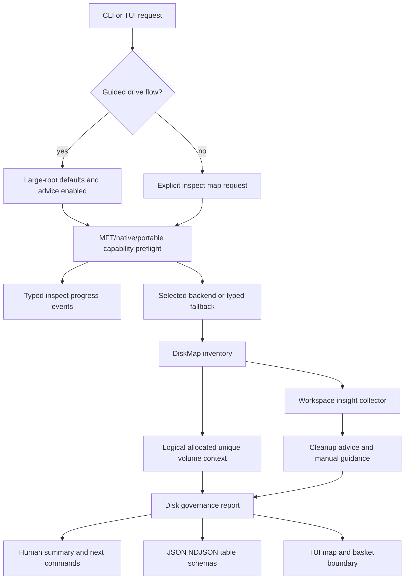

# Full Disk Governance And MFT Productization Refactor - Plan

## Goal Capsule

| Field | Decision |
|---|---|
| Objective | Turn the E-drive dogfood findings into product-grade full-disk governance: explicit MFT capability checks, responsive long scans, honest disk-usage semantics, deeper workspace review-only insights, and clearer commands that tell users what Rebecca can safely clean versus what it can only help them review. |
| Authority | The user explicitly allows fearless refactoring, breaking unreleased contracts, deleting compatibility baggage, calling subagents during execution, committing during work, and preferring the best architecture over minimal patches. |
| Execution profile | Break internal and pre-release CLI/API shapes when needed; preserve preview-first cleanup, recoverable trash by default, explicit permanent deletion, no automatic deletion of VCS stores or rebuild-heavy workspaces, and green cross-platform CI. |
| Stop conditions | Stop for any change that would give Rebecca deletion authority over Git, SVN, Unity Library, repo-ref, toolchain installs, or package-manager stores without a review-only boundary; stop if raw-volume access behavior needs a user product decision. |
| Landing | Implement in focused conventional commits; keep generated dogfood evidence under `target/`; update changelog and docs in the same work stream. |

---

## Product Contract

### Summary

Rebecca already has a strong scanner, cleanup executor, TUI, receipts, skill packaging, progress events, and Windows-native/NTFS experimentation.
The E-drive dogfood exposed the next product gap: a user with a nearly full disk needs Rebecca to explain which backend is being used, why MFT did or did not run, why logical totals can exceed perceived disk usage, which huge workspaces are review-only, and which command should be used next.

This plan refactors the disk-map and cleanup-advice stack around that real workflow.
The target is not to make Rebecca delete more aggressively.
The target is to make Rebecca the best CLI for finding space, understanding safe reclaim paths, and separating safe automated cleanup from manual review decisions.

### Problem Frame

The local E-drive scan showed a high-value failure mode for a cleanup CLI.
The portable full-root inventory finished but took minutes and produced a logical total larger than the physical disk because logical bytes, hardlinks, sparse files, reparse handling, and allocated bytes were not explained at the decision point.
The MFT backend did not feel product-grade in a normal shell because feature gating and non-elevated raw-volume access surfaced only as fallback diagnostics after the user waited.
`clean` correctly focused on system and user caches, while the actual disk pressure came from workspace patterns such as Git object stores, SVN pristine stores, Unity Library, vcpkg build directories, repo-ref clones, generated output trees, and large mirrored data.

The current review-only advice patch is directionally right but not deep enough.
It derives workspace insights from ranked entries, so a huge review-only child can be missed when it does not survive the top-entry cut.
It also needs a stronger API boundary between executable cleanup advice and manual review guidance so TUI baskets, `purge`, and future automation cannot accidentally treat review-only evidence as a target.

### Requirements

**Backend capability and MFT productization**

- R1. Selecting `windows-ntfs-mft-experimental` must run a fast preflight that reports build feature state, platform support, local NTFS suitability, raw-volume privilege, and fallback intent before a long portable walk starts.
- R2. Feature-disabled, unsupported-platform, non-NTFS, permission-denied, timeout, and parser-degraded MFT outcomes must use typed diagnostics that appear in human output, JSON, NDJSON progress, and dogfood reports.
- R3. Windows release artifacts must either include NTFS support by default or make the missing feature impossible to confuse with a runtime permission problem.
- R4. MFT fallback must remain safe and read-only, but the user must not experience a silent multi-minute wait when the requested backend cannot run.

**Long-scan responsiveness and command UX**

- R5. `inspect map` and any new guided full-disk command must emit early lifecycle progress for backend selection, fallback, root start, traversal counters, backend stages, and finalizing in both human stderr and NDJSON.
- R6. Full-disk human output must recommend the right next command family: `clean` for system/user caches, `purge --root` for project artifacts, and inspect-driven manual review for huge non-cleanable stores.
- R7. Rebecca must provide a first-class guided entry point for "what is filling this drive" with safe defaults for large roots, cleanup advice enabled, bounded groups, and readable follow-up guidance.

**Disk-usage semantics**

- R8. Disk-map reports must distinguish logical bytes, allocated bytes, unique bytes, and reclaimable bytes without implying that any one number is the user's physical free-space delta.
- R9. When volume totals are available, human and machine output should show the OS-reported volume used/free context alongside scan totals so users can reconcile logical totals with disk pressure.
- R10. Human renderers must explain unavailable allocated/unique fields and the common reasons logical totals exceed physical usage, including hardlinks, sparse files, compression, and reparse skips.

**Workspace insights and review-only safety**

- R11. Review-only workspace insights must be collected from traversal/report evidence, not only from bounded `top_entries`.
- R12. Workspace insights must preserve measured size evidence and rank by impact before static category priority.
- R13. Rebecca must recognize at least Git object stores, SVN pristine stores, Unity Library, vcpkg `buildtrees`/`packages`/`downloads`, repo-ref clones, generated output trees, and local mirror/data caches as review-only candidates when they are large enough to matter.
- R14. Review-only insights must never create executable cleanup commands, purge targets, basket items, or saved-plan delete targets.
- R15. Review-only guidance must still be useful: it should explain why the data is large, why Rebecca will not delete it automatically, and which external tool or manual review path the user should use.

**Inspect-to-action bridge**

- R16. Cleanable descendants should surface exact preview commands with estimates when Rebecca can safely automate the cleanup.
- R17. Manual-review descendants should surface structured manual guidance separately from suggested Rebecca commands.
- R18. TUI and CLI summaries must keep cleanable, maybe-cleanable, and review-only totals visually separate so users can understand safe automation versus review work.

**Evidence, docs, and release readiness**

- R19. Tests must cover MFT preflight diagnostics, fallback event ordering, byte-semantics rendering, review-only collection outside top entries, action-boundary enforcement, and guided command output.
- R20. Dogfood scripts must include a read-only large-drive workflow that captures backend, progress, semantics, advice, and follow-up quality without requiring destructive cleanup.
- R21. README, skill guidance, CLI API docs, schemas, and changelog must explain the updated full-disk workflow in user language.

### Acceptance Examples

- AE1. Given a normal non-elevated Windows shell and `--scan-backend windows-ntfs-mft-experimental`, when Rebecca starts a drive-root scan, then it reports that MFT raw-volume access is unavailable before falling back and includes a clear privilege next step.
- AE2. Given a build without the `ntfs` feature, when the MFT backend is selected, then the diagnostic says the build does not include NTFS support rather than implying an operating-system permission problem.
- AE3. Given a large drive root and `--format ndjson`, when the portable scanner runs for minutes, then the stream contains started, backend/fallback, traversal-progress, finalizing, map-entry, map-group, and completed events before the final payload.
- AE4. Given logical bytes exceed OS-reported used bytes, when human output renders totals, then it labels logical bytes as path-ranked inventory and shows the OS volume used/free context when available.
- AE5. Given a huge `.git/objects/pack` directory that is not in the final `top_entries`, when cleanup advice is enabled, then the nearest useful parent or evidence section still reports a review-only Git object-store insight.
- AE6. Given a Unity `Library` or SVN `pristine` store, when TUI basket selection is attempted, then Rebecca refuses to add it as a cleanup target and shows review-only guidance instead.
- AE7. Given a cleanable Rust `target` descendant and a review-only Git object store under the same workspace, when inspect summary renders next actions, then Rebecca shows a `purge --root ... --dry-run` preview command for the cleanable item and a separate manual review note for Git.
- AE8. Given a user asks "what is filling this drive", when they run the guided drive-inspection command, then the first screen explains top usage, cleanable estimates, review-only estimates, backend provenance, and the safest next command family.

### Scope Boundaries

- In scope: `inspect map`, a guided drive-inspection entry point, disk-map metrics, MFT preflight/fallback diagnostics, progress events, cleanup-advice model, TUI basket boundaries, schemas, docs, skill text, dogfood scripts, tests, and changelog.
- In scope: breaking or removing top-entry-only advice plumbing, stale compatibility helpers, duplicated backend diagnostic text, and any internal API shape that prevents clean separation of automated cleanup from review-only guidance.
- Deferred: making MFT the default backend for all Windows scans, APFS/ext4 native metadata backends, automatic Git/SVN/Unity cleanup, package-manager-specific delete flows, and permanent-deletion recommendations.
- Outside this product's identity: deleting VCS stores or rebuild-heavy project state by default, hiding fallback behind a silent portable scan, presenting logical bytes as guaranteed reclaimable bytes, or treating review-only guidance as a cleanup plan.

---

## Planning Contract

### Key Technical Decisions

- KTD1. MFT selection gets a preflight contract before backend dispatch.
  The backend should fail fast into a typed fallback reason when the build, platform, filesystem, privilege, or raw-volume handle cannot support MFT.
- KTD2. Disk-map output becomes a disk-governance report, not just a ranked list.
  The report should tell users what was measured, how trustworthy each byte number is, what can be automated, and what requires review.
- KTD3. Review-only is a separate advice class with no executable command.
  The model may carry manual guidance and external-tool hints, but it must not enter purge, basket, saved-plan, or cleanup executor paths.
- KTD4. Byte semantics are first-class API fields.
  Logical, allocated, unique, volume used/free, and reclaimable estimates should be named independently instead of folded into one "size" concept.
- KTD5. Progress belongs at the core event boundary.
  CLI, NDJSON, and TUI should consume the same typed progress events so long scans stay observable without renderer-specific polling.
- KTD6. Workspace insights should be collected during traversal or aggregation.
  A bounded `top_entries` list is a rendering artifact and cannot be the only source of high-value cleanup intelligence.
- KTD7. Guided commands should wrap existing primitives instead of duplicating scanners.
  The new user-facing flow should compose disk-map request defaults, advice enrichment, and rendering policy around the same core inventory engine.

### High-Level Technical Design

### System-Wide Impact

- The disk-map report contract expands from size inventory to action guidance, so schemas, docs, TUI projections, table exports, and tests all need coordinated updates.
- MFT diagnostics affect release packaging and docs because the same CLI flag can mean different things depending on compile features and elevation.
- Review-only advice affects safety policy, basket selection, saved-plan generation, and command rendering because it must be visible but non-executable.
- Dogfood becomes a release-readiness input for full-disk behavior, not only a performance convenience.

### Assumptions

- The current local E-drive evidence is dogfood input, not a committed fixture; durable tests should use synthetic fixtures and targeted integration tests.
- Windows release builds should likely include the `ntfs` feature if crate size and dependency policy allow it; if not, the CLI must say the feature is unavailable before scanning.
- New machine fields should be additive where practical, but the user has approved breaking unreleased contracts when a clean model requires it.
- Guided full-disk inspection can start as `rebecca inspect drive <root>` or an equivalent subcommand that delegates to `inspect map`; exact naming can be adjusted during implementation if clap ergonomics strongly favor another shape.

### Risks & Dependencies

| Risk | Mitigation |
|---|---|
| MFT preflight duplicates backend checks and drifts | Keep the preflight type next to backend dispatch and reuse it for human, JSON, NDJSON, dogfood, and tests. |
| Review-only guidance becomes too broad and noisy | Add size thresholds, source confidence, impact sorting, and tests for top-entry-independent collection. |
| Volume used/free numbers vary by platform and permission | Make volume context nullable with provenance; never block inventory when volume context is unavailable. |
| Guided command creates a second scanner path | Implement it as request defaults plus renderer policy over `inspect map` core. |
| Additional progress events break machine consumers | Preserve existing lifecycle events and add typed progress payloads under documented `inspect-progress` semantics. |
| Users interpret review-only bytes as automatically reclaimable | Render review-only totals separately from cleanable bytes and omit Rebecca delete commands for them. |

---

## Implementation Units

### U1. Add MFT capability preflight and typed fallback diagnostics

- **Goal:** Make MFT backend selection fail fast and explainably when NTFS support, privilege, filesystem, or build features are missing.
- **Requirements:** R1, R2, R3, R4, R19, R21.
- **Dependencies:** None.
- **Files:** `crates/rebecca-core/src/disk_map.rs`; `crates/rebecca-core/src/scan/backend.rs`; `crates/rebecca-core/src/scan/windows_ntfs_mft.rs`; `crates/rebecca-core/src/scan.rs`; `crates/rebecca/src/inspect.rs`; `crates/rebecca/src/capabilities.rs`; `docs/adr/0005-scan-engine-strategy.md`; `docs/api/cli/v1/README.md`; `CHANGELOG.md`.
- **Approach:** Introduce an MFT capability/preflight result with typed reasons such as feature-disabled, unsupported-platform, non-local-volume, non-NTFS, permission-denied, timeout-risk, and backend-degraded.
  Emit a progress event before fallback, attach the same typed reason to report provenance, and make human output name the next step for elevation or feature-enabled builds.
  Decide during implementation whether Windows release profiles should enable `ntfs` by default; if they do not, make the build limitation visible in `rebecca info` and backend help.
- **Test scenarios:** Feature-disabled MFT reports build limitation; non-Windows reports unsupported platform; mocked permission-denied reports privilege guidance; fallback still produces a portable report with caveat; NDJSON event ordering includes backend fallback before long traversal.
- **Verification:** `cargo nextest run -p rebecca-core disk_map scan_engine --all-features --locked --no-fail-fast`; `cargo nextest run -p rebecca --test cli_inspect --features ntfs --locked --no-fail-fast`.

### U2. Make long full-disk scans visibly alive

- **Goal:** Ensure large `inspect map` runs provide useful progress and backend context before final output.
- **Requirements:** R5, R6, R19, R20.
- **Dependencies:** U1.
- **Files:** `crates/rebecca-core/src/progress.rs`; `crates/rebecca-core/src/disk_map.rs`; `crates/rebecca/src/inspect.rs`; `crates/rebecca/src/output.rs`; `crates/rebecca/src/progress.rs`; `crates/rebecca/tests/cli_inspect.rs`; `crates/rebecca/tests/cli_api.rs`; `docs/api/cli/v1/payloads.schema.json`; `crates/rebecca/schemas/api/cli/v1/payloads.schema.json`.
- **Approach:** Audit inspect-progress coverage for backend selection, fallback, traversal counters, root status, finalizing, and bounded map-entry/map-group emission.
  Add missing stage events and human messages while preserving clean stdout for JSON and table formats.
  Keep file-level events behind `--progress-detail file`; target-level progress should use sampled counters and backend events only.
- **Test scenarios:** NDJSON includes lifecycle, inspect-progress, map-entry, map-group, and completed events; human stderr updates during long scans; `--no-progress` suppresses human progress but not final report; file events remain opt-in.
- **Verification:** `cargo nextest run -p rebecca --test cli_inspect --test cli_api --locked --no-fail-fast`.

### U3. Add volume context and clearer disk-usage semantics

- **Goal:** Make reports honest about logical bytes, allocated bytes, unique bytes, OS volume usage, and reclaimable estimates.
- **Requirements:** R8, R9, R10, R19, R21.
- **Dependencies:** U2.
- **Files:** `crates/rebecca-core/src/disk_map.rs`; `crates/rebecca-core/src/scan/windows_native.rs`; `crates/rebecca-core/src/scan/portable.rs`; `crates/rebecca/src/render/inspect.rs`; `crates/rebecca/src/inspect.rs`; `crates/rebecca/src/tui/projection.rs`; `docs/api/cli/v1/README.md`; `docs/api/cli/v1/payloads.schema.json`; `crates/rebecca/schemas/api/cli/v1/payloads.schema.json`.
- **Approach:** Add nullable volume context to disk-map reports with total, free, used, filesystem label when available, and provenance.
  Render logical totals as path-ranked inventory, allocated/unique metrics as backend-dependent fields, and cleanable/review-only bytes as guidance rather than guaranteed free-space delta.
  Add caveats when logical totals exceed volume used or when metadata profile omits allocated/unique claims.
- **Test scenarios:** Logical-only profile keeps allocated/unique null and emits caveat; native profile reports allocated/unique where available; human output explains logical versus allocated; JSON schema accepts nullable volume context; table output remains stable.
- **Verification:** `cargo nextest run -p rebecca-core disk_map --locked --no-fail-fast`; `cargo nextest run -p rebecca --test cli_inspect --locked --no-fail-fast`.

### U4. Move workspace insights out of the top-entry rendering path

- **Goal:** Collect review-only workspace insights from traversal or report aggregation so important evidence is not lost when it misses `top_entries`.
- **Requirements:** R11, R12, R13, R14, R19.
- **Dependencies:** U3.
- **Files:** `crates/rebecca-core/src/cleanup_advice.rs`; `crates/rebecca-core/src/disk_map.rs`; `crates/rebecca-core/src/disk_session.rs`; `crates/rebecca-core/tests/cleanup_advice.rs`; `crates/rebecca-core/tests/disk_map.rs`; `crates/rebecca/tests/cli_inspect.rs`.
- **Approach:** Replace top-entry-only workspace candidate discovery with an `InsightCollector` or equivalent aggregation path that sees all traversal entries subject to bounded memory.
  Store measured bytes, evidence path, insight kind, confidence, and nearest display parent.
  Rank by measured impact first, then category priority, and attach the best insight to affected entries or a dedicated report section.
  Keep review-only guidance non-executable by construction.
- **Test scenarios:** A review-only child below the `top_entries` cutoff still appears in report guidance; two insights under one parent rank by bytes; Git/SVN/Unity/vcpkg/repo-ref patterns produce review-only status; review-only entries never produce `suggested_command`.
- **Verification:** `cargo nextest run -p rebecca-core cleanup_advice disk_map --locked --no-fail-fast`; `cargo nextest run -p rebecca --test cli_inspect --locked --no-fail-fast`.

### U5. Split executable cleanup advice from manual review guidance

- **Goal:** Make cleanable commands and review-only manual guidance distinct in API, human output, table export, and TUI.
- **Requirements:** R14, R15, R16, R17, R18, R19.
- **Dependencies:** U4.
- **Files:** `crates/rebecca-core/src/cleanup_advice.rs`; `crates/rebecca-core/src/plan.rs`; `crates/rebecca/src/render/inspect.rs`; `crates/rebecca/src/inspect.rs`; `crates/rebecca/src/tui/basket.rs`; `crates/rebecca/src/tui/app.rs`; `crates/rebecca/src/tui/presentation.rs`; `crates/rebecca/tests/cli_inspect.rs`; `crates/rebecca/tests/cli_tui.rs`.
- **Approach:** Add a manual-guidance structure for review-only advice with fields such as reason, external_tool_hint, manual_review_hint, and evidence_path.
  Keep `CleanupAdviceCommand` only for executable Rebecca previews.
  Update renderers so cleanable and maybe-cleanable sections show Rebecca commands, while review-only sections show manual guidance and cannot be added to baskets or saved cleanup plans.
- **Test scenarios:** Review-only advice serializes manual guidance and null command; table exports separate command and manual guidance columns; TUI refuses review-only basket insertion; cleanable project artifacts still produce `purge --dry-run` previews.
- **Verification:** `cargo nextest run -p rebecca --test cli_inspect --test cli_tui --locked --no-fail-fast`.

### U6. Add a guided full-disk inspection command

- **Goal:** Give users an obvious command for "what is filling this drive" that applies Rebecca's safest large-root defaults.
- **Requirements:** R6, R7, R16, R17, R18, R21.
- **Dependencies:** U3, U4, U5.
- **Files:** `crates/rebecca/src/cli.rs`; `crates/rebecca/src/inspect.rs`; `crates/rebecca/src/render/inspect.rs`; `crates/rebecca/tests/cli_help.rs`; `crates/rebecca/tests/cli_inspect.rs`; `README.md`; `skills/rebecca-disk-cleaner/SKILL.md`; `docs/api/cli/v1/README.md`.
- **Approach:** Add `rebecca inspect drive <root>` or the cleanest clap-compatible equivalent as a wrapper over `inspect map`.
  Defaults should favor `--metadata-profile logical-only` for a first pass, cleanup advice on, bounded top entries, useful groups, backend auto/recommendation text, and no deletion.
  Human output should end with separate next-action groups: safe Rebecca previews, manual review items, and optional deeper backend/metadata reruns.
- **Test scenarios:** Help text makes the command discoverable; default output includes top usage, cleanable summary, review-only summary, backend provenance, and next commands; machine output remains compatible with disk-map payloads or documents a new payload kind.
- **Verification:** `cargo nextest run -p rebecca --test cli_help --test cli_inspect --locked --no-fail-fast`.

### U7. Build full-disk dogfood evidence and release gates

- **Goal:** Make the E-drive style workflow reproducible without destructive cleanup and visible in release evidence.
- **Requirements:** R19, R20, R21.
- **Dependencies:** U1, U2, U3, U4, U5, U6.
- **Files:** `scripts/dogfood/*`; `scripts/release/run-release-gates.ps1`; `docs/release.md`; `CHANGELOG.md`; `README.md`.
- **Approach:** Add or extend a dogfood script that runs guided drive inspection, portable map, Windows-native map, optional NTFS MFT map, purge previews for selected workspace roots, and schema validation.
  Capture elapsed time, backend/fallback state, volume context, top entries, cleanable totals, review-only totals, diagnostics, and next-command summary under `target/dogfood/`.
  Release gates should include the script in evidence mode where host support exists and skip with typed reasons elsewhere.
- **Test scenarios:** Script runs on a small fixture root without admin; NTFS-only branch skips cleanly when unsupported; report contains backend, progress, metrics, advice, and guidance sections; release docs explain how to interpret skipped MFT evidence.
- **Verification:** `pwsh -File scripts\dogfood\run-disk-governance-dogfood.ps1 -Root docs\plans -Top 20 -NoDelete`; `pwsh -File scripts\release\run-release-gates.ps1`.

### U8. Remove stale compatibility and update user-facing docs

- **Goal:** Keep the refactor clean by deleting obsolete top-entry-only advice code, duplicated diagnostic wording, and docs that teach the old mental model.
- **Requirements:** R3, R6, R10, R14, R21.
- **Dependencies:** U1, U2, U3, U4, U5, U6, U7.
- **Files:** `crates/rebecca-core/src/lib.rs`; `crates/rebecca-core/src/cleanup_advice.rs`; `crates/rebecca-core/src/disk_map.rs`; `crates/rebecca/src/render/inspect.rs`; `README.md`; `skills/rebecca-disk-cleaner/SKILL.md`; `docs/api/cli/v1/README.md`; `docs/api/cli/v1/payloads.schema.json`; `crates/rebecca/schemas/api/cli/v1/payloads.schema.json`; `CHANGELOG.md`.
- **Approach:** Delete compatibility shims that only exist for the old advice path.
  Keep public exports narrow.
  Rewrite docs around the user workflows: find what is large, preview safe cleanup, review large workspaces manually, rerun with richer metadata or NTFS when appropriate, and only then execute cleanup.
  Humanize changelog entries under Unreleased without listing internal modules.
- **Test scenarios:** No dead-code warnings; schema examples match updated payloads; skill validates; README examples run or are clearly dry-run/read-only.
- **Verification:** `cargo fmt --all -- --check`; `cargo clippy --workspace --all-targets --all-features --locked -- -D warnings`; `cargo nextest run --workspace --all-features --locked --no-fail-fast`.

---

## Verification Contract

| Gate | Command | Covers | Done signal |
|---|---|---|---|
| Format | `cargo fmt --all -- --check` | All units | No formatting diff. |
| Lints | `cargo clippy --workspace --all-targets --all-features --locked -- -D warnings` | All units | No warnings on Windows and Ubuntu CI. |
| Full tests | `cargo nextest run --workspace --all-features --locked --no-fail-fast` | All units | Full workspace suite passes. |
| Focused inspect/API tests | `cargo nextest run -p rebecca --test cli_inspect --test cli_api --test cli_tui --locked --no-fail-fast` | U2, U5, U6 | Progress, schema, TUI, and rendering behavior pass. |
| Focused core tests | `cargo nextest run -p rebecca-core cleanup_advice disk_map scan_engine --locked --no-fail-fast` | U1, U3, U4 | Backend, metrics, and advice model pass. |
| NTFS feature tests | `cargo nextest run -p rebecca-core disk_map scan_engine --features ntfs --locked --no-fail-fast` | U1 | Feature-enabled backend paths still pass. |
| Skill/docs validation | `python skills/validate.py` | U6, U8 | Rebecca skill remains installable and usable. |
| Dogfood fixture | `pwsh -File scripts\dogfood\run-disk-governance-dogfood.ps1 -Root docs\plans -Top 20 -NoDelete` | U7 | Report captures backend, progress, metrics, advice, and next-action guidance. |
| Real-drive read-only dogfood | `cargo run -p rebecca -- inspect drive <drive-root> --no-scan-cache --top 40` | U1-U7 | On a large local drive, output stays responsive, non-destructive, and explains backend/byte/advice semantics. |

---

## Definition of Done

- D1. MFT backend selection never leaves a user waiting through a long fallback without an early, typed explanation of feature, privilege, platform, or filesystem state.
- D2. Long full-disk scans are visibly alive in human mode and machine-observable in NDJSON mode.
- D3. Disk-map human and machine output separates logical, allocated, unique, OS volume context, cleanable, review-only, and reclaimable concepts.
- D4. Workspace review-only insights are collected independently of `top_entries` and ranked by measured impact.
- D5. Review-only guidance cannot become a Rebecca cleanup target, purge target, saved-plan target, or TUI basket item.
- D6. Users get clear next actions for safe Rebecca previews versus manual review, with `clean`, `purge`, and guided inspection positioned for different jobs.
- D7. README, skill text, API docs, schemas, release docs, and changelog match the new workflow in user-facing language.
- D8. All verification gates in the Verification Contract pass, or any intentionally skipped platform gate records a typed skip reason.
- D9. Dead compatibility code and abandoned implementation attempts from this refactor are removed before the final commit.
