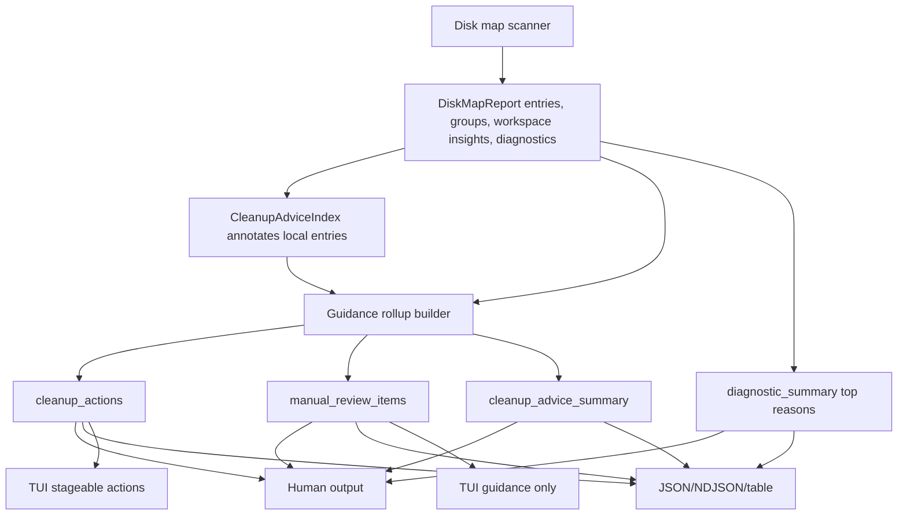

# Action-Centric Disk Advice Refactor - Plan

## Goal Capsule

| Field | Value |
| --- | --- |
| Objective | Turn full-disk inspection from a ranked-path report with attached advice into an action-centric disk guidance model: non-overlapping Rebecca cleanup actions, non-executable manual review items, compact evidence, and useful diagnostics. |
| User impact | A user with a nearly full disk should quickly understand what Rebecca can preview and clean, what they must review manually, why backend fallback happened, and which bytes are estimates instead of guaranteed reclaim. |
| Execution profile | Break pre-release JSON/NDJSON/table/TUI internals when they block the clean model; delete compatibility shims that preserve entry-heavy advice; keep cleanup preview-first and Trash/Recycle Bin by default. |
| Landing | Implement directly on `main` in focused conventional commits, then push `main` after local verification is coherent. |
| Stop conditions | Stop before giving Rebecca automatic deletion authority over Git, SVN, Unity Library, repo-ref, game libraries, package stores, or other durable application data. Stop if an action rollup cannot preserve the existing protected-path and recoverable-trash guarantees. |

## Product Contract

### Summary

Rebecca already scans large disks, reports backend provenance, offers cleanup commands, and separates review-only findings from executable cleanup advice.
The next product gap is that guidance is still path-row driven.
On the E-drive dogfood run, parent and child rows caused double-counted cleanable and review-only totals, workspace evidence flooded the output, and large durable game/application data appeared as generic unknown space.

This refactor makes the report answer the user's real question first: "what can I do now, safely?"

### Problem Frame

`DiskMapReport` currently exposes `top_entries`, `workspace_insights`, `groups`, and diagnostics.
Each ranked entry can carry a full `cleanup_advice` object, and human summaries aggregate those entry annotations.
That creates four structural problems:

- Parent and child rows can both contribute bytes to the same summary, so cleanup/review totals can exceed meaningful disk usage.
- Review-only evidence is repeated per path, which makes large workspaces and generated output trees noisy instead of actionable.
- Machine users must infer actions by walking `top_entries`, which is fragile and loses insights that are outside the top-entry cut.
- Diagnostics with `--diagnostic-limit 0` keep counts but lose the representative reasons a user needs during long fallback scans.

### Requirements

**Action-level guidance**

- R1. `inspect map` and `inspect drive` reports must expose report-level cleanup guidance, not only entry-level annotations.
- R2. Executable Rebecca actions and manual review items must be separate by construction; manual review must never produce a cleanup command, saved-plan target, purge target, or TUI basket item.
- R3. Action and review byte totals must be non-overlapping within each rollup, so ancestor and descendant paths do not double count.
- R4. Entry-level `cleanup_advice` may remain as a local annotation, but heavy evidence and user-facing summaries must move to report-level rollups.
- R5. `--advice-status` must filter both visible entries and report-level guidance consistently.

**Evidence and noise control**

- R6. Cleanup/review rollups must carry bounded samples and counts instead of unbounded evidence lists.
- R7. Workspace insights must be owner-aware: Git object stores, repo-ref clones, generated output, mirrors, Unity Library, vcpkg stores, SVN pristine data, and similar findings should aggregate at the useful owner path.
- R8. Weak directory-name heuristics such as `out`, `mirror`, or `data` must require project/application anchors or size thresholds before becoming review-only findings.
- R9. Steam libraries, game install folders, Battle.net/World of Warcraft roots, and durable application data must be classified as review-only or protected, not cleanable.
- R10. Steam shader/download/temp caches and other explicitly safe cache rules must remain executable cleanup candidates when existing rules allow them.

**Diagnostics and user flow**

- R11. `diagnostic_summary` must include compact top reasons or representative samples even when `diagnostics` is empty because `--diagnostic-limit 0` was requested.
- R12. NTFS/MFT permission-denied and feature/fallback outcomes must be visible in human output, JSON, NDJSON completion payloads, and dogfood reports.
- R13. CSV/TSV table output must stay flat: action/review IDs, status, command text, and compact guidance columns are acceptable; nested evidence JSON is not.
- R14. TUI views must project report-level actions and manual review items. Clicking or selecting manual review may navigate/show guidance but must not stage deletion.
- R15. Dogfood and release gates must record action rollups, non-overlap totals, manual review counts, compact diagnostics, and MFT pass/typed-skip evidence.

**Documentation**

- R16. README, CLI API docs, packaged skill text, changelog, and dogfood docs must explain the user workflow in plain language: inspect, preview safe cleanup, review durable data manually, then execute or empty trash intentionally.
- R17. Docs must state that review-only bytes are not reclaimable bytes and that normal cleanup moves to Trash/Recycle Bin unless `--permanent` is supplied.

### Acceptance Examples

- AE1. Given `target` and `target/debug` both appear in ranked entries, when cleanup advice is enabled, then the report exposes one purge action with non-overlapping bytes and bounded sample paths.
- AE2. Given `.git`, `.git/objects`, and `.git/objects/pack` appear under the same repository, when cleanup advice is enabled, then the report exposes one manual review item for the Git object store owner and no Rebecca delete command.
- AE3. Given many generated-output child paths, when human output renders cleanup guidance, then it shows a compact action/review group with a sample count rather than printing dozens of repeated evidence lines.
- AE4. Given a Steam library `steamapps/common` game or a World of Warcraft root, when disk-map guidance runs, then the item is review-only/protected with manual guidance and no cleanup command.
- AE5. Given Steam shadercache or downloading/temp cache paths matched by existing safe rules, when cleanup advice runs, then those paths still produce previewable Rebecca cleanup actions.
- AE6. Given `--diagnostic-limit 0`, when fallback or skipped-read diagnostics occur, then `diagnostic_summary` still includes top reason codes and representative guidance while `diagnostics` remains empty.
- AE7. Given `inspect map --format csv --cleanup-advice`, when table rows are exported, then rows include compact `cleanup_action_id` or `cleanup_review_id` columns without embedding repeated nested evidence JSON.
- AE8. Given a manual-review item in the TUI, when the user clicks or presses Enter, then Rebecca focuses the guidance/details and refuses to stage it for cleanup.
- AE9. Given a non-admin Windows shell requests MFT-backed drive inspection, when raw-volume access is denied, then human output and NDJSON completion both contain a typed permission-denied fallback and next step.

### Scope Boundaries

- In scope: `inspect map`, `inspect drive`, disk-map report models, cleanup-advice aggregation, workspace insight ownership, diagnostics summary, human output, JSON/NDJSON/table output, TUI projection/basket boundaries, dogfood scripts, schema/docs/skill/changelog, and tests.
- In scope: breaking or deleting entry-heavy advice compatibility, stale internal helpers, duplicated summary code, and noisy workspace heuristics that block action-level guidance.
- Deferred: native APFS/ext4 metadata backends, automatic cleanup for game/application libraries, Git maintenance commands, Unity-specific cleanup automation, and project artifact catalog expansion beyond what is needed for action rollups.
- Outside scope: changing default deletion away from recoverable trash, making review-only bytes appear reclaimable, or silently treating backend fallback as a successful native scan.

## Planning Contract

### Key Technical Decisions

- KTD1. Add a report-level guidance layer after scan and advice annotation.
  Scanner code should continue producing entries, workspace insights, groups, and diagnostics.
  Guidance aggregation should convert those facts into user actions without teaching the scanner about CLI commands.
- KTD2. Use path-dominance non-overlap rules inside each action/review rollup.
  If an ancestor path is counted, descendants become samples/evidence only.
  If a descendant is counted first and an ancestor later appears, replace descendants with the ancestor.
- KTD3. Treat action identity as a product contract, not a rendered string.
  Cleanable keys should include source, rule/artifact/app identity, command family, gates, and owner path.
  Manual review keys should include insight kind, stable rule id, and owner path.
- KTD4. Keep review-only non-executable by type.
  Review items may carry reason, sample paths, and external-tool hints; they must not have Rebecca cleanup commands or executor target shapes.
- KTD5. Make durable game/application data a safety classification.
  Reuse existing protection/safety knowledge and Steam discovery where possible; avoid weak basename-only matches for game or application data.
- KTD6. Keep table output flat and TUI human-only.
  JSON/NDJSON may expose structured rollups; CSV/TSV should expose compact IDs and strings; TUI selection can navigate but deletion staging must require executable actions.
- KTD7. Diagnostics summary owns compact explanations.
  `diagnostics` remains a bounded sample list; `diagnostic_summary` carries counts plus top reasons/samples needed when sample retention is zero.

### High-Level Technical Design

### System-Wide Impact

- CLI/API contracts change because report-level guidance becomes the stable machine surface.
- TUI basket logic must consume action IDs instead of inferring safety from entry paths.
- Dogfood scripts become product evidence for large-drive guidance quality, not just smoke tests.
- Docs and skill text should lead with the inspect/preview/execute/trash workflow instead of internal scanner details.

### Assumptions

- Rebecca is pre-stable, so breaking the current machine payload is allowed when it simplifies the model.
- The same `rebecca` binary continues to own CLI, TUI, and skill installation.
- `inspect` remains read-only.
- Review-only findings are useful for user decisions but are not reclaimable estimates.
- Existing safety policy and recoverable trash semantics remain authoritative.

### Risks & Dependencies

| Risk | Mitigation |
| --- | --- |
| Action totals become another source of double counting | Centralize non-overlap path accounting and cover ancestor/descendant fixture tests. |
| Review-only items accidentally become executable | Use distinct model types and add TUI/executor/saved-plan negative tests. |
| Weak workspace heuristics over-report common folders | Require owner anchors or thresholds and keep weak rules review-only. |
| JSON consumers lose entry-level details | Keep local entry annotations compact, but document report-level guidance as the intended stable surface. |
| TUI and table output drift from CLI human output | Build all surfaces from the same guidance rollups and add focused CLI/TUI tests. |

## Implementation Units

### U1. Introduce report-level guidance rollup types

- **Goal:** Add first-class report-level cleanup actions, manual review items, and summary totals to the core model.
- **Dependencies:** None.
- **Files:** `crates/rebecca-core/src/cleanup_advice.rs`; `crates/rebecca-core/src/disk_map.rs`; `crates/rebecca-core/tests/cleanup_advice.rs`; `crates/rebecca-core/tests/disk_map.rs`.
- **Approach:** Replace entry-only aggregation with explicit rollup structs.
  Use stable IDs, action kind, status, owner path, bounded samples, non-overlap byte totals, command or manual guidance, and covered-entry counts.
  Keep entry-level advice as a local annotation or action reference, but do not make it the summary source.
- **Test scenarios:** Nested cleanable parent/child produces one action; review-only Git parent/child produces one review item; protected/manual review items have no command; empty reports omit rollups cleanly.
- **Verification:** `cargo nextest run -p rebecca-core cleanup_advice disk_map --locked --no-fail-fast`.

### U2. Implement non-overlap bytes and evidence compaction

- **Goal:** Make action/review bytes trustworthy and output evidence small enough for real full-disk scans.
- **Dependencies:** U1.
- **Files:** `crates/rebecca-core/src/cleanup_advice.rs`; `crates/rebecca-core/tests/cleanup_advice.rs`; `crates/rebecca/tests/cli_inspect.rs`.
- **Approach:** Add path relation accounting that retains only non-overlapping measured paths per rollup.
  Expose `sample_paths`, `sample_count`, `covered_path_count`, and optionally `omitted_sample_count`.
  Remove or cap old unbounded `cleanup_advice.evidence` payloads.
- **Test scenarios:** Ancestor replaces descendants for bytes; descendants remain samples; two unrelated paths sum; evidence cap reports omitted count; cleanable evidence remains available when a review-only parent is primary.
- **Verification:** `cargo nextest run -p rebecca-core cleanup_advice --locked --no-fail-fast`; `cargo nextest run -p rebecca --test cli_inspect --locked --no-fail-fast`.

### U3. Make workspace insights owner-aware and durable-data safe

- **Goal:** Reduce workspace insight noise and classify large durable application/game data as review-only instead of unknown or cleanable.
- **Dependencies:** U1, U2.
- **Files:** `crates/rebecca-core/src/disk_map.rs`; `crates/rebecca-core/src/cleanup_advice.rs`; `crates/rebecca-core/src/safety.rs`; `crates/rebecca-core/src/applications.rs`; `crates/rebecca-core/tests/disk_map.rs`; `crates/rebecca-core/tests/safety_policy.rs`; `crates/rebecca-core/tests/cleanup_advice.rs`.
- **Approach:** Add owner-path detection for Git, SVN, repo-ref, generated output, local mirrors, Unity Library, vcpkg, Steam library data, Battle.net, and World of Warcraft.
  Reuse existing Steam discovery/protection knowledge for strong anchors.
  Tighten weak basename heuristics with anchor checks or meaningful byte thresholds.
- **Test scenarios:** `.git/objects/pack` rolls up to a repository-owned review item; `repo-ref` clones aggregate; `out` under a known project can be review-only while arbitrary `out` noise is ignored below threshold; Steam `common` and WoW roots are review-only/protected; Steam shader/download/temp caches still match safe cleanup rules.
- **Verification:** `cargo nextest run -p rebecca-core disk_map safety_policy cleanup_advice discovery --locked --no-fail-fast`.

### U4. Render action-centric guidance in human, JSON, NDJSON, and tables

- **Goal:** Make every non-interactive surface start from actions and manual review items, not ranked entries.
- **Dependencies:** U1, U2, U3.
- **Files:** `crates/rebecca/src/render/inspect.rs`; `crates/rebecca/src/inspect.rs`; `crates/rebecca/src/api.rs`; `crates/rebecca/tests/cli_inspect.rs`; `crates/rebecca/tests/cli_api.rs`; `crates/rebecca/schemas/api/cli/v1/payloads.schema.json`; `docs/api/cli/v1/README.md`.
- **Approach:** Update summaries to use report-level non-overlap totals.
  JSON/NDJSON should expose structured rollups.
  CSV/TSV should add compact action/review columns and avoid nested evidence.
  `--advice-status` should filter entries and rollups consistently.
- **Test scenarios:** Human summary reports one action for nested `target` paths; JSON exposes `cleanup_actions` and `manual_review_items`; NDJSON completed payload includes rollups; CSV/TSV has compact IDs and command/guidance columns; advice-status filtering keeps matching rollups only.
- **Verification:** `cargo nextest run -p rebecca --test cli_inspect --test cli_api --locked --no-fail-fast`.

### U5. Add compact diagnostic reasons and dogfood evidence

- **Goal:** Keep fallback and skipped-read diagnostics actionable even when sample retention is disabled.
- **Dependencies:** U4.
- **Files:** `crates/rebecca-core/src/disk_map.rs`; `crates/rebecca/src/render/inspect.rs`; `crates/rebecca/src/inspect.rs`; `crates/rebecca/tests/cli_inspect.rs`; `crates/rebecca-core/tests/disk_map.rs`; `scripts/dogfood/run-disk-governance-dogfood.ps1`; `scripts/dogfood/README.md`; `docs/release.md`.
- **Approach:** Extend `diagnostic_summary` with top reason codes and compact representative guidance.
  Keep `diagnostics` as the bounded detailed sample list.
  Update dogfood reports to capture rollups, non-overlap totals, diagnostics, and MFT pass/typed-skip state.
- **Test scenarios:** Limit zero keeps empty diagnostics but reports top reason/guidance; fallback permission-denied appears in human and NDJSON completion; dogfood fixture report contains action/review/diagnostic sections; NTFS branch records pass or typed skip.
- **Verification:** `cargo nextest run -p rebecca-core disk_map --locked --no-fail-fast`; `cargo nextest run -p rebecca --test cli_inspect --locked --no-fail-fast`; `pwsh -File scripts\dogfood\run-disk-governance-dogfood.ps1 -Root docs\plans -Top 20 -NoDelete`.

### U6. Adapt TUI projection and basket boundaries

- **Goal:** Make the TUI use the same action model while preserving an explicit no-delete boundary for manual review.
- **Dependencies:** U4.
- **Files:** `crates/rebecca/src/tui/projection.rs`; `crates/rebecca/src/tui/basket.rs`; `crates/rebecca/src/tui/app.rs`; `crates/rebecca/src/tui/presentation.rs`; `crates/rebecca/tests/cli_tui.rs`.
- **Approach:** Project executable actions as stageable items and manual review items as guidance-only rows/details.
  Mouse/keyboard activation on manual review should navigate or expand details, not stage cleanup.
  Remove any old path-based shortcut that can bypass action kind checks.
- **Test scenarios:** Cleanable action can be staged; manual review item cannot be staged; selecting review-only shows guidance; basket rejects review-only action IDs; existing preview/receipt/trash flow remains unchanged.
- **Verification:** `cargo nextest run -p rebecca --test cli_tui --locked --no-fail-fast`.

### U7. Update docs, skill, schema, and changelog in user language

- **Goal:** Teach users the new workflow without exposing internal model churn.
- **Dependencies:** U4, U5, U6.
- **Files:** `README.md`; `skills/rebecca-disk-cleaner/SKILL.md`; `docs/api/cli/v1/README.md`; `crates/rebecca/schemas/api/cli/v1/payloads.schema.json`; `CHANGELOG.md`.
- **Approach:** Rewrite guidance around "inspect first, preview safe cleanup, review durable data, execute to trash, empty trash intentionally."
  Make review-only and reclaimable semantics explicit.
  Keep changelog entries concise and unreleased.
- **Test scenarios:** Skill validation passes; docs mention MFT fallback, review-only no-delete semantics, Trash/Recycle Bin default, `--permanent`, and `trash empty`; schema validates the new rollups.
- **Verification:** `python skills/validate.py`; `cargo nextest run -p rebecca --test cli_api --locked --no-fail-fast`.

### U8. Final cleanup, simplification, and release proof

- **Goal:** Remove stale compatibility paths and prove the full stack is green.
- **Dependencies:** U1, U2, U3, U4, U5, U6, U7.
- **Files:** `crates/rebecca-core/src/cleanup_advice.rs`; `crates/rebecca-core/src/disk_map.rs`; `crates/rebecca/src/render/inspect.rs`; `crates/rebecca/src/inspect.rs`; related tests and docs touched by U1-U7.
- **Approach:** Consolidate duplicated aggregation/render helpers, delete entry-heavy compatibility code, run focused and full gates, then commit in reviewable slices.
- **Test scenarios:** No old summary path double-counts `top_entries`; no unbounded evidence list remains in user-facing summaries; all supported platforms keep compile/test coverage; dogfood report on a small root is generated.
- **Verification:** Full Verification Contract.

## Verification Contract

| Gate | Command | Covers | Expected result |
| --- | --- | --- | --- |
| Format | `cargo fmt --all -- --check` | U1-U8 | Rust formatting is stable. |
| Focused core | `cargo nextest run -p rebecca-core cleanup_advice disk_map safety_policy discovery --locked --no-fail-fast` | U1-U3, U5 | Core guidance, workspace insight, diagnostics, and safety tests pass. |
| Focused CLI | `cargo nextest run -p rebecca --test cli_inspect --test cli_api --test cli_tui --locked --no-fail-fast` | U4, U6, U7 | Human/API/table/TUI contracts pass. |
| Skill validation | `python skills/validate.py` | U7 | Packaged skill remains installable and valid. |
| Dogfood fixture | `pwsh -File scripts\dogfood\run-disk-governance-dogfood.ps1 -Root docs\plans -Top 20 -NoDelete` | U5 | Dogfood report captures action rollups, review items, diagnostics, and backend evidence. |
| Clippy | `cargo clippy --workspace --all-features --locked -- -D warnings` | U1-U8 | Lints pass across all crates and features. |
| Full tests | `cargo nextest run --workspace --all-features --locked --no-fail-fast` | U1-U8 | Workspace regression suite is green. |

## Definition of Done

- D1. `inspect map` and `inspect drive` expose report-level executable actions and manual review items with stable IDs.
- D2. Cleanable, maybe-cleanable, review-only, contains-cleanable, and protected rollups use non-overlapping byte totals.
- D3. Entry-level advice no longer drives summaries and no longer carries unbounded repeated evidence.
- D4. Workspace insights aggregate by useful owner and reduce weak basename noise.
- D5. Durable game/application/library data is review-only or protected; safe cache rules remain executable.
- D6. Human, JSON, NDJSON, CSV/TSV, and TUI surfaces use the same action model.
- D7. Manual review items cannot be staged, saved, purged, or executed by Rebecca.
- D8. Diagnostics remain useful with `--diagnostic-limit 0`.
- D9. Dogfood reports and release docs capture action rollups and MFT pass/typed-skip evidence.
- D10. README, skill, CLI API docs, schemas, and changelog describe the workflow in user-facing language.
- D11. All Verification Contract gates pass, or any skipped platform-specific gate has a typed skip reason.
