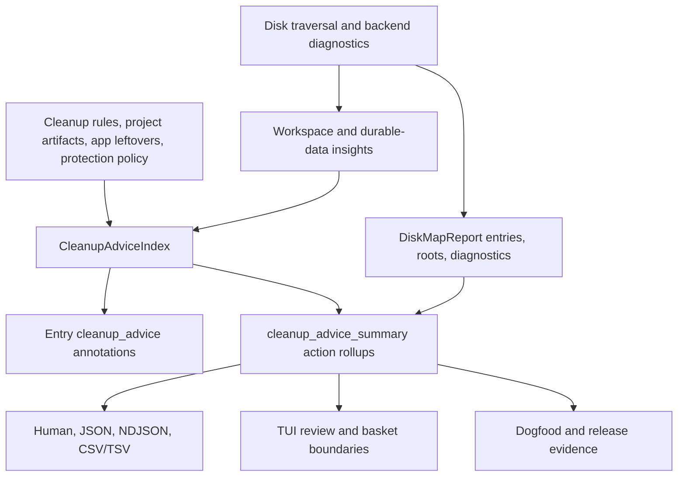

# Guided Cleanup Action Aggregation Refactor - Plan

## Goal Capsule

| Field | Decision |
| --- | --- |
| Objective | Make `inspect drive` and `inspect map --cleanup-advice` explain cleanup in action-sized units instead of path-sized fragments, with non-overlapping estimates, deduplicated workspace insights, durable app/game guidance, compact diagnostics, and dogfood evidence that can prove the experience on a real large drive. |
| Authority | User dogfood findings and repo safety policy win over compatibility; existing CLI API v1 names may break before public adoption when the cleaner model is materially better. |
| Execution profile | Fearless refactor on `main`, with old transitional code removed instead of wrapped. |
| Stop conditions | Stop for any change that makes review-only data executable, weakens protected-path enforcement, or turns durable application/game data into a Rebecca deletion target without a separate product decision. |
| Landing | Implement directly on `main` in focused conventional commits, with local verification and pushed `main` only after the tree is coherent. |

---

## Product Contract

### Summary

Rebecca should answer "what can I do next?" at the same unit a user can act on: a purge command, a clean preview, a manual review item, or a protected durable-data note.
The current entry-level advice repeats parent and child bytes, hides important guidance behind `top_entries`, and makes dogfood reports overstate review-only or cleanable totals.
This plan adds a core-owned cleanup advice summary that preserves entry annotations for evidence while exposing action rollups as the primary recommendation surface.

### Problem Frame

The E-drive dogfood showed `target` and `target/debug` as two separate cleanable findings even though they share one `rebecca purge --root ... --artifact target` action.
It also produced thousands of workspace insights where the useful action is one review decision per owner path, not one row per generated child.
Large game/application data such as `SteamLibrary/steamapps/common` and `World of Warcraft/Data` should be explained as durable review-only data instead of left as unknown inventory.
Diagnostics with `--diagnostic-limit 0` preserve counts but lose the compact reasons a release or support report needs.

### Requirements

**Action-sized cleanup guidance**

- R1. Disk-map reports with cleanup advice must include an action-level summary separate from `top_entries`, so users see one recommendation per executable command, manual review item, or protection note.
- R2. Action rollups must compute non-overlapping logical bytes by dropping descendant evidence when an ancestor already covers the same action, so parent/child ranked entries cannot double-count the same reclaim or review scope.
- R3. Cleanable and maybe-cleanable rollups must preserve Rebecca preview commands, required flags, warning gates, source, rule ID, category, and evidence paths.
- R4. Review-only rollups must never contain a Rebecca cleanup command and must carry manual guidance, optional external tool hints, owner path, evidence paths, and review-only bytes.
- R5. Protected rollups must explain why Rebecca will not act and must remain visually distinct from cleanable and review-only totals.

**Workspace and durable-data semantics**

- R6. Workspace insights must deduplicate by canonical owner path and kind before advice is built, so nested generated output trees or repeated evidence do not flood the user.
- R7. Workspace insights must keep enough evidence paths for trust without making every evidence path a separate action.
- R8. Disk-map guidance must classify common durable app/game data such as Steam installed games and World of Warcraft data as review-only or protected durable data.
- R9. The durable-data guidance must explain that users can uninstall or move the application/game through the owning launcher or platform, not delete internal data by hand.

**Diagnostics and dogfood**

- R10. Diagnostic summaries must include compact reason samples or top reason groups even when `diagnostics` is empty because `--diagnostic-limit 0` was requested.
- R11. Human output must show compact diagnostic reasons when raw samples are suppressed, while JSON/NDJSON keep the raw bounded `diagnostics` behavior predictable.
- R12. The disk-governance dogfood report must record action rollups, non-overlapping cleanable/review-only bytes, diagnostic reason summaries, fallback evidence, and whether the run was elevated enough for MFT.
- R13. Release gates must fail on missing required dogfood fields, unsafe executable review-only guidance, and schema/test drift; platform-only privileged evidence may be a typed skip.

**Interfaces and documentation**

- R14. CLI human output, JSON, NDJSON completion payloads, CSV/TSV exports, and TUI surfaces must agree on action rollups and review-only boundaries.
- R15. CLI API schemas and docs must describe the new action summary clearly enough for external tools to consume without reading human text.
- R16. README, skill guidance, and changelog language must teach the user the difference between previewable cleanup, permanent deletion, trash emptying, review-only findings, and durable data.

### Acceptance Examples

- AE1. Given a Rust project with `target` and `target/debug` both in ranked entries, when cleanup advice is enabled, then the action summary contains one `purge --dry-run --root <project> --artifact target` rollup and its non-overlapping logical bytes equal the ancestor scope, not ancestor plus child.
- AE2. Given two unrelated cleanable project artifacts, when cleanup advice is enabled, then the action summary contains two rollups and the total cleanable non-overlap bytes is their sum.
- AE3. Given nested `out` or mirror evidence under one workspace owner, when disk-map guidance is built, then the report shows one review-only rollup with bounded evidence paths.
- AE4. Given `SteamLibrary/steamapps/common`, when inspect advice is enabled, then Rebecca reports durable game installs as review-only/protected guidance with no `suggested_command`.
- AE5. Given `World of Warcraft/Data`, when inspect advice is enabled, then Rebecca reports durable game data with launcher/manual review guidance instead of `unknown` if the directory is large enough to matter.
- AE6. Given `--diagnostic-limit 0` and many skipped directory diagnostics, when human output renders, then it shows total counts and compact reason groups but no raw diagnostic sample list.
- AE7. Given dogfood on a non-elevated Windows shell with requested MFT backend, when fallback occurs, then the report records the typed fallback kind, guidance, actual backend, and MFT elevation status.
- AE8. Given JSON schema validation over an `inspect drive` payload, when action rollups are present, then the payload validates and review-only rollups cannot contain cleanup commands.

### Scope Boundaries

- In scope: breaking internal Rust structs, CLI API v1 disk-map payload shape, schema files, tests, dogfood report fields, TUI presentation, and old duplicated rendering helpers when the action model replaces them.
- Deferred for later: adding new raw filesystem backends, changing NTFS parsing correctness, executing review-only recommendations, or designing launcher-specific uninstall workflows.
- Outside this product's identity: deleting Git/SVN history, Unity Library, game installations, local mirrors, or durable application data automatically from `inspect` guidance.

---

## Planning Contract

### Key Technical Decisions

- KTD1. Core owns action rollups. `crates/rebecca-core/src/cleanup_advice.rs` should build `CleanupAdviceAction` and `CleanupAdviceSummary` from typed advice evidence, not leave each renderer to infer totals from `top_entries`.
- KTD2. Entry advice remains evidence, not the summary. `DiskMapEntry.cleanup_advice` should stay useful for row-level context, but human summaries, TUI action panels, dogfood reports, and API consumers should prefer the new action summary.
- KTD3. Non-overlap is path-union based per action key. For each rollup, sort evidence paths by depth and bytes, keep ancestors before descendants, and sum only disjoint scopes to prevent duplicate parent/child totals.
- KTD4. Workspace owners are canonical before advice. The collector should produce owner-level insights with bounded evidence paths, so repeated generated-output matches do not become repeated review-only recommendations.
- KTD5. Compact diagnostics belong in the summary contract. `diagnostics` remains the raw bounded sample array, while `diagnostic_summary` gains reason groups or representative paths that survive `--diagnostic-limit 0`.
- KTD6. Durable app/game data is review guidance, not a cleanup rule. The model should reuse the review-only/manual guidance channel, protection vocabulary, and existing Steam safety semantics instead of adding executable cleanup rules for installed games or app data.

### High-Level Technical Design

### System-Wide Impact

This work changes the disk-map contract used by CLI rendering, TUI projections, dogfood scripts, release gates, schemas, and skill guidance.
The safety model becomes clearer because executable actions, manual review items, and protected durable data have separate typed lanes.
The API becomes more useful for agents because action rollups can be consumed directly without heuristically grouping paths.

### Assumptions

- Existing `CleanupAdviceEvidence` fields are sufficient to derive action keys after adding owner/evidence fields where needed.
- Breaking disk-map JSON before the next public release is acceptable because the user has explicitly approved fearless refactoring.
- Logical bytes remain the portable estimate for advice; allocated and unique bytes stay backend-dependent evidence fields.
- The first durable-data classifier can be conservative and pattern-based, with tests for Steam and World of Warcraft before expanding to every launcher.

### Risks & Dependencies

| Risk | Mitigation |
| --- | --- |
| Action rollups hide useful evidence | Keep bounded evidence paths and retain row-level `cleanup_advice` on entries. |
| Non-overlap math undercounts disjoint children | Add core tests for sibling, ancestor/descendant, and mixed cleanable/review-only cases. |
| Durable data classification creates false confidence | Use review-only/protected wording and no cleanup commands. |
| Schema changes break docs or tests | Update both schema copies and CLI API docs in the same unit. |
| Dogfood cannot prove elevated MFT on the current shell | Record typed skip with privilege/elevation state instead of pretending the evidence exists. |

---

## Implementation Units

### U1. Add core cleanup action rollups and non-overlap metrics

- **Goal:** Add a core-owned action summary to disk-map reports so action-sized guidance is available before rendering.
- **Requirements:** R1, R2, R3, R4, R5, AE1, AE2, AE8.
- **Files:** Modify `crates/rebecca-core/src/cleanup_advice.rs`, `crates/rebecca-core/src/disk_map.rs`, `crates/rebecca-core/src/lib.rs`; update `crates/rebecca-core/tests/cleanup_advice.rs` and `crates/rebecca-core/tests/disk_map.rs`.
- **Approach:** Introduce `CleanupAdviceAction`, `CleanupAdviceActionKind`, `CleanupAdviceActionMetrics`, and `CleanupAdviceSummary` or equivalent names in `cleanup_advice.rs`.
  Build rollups from entry advice plus workspace insight candidates, keying executable actions by formatted command/rule identity, review-only actions by owner path and kind, and protected actions by protection kind plus matched path.
  Compute per-action non-overlap logical bytes using `path_relation` and keep bounded evidence paths.
  Add the summary to `DiskMapReport` with serde defaults.
- **Patterns to follow:** `CleanupAdviceIndex::annotate_disk_map_report`; `cleanup_advice_command`; `DiskMapWorkspaceInsightCollector`; `path_overlap::path_relation`.
- **Test scenarios:** Parent and child project artifact entries produce one action with non-overlapping bytes equal to the parent; sibling artifacts produce separate action bytes; review-only action has no command; protected evidence stays separate; reports without cleanup advice serialize an empty or absent summary consistently.
- **Verification:** `cargo nextest run -p rebecca-core cleanup_advice disk_map --locked --no-fail-fast`.
- **Execution note:** Start with failing core tests for parent/child double-count and review-only command absence before changing production code.

### U2. Canonicalize workspace insights and classify durable app/game data

- **Goal:** Reduce noisy review-only insight floods and make durable app/game data understandable.
- **Requirements:** R6, R7, R8, R9, AE3, AE4, AE5.
- **Files:** Modify `crates/rebecca-core/src/disk_map.rs`, `crates/rebecca-core/src/cleanup_advice.rs`, `crates/rebecca-core/src/protection/patterns.rs` if durable-data vocabulary belongs there; update `crates/rebecca-core/tests/disk_map.rs`, `crates/rebecca-core/tests/cleanup_advice.rs`, and `crates/rebecca-core/tests/safety_policy.rs` if protection wording changes.
- **Approach:** Replace the `(kind, path)` workspace insight key with a canonical owner key that can merge evidence paths and metrics.
  Add insight kinds for durable game or application data where the path pattern is clear, starting with Steam library semantics around `steamapps/common` and World of Warcraft `Data`.
  Cap evidence paths per owner and sort by impact.
  Keep generated-output and local-mirror insights review-only, but group repeated children under their nearest useful owner and require a workspace/toolchain anchor before weak names such as `out` or `mirror` become report-level actions.
- **Patterns to follow:** `workspace_insight_kind_for_directory`; `workspace_insight_metadata`; `ProtectionBlockKind::ApplicationDurableData`.
- **Test scenarios:** Nested anchored generated output produces one owner insight with multiple evidence paths; unanchored `out` or `mirror` names do not flood reports; `steamapps/common` produces durable-game review guidance; `World of Warcraft/Data` produces durable-game review guidance; unrelated directories remain unknown; review-only durable data never yields a command.
- **Verification:** `cargo nextest run -p rebecca-core disk_map cleanup_advice safety_policy --locked --no-fail-fast`.

### U3. Rework CLI, table, NDJSON, and TUI surfaces around action summaries

- **Goal:** Make user-facing output show action rollups first and row evidence second.
- **Requirements:** R1, R3, R4, R5, R14, AE1, AE6, AE8.
- **Files:** Modify `crates/rebecca/src/render/inspect.rs`, `crates/rebecca/src/inspect.rs`, `crates/rebecca/src/tui/presentation.rs`, `crates/rebecca/src/tui/view.rs`, `crates/rebecca/src/tui/basket.rs`, `crates/rebecca/src/tui/projection.rs`; update `crates/rebecca/tests/cli_inspect.rs` and `crates/rebecca/tests/cli_tui.rs`.
- **Approach:** Replace entry-summed cleanup totals with `cleanup_advice_summary`.
  Human output should show previewable actions, manual review actions, protected actions, non-overlap bytes, and one safest next command.
  CSV/TSV should add action columns or an action-summary export path without mixing manual guidance into command cells.
  TUI should show review-only actions as inspectable guidance and keep basket insertion limited to executable actions.
- **Patterns to follow:** `print_cleanup_advice_summary`; `map_advice_cells`; `tui::basket::toggle_advice`; `tui::view` manual guidance rendering.
- **Test scenarios:** Human summary prints one cleanable action for parent/child target; table export separates action ID, command, and manual guidance; NDJSON completed payload includes the summary; TUI refuses review-only action insertion and still allows cleanable action preview.
- **Verification:** `cargo nextest run -p rebecca --test cli_inspect --test cli_tui --locked --no-fail-fast`.

### U4. Add compact diagnostic reason groups that survive zero raw samples

- **Goal:** Keep support and release reports useful when raw diagnostics are suppressed.
- **Requirements:** R10, R11, R12, AE6, AE7.
- **Files:** Modify `crates/rebecca-core/src/disk_map.rs`, inventory diagnostic summary types if shared in `crates/rebecca-core/src/inventory.rs`, `crates/rebecca/src/render/inspect.rs`; update `crates/rebecca-core/tests/disk_map.rs` and `crates/rebecca/tests/cli_inspect.rs`.
- **Approach:** Extend diagnostic summary structs with compact groups containing kind, count, optional reason code, optional representative path, and optional representative detail.
  Populate groups independently from raw retained samples.
  Human rendering should show top reasons when raw samples are empty and diagnostics were truncated.
  JSON should keep `diagnostics` as the raw bounded list so `--diagnostic-limit 0` remains meaningful.
- **Patterns to follow:** `DiskMapDiagnostics::push_with_priority`; `DiskMapDiagnosticKindSummary`; `print_map_report`; `print_space_report`.
- **Test scenarios:** Limit zero produces empty `diagnostics` but non-empty compact groups; priority fallback reason appears in compact groups; human output prints compact reasons and omits raw sample heading; nonzero limits still print raw samples.
- **Verification:** `cargo nextest run -p rebecca-core disk_map --locked --no-fail-fast`; `cargo nextest run -p rebecca --test cli_inspect --locked --no-fail-fast`.

### U5. Upgrade dogfood reports and release gates for action-level evidence

- **Goal:** Make real-drive dogfood catch the exact failures found on E drive.
- **Requirements:** R12, R13, AE1, AE6, AE7, AE8.
- **Files:** Modify `scripts/dogfood/run-disk-governance-dogfood.ps1`, `scripts/dogfood/README.md`, `scripts/release/run-release-gates.ps1`, `docs/release.md`.
- **Approach:** Parse action summary fields instead of counting only top-entry statuses.
  Record cleanable, maybe-cleanable, review-only, and protected action counts, non-overlap bytes, top actions, diagnostic compact groups, actual backend, requested backend, fallback kind, and elevation/MFT support state.
  Add self-test fixtures for the new report shape.
  In release gates, fail if review-only actions have commands, action summaries are absent from cleanup-advice payloads, or dogfood cannot parse required fields.
- **Patterns to follow:** Existing `Count-AdviceStatus`, `Sum-AdviceBytes`, release dogfood self-test checks, and no-delete evidence handling.
- **Test scenarios:** Self-test emits new fields; dogfood summary includes non-overlap bytes; report parser handles zero diagnostic samples with compact groups; release gate fails a malformed report that omits action summary.
- **Verification:** `pwsh -File scripts\\dogfood\\run-disk-governance-dogfood.ps1 -SelfTest`; `pwsh -File scripts\\release\\run-release-gates.ps1 -SelfTest`.

### U6. Update schemas, docs, skill, and changelog in user language

- **Goal:** Keep machine consumers and users aligned with the new action model.
- **Requirements:** R14, R15, R16, AE8.
- **Files:** Modify `crates/rebecca/schemas/api/cli/v1/payloads.schema.json`, `docs/api/cli/v1/payloads.schema.json`, `docs/api/cli/v1/README.md`, `README.md`, `skills/rebecca-disk-cleaner/SKILL.md`, `crates/rebecca/skills/rebecca-disk-cleaner/SKILL.md`, `CHANGELOG.md`.
- **Approach:** Add schema definitions for cleanup action summary and compact diagnostic groups.
  Explain that action bytes are non-overlapping estimates and entry bytes are evidence.
  Update examples to distinguish preview, trash, permanent delete, trash empty, review-only findings, and durable app/game guidance.
  Humanize changelog bullets under Unreleased and remove repeated implementation wording.
- **Patterns to follow:** Current CLI API v1 disk-map schema section; existing skill preview-first cleanup flow; README quick-start style.
- **Test scenarios:** Schema validation tests accept `inspect drive` and `inspect map` payloads with action summaries; skill mentions action rollups and durable-data review-only guidance; changelog has user-facing bullets without duplicate phrases.
- **Verification:** `cargo nextest run -p rebecca --test cli_api --test cli_inspect --locked --no-fail-fast`; `cargo fmt --all -- --check`.

### U7. Run integrated verification, review, dogfood, and commit

- **Goal:** Ship the refactor with confidence and leave no stale compatibility scaffolding.
- **Requirements:** R13, R14, R15, R16.
- **Files:** Review all changed files and remove replaced helpers in `crates/rebecca-core/src/cleanup_advice.rs`, `crates/rebecca/src/render/inspect.rs`, dogfood scripts, schemas, and docs.
- **Approach:** Run focused gates after each unit, then full workspace gates.
  Use subagent review for non-mechanical diffs after implementation.
  Commit in logical slices only after tests pass.
  Push `main` only when local verification is green or a platform-specific skip is typed and documented.
- **Patterns to follow:** `docs/release.md`; `scripts/release/run-release-gates.ps1`; current direct-main commit preference.
- **Test scenarios:** Full `cargo nextest` passes; clippy with all targets and all features passes; release/dogfood self-tests pass; `cargo deny check` still passes; final `git status` is clean after commit.
- **Verification:** `cargo fmt --all -- --check`; `git diff --check`; `cargo clippy --workspace --all-targets --all-features --locked -- -D warnings`; `cargo nextest run --workspace --locked --no-fail-fast`; `pwsh -File scripts\\release\\run-release-gates.ps1 -SelfTest`; `pwsh -File scripts\\dogfood\\run-disk-governance-dogfood.ps1 -SelfTest`; `cargo deny check`.

---

## Verification Contract

| Gate | Command | Covers | Done signal |
| --- | --- | --- | --- |
| Formatting | `cargo fmt --all -- --check` | U1-U7 | Rust formatting is stable. |
| Diff hygiene | `git diff --check` | U1-U7 | No whitespace errors. |
| Focused core | `cargo nextest run -p rebecca-core cleanup_advice disk_map safety_policy --locked --no-fail-fast` | U1, U2, U4 | Core models, non-overlap logic, insight canonicalization, durable data, and diagnostics pass. |
| Focused CLI/TUI | `cargo nextest run -p rebecca --test cli_inspect --test cli_tui --test cli_api --locked --no-fail-fast` | U3, U6 | Human, machine, schema, and TUI behavior pass. |
| Dogfood self-test | `pwsh -File scripts\\dogfood\\run-disk-governance-dogfood.ps1 -SelfTest` | U5 | Dogfood report shape validates without touching user data. |
| Release self-test | `pwsh -File scripts\\release\\run-release-gates.ps1 -SelfTest` | U5, U7 | Release gate parser validates the required evidence shape. |
| Lint | `cargo clippy --workspace --all-targets --all-features --locked -- -D warnings` | U1-U7 | No clippy warnings. |
| Full tests | `cargo nextest run --workspace --locked --no-fail-fast` | U1-U7 | Workspace tests pass. |
| Dependency policy | `cargo deny check` | U7 | Advisories, bans, licenses, and sources pass. |

---

## Definition of Done

- D1. Disk-map reports include a cleanup advice action summary with non-overlapping bytes, action counts, evidence paths, commands only for executable actions, and manual guidance for review-only actions.
- D2. CLI human output leads with action-sized cleanup guidance and no longer reports duplicated parent/child cleanup totals as if they were additive.
- D3. Workspace insight floods are reduced by canonical owner grouping with bounded evidence paths.
- D4. Steam installed games and World of Warcraft data receive durable review-only/protected guidance and never a Rebecca cleanup command.
- D5. Diagnostic summary compact groups remain useful when `--diagnostic-limit 0` suppresses raw diagnostics.
- D6. Dogfood and release gate self-tests cover action rollups, non-overlap bytes, diagnostics, backend fallback, and unsafe review-only command rejection.
- D7. Schemas, API docs, README, packaged skill copies, and changelog describe the new behavior in user-facing language.
- D8. Replaced entry-summing helpers and stale compatibility code are removed, not kept as unused fallback paths.
- D9. All gates in the Verification Contract pass or record a typed platform skip that does not weaken release confidence.
